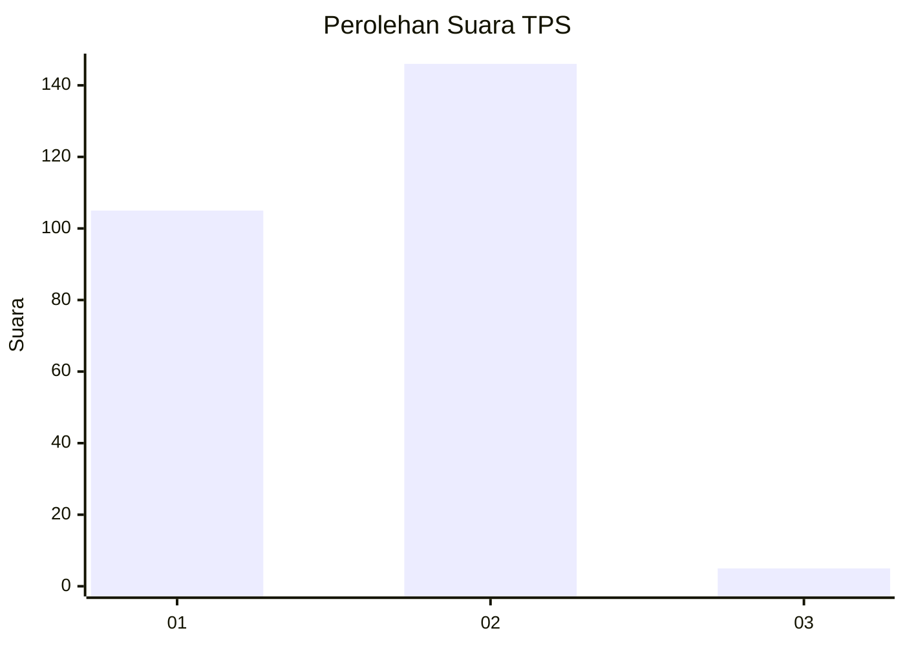
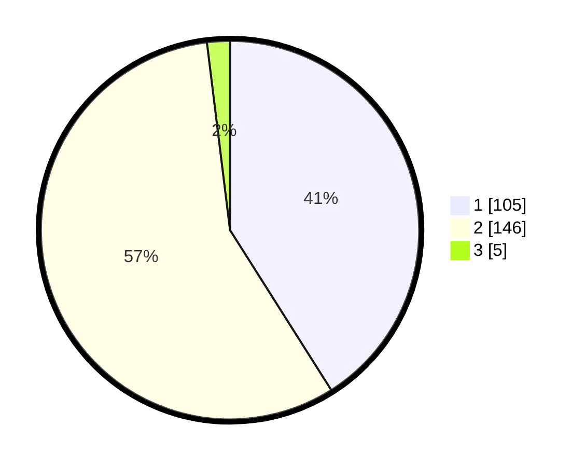

# Hasil

## Grafik

## Tabel

| No. | Nama Paslon    | Suara | Suara (raw) | Persentase |
|:--- |:-------------- | -----:| -----------:| ----------:|
| 1   | ANIES MUHAIMIN | 105   | [105][p-1]  | 41,02      |
| 2   | PRABOWO GIBRAN | 146   | [146][p-2]  | 57,03      |
| 3   | GANJAR MAHFUD  | 5     | [5][p-3]    | 1,95       |

[p-1]: https://github.com/gigit-pemilu/pemilu-2024/blob/main/pilpres/hitung-suara/sub/35-jawa-timur/sub/28-pamekasan/sub/04-pamekasan/sub/2018-toronan/sub/006-tps/sub/paslon-1.txt
[p-2]: https://github.com/gigit-pemilu/pemilu-2024/blob/main/pilpres/hitung-suara/sub/35-jawa-timur/sub/28-pamekasan/sub/04-pamekasan/sub/2018-toronan/sub/006-tps/sub/paslon-2.txt
[p-3]: https://github.com/gigit-pemilu/pemilu-2024/blob/main/pilpres/hitung-suara/sub/35-jawa-timur/sub/28-pamekasan/sub/04-pamekasan/sub/2018-toronan/sub/006-tps/sub/paslon-3.txt

## Foto C Plano

https://sirekap-obj-formc.kpu.go.id/2d89/pemilu/ppwp/35/28/04/20/18/3528042018006-20240214-201836--150a9658-1e9e-4e5c-ad48-a31e18695ec6.jpg

https://sirekap-obj-formc.kpu.go.id/2d89/pemilu/ppwp/35/28/04/20/18/3528042018006-20240214-201939--2fab3c3a-44eb-4047-b4c2-cb5b2b42963c.jpg

https://sirekap-obj-formc.kpu.go.id/2d89/pemilu/ppwp/35/28/04/20/18/3528042018006-20240217-094303--6e91e25e-8511-431b-b9df-bec86d00a860.jpg

## Metadata

| Key        | Value               |
| ---------- | ------------------- |
| Time Stamp | 2024-02-17 10:00:02 |

