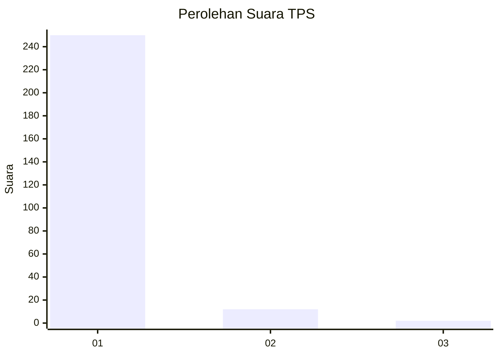
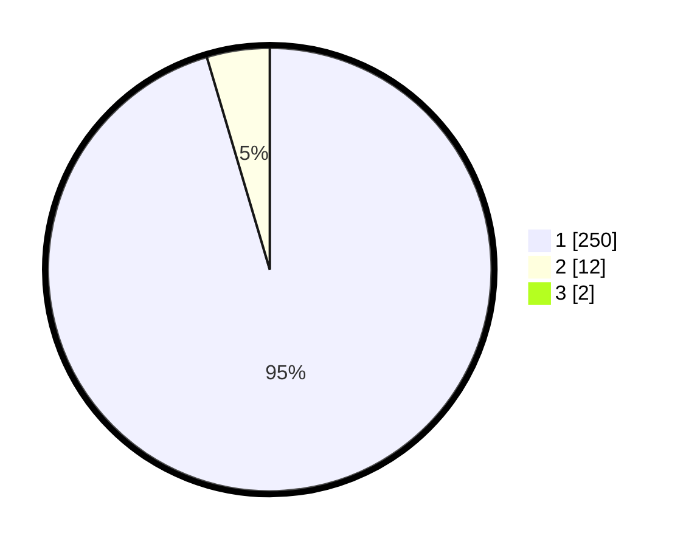

# Hasil

## Grafik

## Tabel

| No. | Nama Paslon    | Suara | Suara (raw) | Persentase |
|:--- |:-------------- | -----:| -----------:| ----------:|
| 1   | ANIES MUHAIMIN | 250   | [250][p-1]  | 94,70      |
| 2   | PRABOWO GIBRAN | 12    | [12][p-2]   | 4,55       |
| 3   | GANJAR MAHFUD  | 2     | [2][p-3]    | 0,76       |

[p-1]: https://github.com/gigit-pemilu/pemilu-2024/blob/main/pilpres/hitung-suara/sub/35-jawa-timur/sub/28-pamekasan/sub/05-proppo/sub/2002-toket/sub/009-tps/sub/paslon-1.txt
[p-2]: https://github.com/gigit-pemilu/pemilu-2024/blob/main/pilpres/hitung-suara/sub/35-jawa-timur/sub/28-pamekasan/sub/05-proppo/sub/2002-toket/sub/009-tps/sub/paslon-2.txt
[p-3]: https://github.com/gigit-pemilu/pemilu-2024/blob/main/pilpres/hitung-suara/sub/35-jawa-timur/sub/28-pamekasan/sub/05-proppo/sub/2002-toket/sub/009-tps/sub/paslon-3.txt

## Foto C Plano

https://sirekap-obj-formc.kpu.go.id/397f/pemilu/ppwp/35/28/05/20/02/3528052002009-20240214-194940--ad872eba-d09f-4984-9b34-b6515d9518a6.jpg

https://sirekap-obj-formc.kpu.go.id/397f/pemilu/ppwp/35/28/05/20/02/3528052002009-20240214-195045--c2bc650e-79a2-4ff9-97b2-9cdee2a56e17.jpg

https://sirekap-obj-formc.kpu.go.id/397f/pemilu/ppwp/35/28/05/20/02/3528052002009-20240214-195335--3685c8aa-8d30-4ed3-be4e-e0ddfe0cb65a.jpg

## Metadata

| Key        | Value               |
| ---------- | ------------------- |
| Time Stamp | 2024-02-15 16:00:26 |

