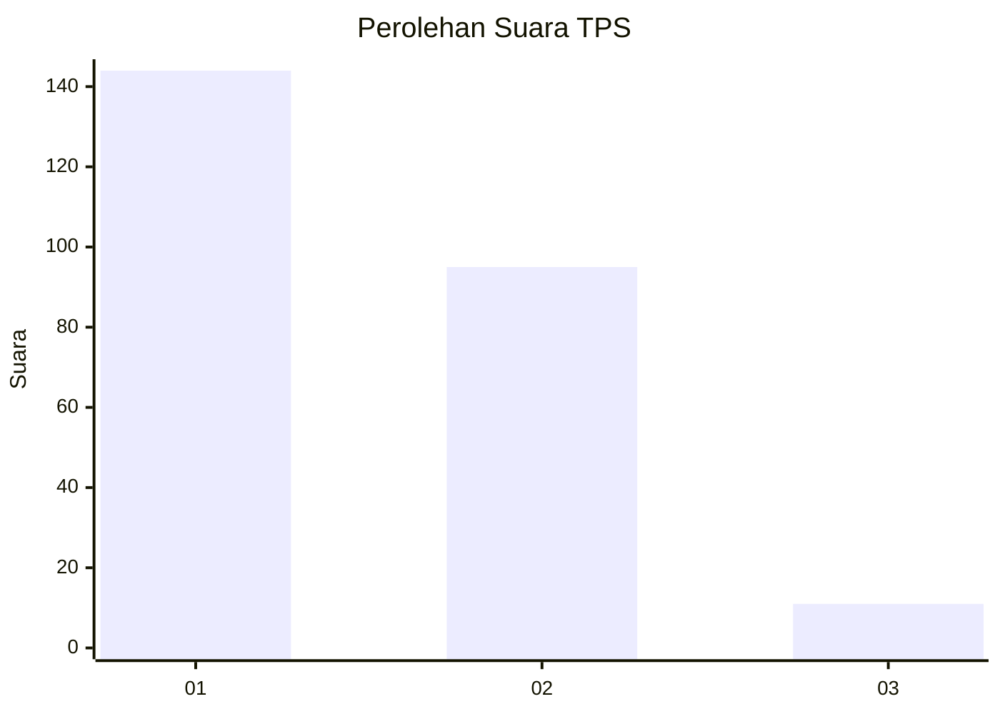
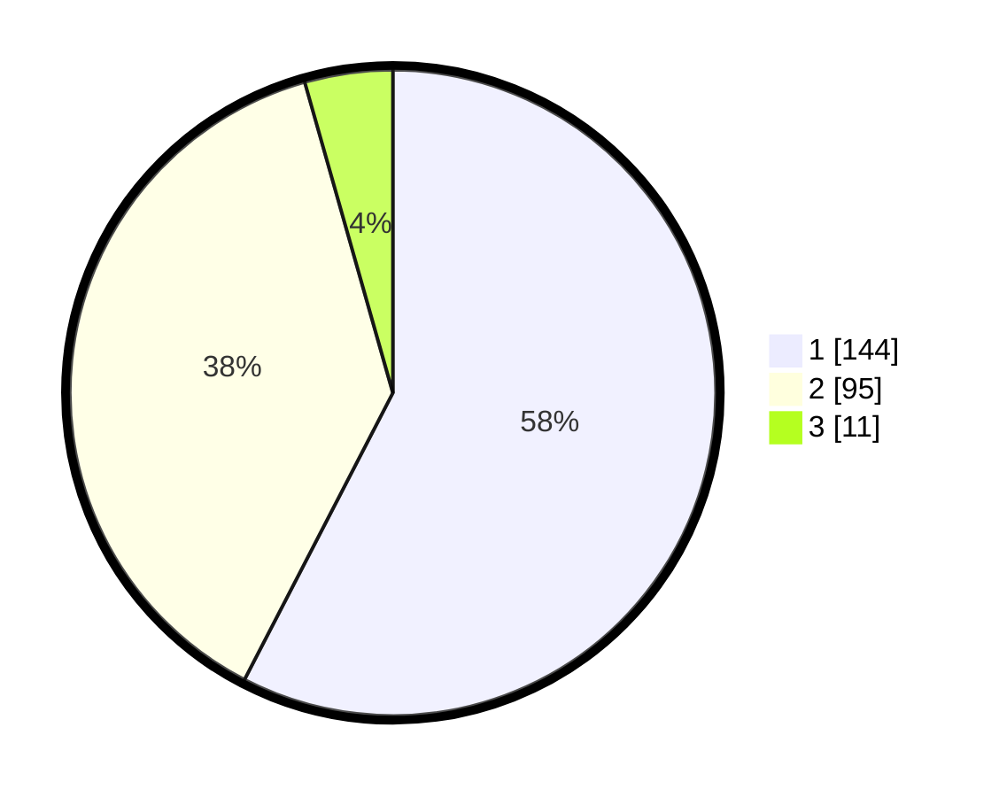

# Hasil

## Grafik

## Tabel

| No. | Nama Paslon    | Suara | Suara (raw) | Persentase |
|:--- |:-------------- | -----:| -----------:| ----------:|
| 1   | ANIES MUHAIMIN | 144   | [144][p-1]  | 57,60      |
| 2   | PRABOWO GIBRAN | 95    | [95][p-2]   | 38,00      |
| 3   | GANJAR MAHFUD  | 11    | [11][p-3]   | 4,40       |

[p-1]: https://github.com/gigit-pemilu/pemilu-2024-35-jawa-timur/blob/main/pilpres/hitung-suara/sub/35-jawa-timur/sub/28-pamekasan/sub/05-proppo/sub/2003-candi-burung/sub/003-tps/sub/paslon-1.txt
[p-2]: https://github.com/gigit-pemilu/pemilu-2024-35-jawa-timur/blob/main/pilpres/hitung-suara/sub/35-jawa-timur/sub/28-pamekasan/sub/05-proppo/sub/2003-candi-burung/sub/003-tps/sub/paslon-2.txt
[p-3]: https://github.com/gigit-pemilu/pemilu-2024-35-jawa-timur/blob/main/pilpres/hitung-suara/sub/35-jawa-timur/sub/28-pamekasan/sub/05-proppo/sub/2003-candi-burung/sub/003-tps/sub/paslon-3.txt

## Foto C Plano

https://sirekap-obj-formc.kpu.go.id/b761/pemilu/ppwp/35/28/05/20/03/3528052003003-20240215-093754--8a72dadc-749f-4ce1-86ba-7d8d0b2186c0.jpg

https://sirekap-obj-formc.kpu.go.id/b761/pemilu/ppwp/35/28/05/20/03/3528052003003-20240215-094136--3d7108b6-0fb7-4cf1-8d75-9a4b2e40e7ea.jpg

## Metadata

| Key        | Value               |
| ---------- | ------------------- |
| Time Stamp | 2024-02-15 16:00:26 |

