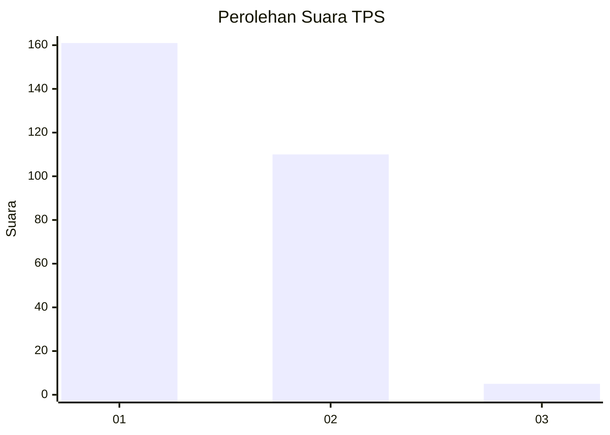
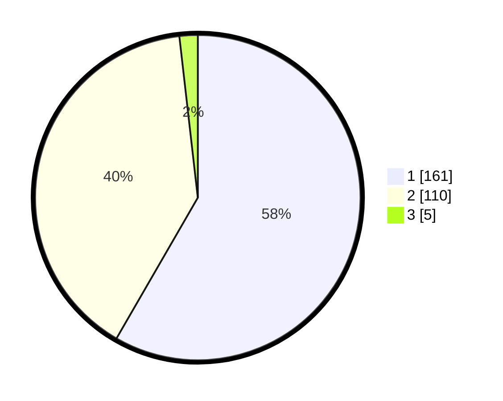

# Hasil

## Grafik

## Tabel

| No. | Nama Paslon    | Suara | Suara (raw) | Persentase |
|:--- |:-------------- | -----:| -----------:| ----------:|
| 1   | ANIES MUHAIMIN | 161   | [161][p-1]  | 58,33      |
| 2   | PRABOWO GIBRAN | 110   | [110][p-2]  | 39,86      |
| 3   | GANJAR MAHFUD  | 5     | [5][p-3]    | 1,81       |

[p-1]: https://github.com/gigit-pemilu/pemilu-2024-35-jawa-timur/blob/main/pilpres/hitung-suara/sub/35-jawa-timur/sub/28-pamekasan/sub/05-proppo/sub/2003-candi-burung/sub/005-tps/sub/paslon-1.txt
[p-2]: https://github.com/gigit-pemilu/pemilu-2024-35-jawa-timur/blob/main/pilpres/hitung-suara/sub/35-jawa-timur/sub/28-pamekasan/sub/05-proppo/sub/2003-candi-burung/sub/005-tps/sub/paslon-2.txt
[p-3]: https://github.com/gigit-pemilu/pemilu-2024-35-jawa-timur/blob/main/pilpres/hitung-suara/sub/35-jawa-timur/sub/28-pamekasan/sub/05-proppo/sub/2003-candi-burung/sub/005-tps/sub/paslon-3.txt

## Foto C Plano

https://sirekap-obj-formc.kpu.go.id/0891/pemilu/ppwp/35/28/05/20/03/3528052003005-20240215-090954--74cd91dc-ecd5-43cd-a506-d177452bcce9.jpg

https://sirekap-obj-formc.kpu.go.id/0891/pemilu/ppwp/35/28/05/20/03/3528052003005-20240215-092018--d4392707-26a1-4c4a-b9cf-1fed52bdb0fc.jpg

https://sirekap-obj-formc.kpu.go.id/0891/pemilu/ppwp/35/28/05/20/03/3528052003005-20240215-092231--c8c10381-f32f-43d6-9301-4d76fd167b83.jpg

## Metadata

| Key        | Value               |
| ---------- | ------------------- |
| Time Stamp | 2024-02-17 14:45:18 |

