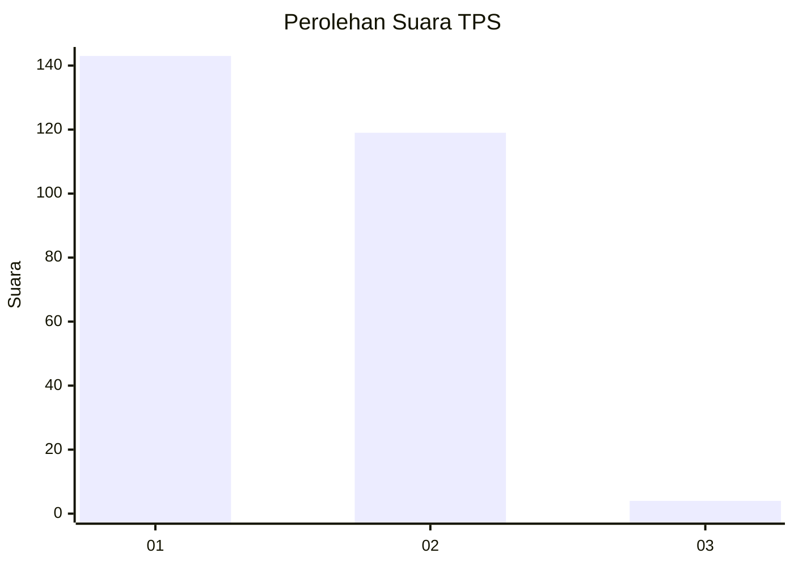
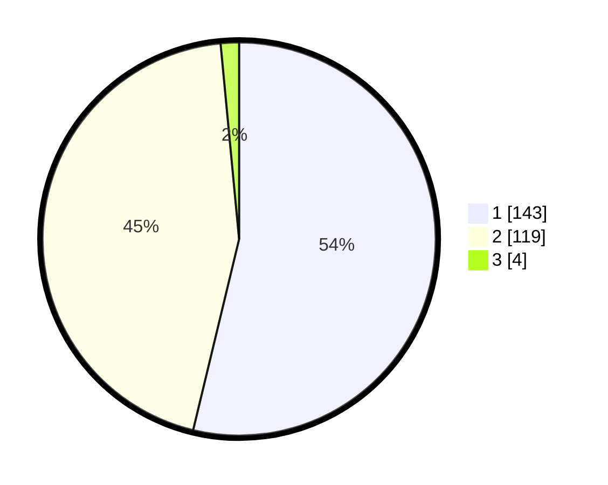

# Hasil

## Grafik

## Tabel

| No. | Nama Paslon    | Suara | Suara (raw) | Persentase |
|:--- |:-------------- | -----:| -----------:| ----------:|
| 1   | ANIES MUHAIMIN | 143   | [143][p-1]  | 53,76      |
| 2   | PRABOWO GIBRAN | 119   | [119][p-2]  | 44,74      |
| 3   | GANJAR MAHFUD  | 4     | [4][p-3]    | 1,50       |

[p-1]: https://github.com/gigit-pemilu/pemilu-2024/blob/main/pilpres/hitung-suara/sub/35-jawa-timur/sub/28-pamekasan/sub/05-proppo/sub/2003-candi-burung/sub/007-tps/sub/paslon-1.txt
[p-2]: https://github.com/gigit-pemilu/pemilu-2024/blob/main/pilpres/hitung-suara/sub/35-jawa-timur/sub/28-pamekasan/sub/05-proppo/sub/2003-candi-burung/sub/007-tps/sub/paslon-2.txt
[p-3]: https://github.com/gigit-pemilu/pemilu-2024/blob/main/pilpres/hitung-suara/sub/35-jawa-timur/sub/28-pamekasan/sub/05-proppo/sub/2003-candi-burung/sub/007-tps/sub/paslon-3.txt

## Foto C Plano

https://sirekap-obj-formc.kpu.go.id/305c/pemilu/ppwp/35/28/05/20/03/3528052003007-20240215-093040--572e1ec2-656d-4b11-ac5e-adb171005d2c.jpg

https://sirekap-obj-formc.kpu.go.id/305c/pemilu/ppwp/35/28/05/20/03/3528052003007-20240215-141908--cc3d74b5-a1ba-4721-afed-07ce257e23f6.jpg

https://sirekap-obj-formc.kpu.go.id/305c/pemilu/ppwp/35/28/05/20/03/3528052003007-20240215-093244--65f234c6-af4e-4103-9db4-ff33e1996db5.jpg

## Metadata

| Key        | Value               |
| ---------- | ------------------- |
| Time Stamp | 2024-02-17 10:30:03 |

