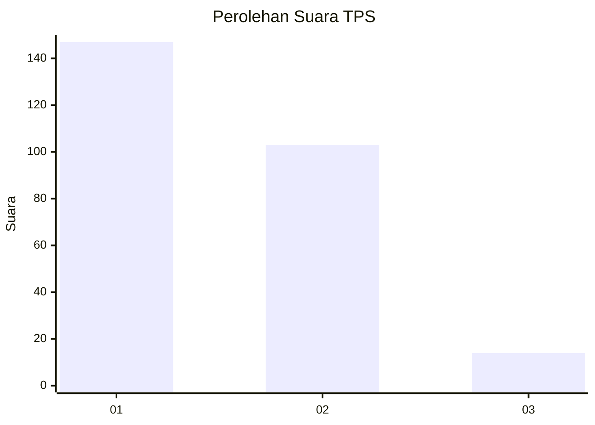
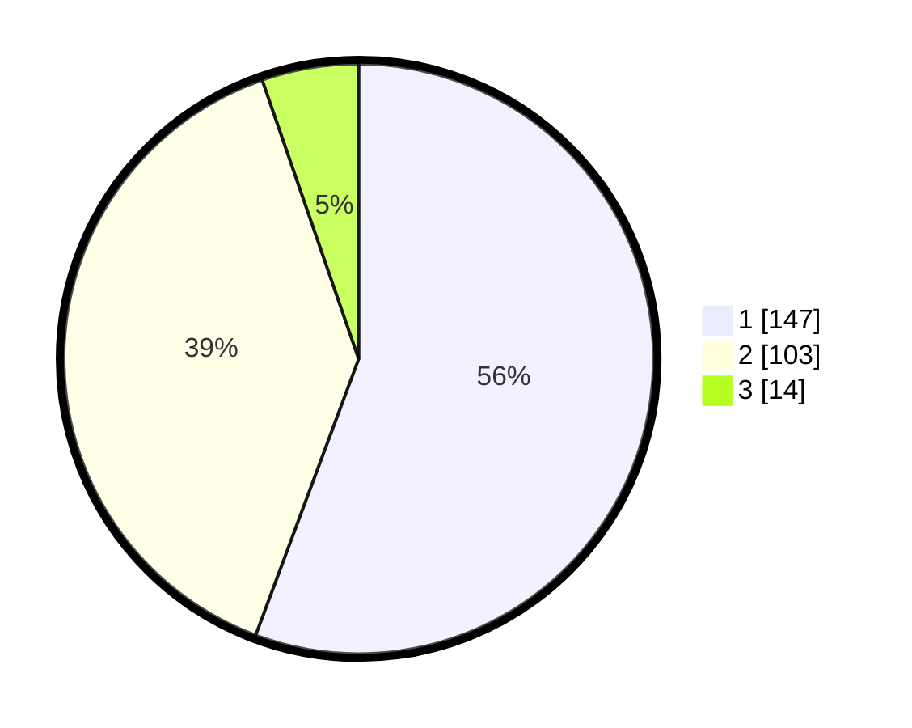

# Hasil

## Grafik

## Tabel

| No. | Nama Paslon    | Suara | Suara (raw) | Persentase |
|:--- |:-------------- | -----:| -----------:| ----------:|
| 1   | ANIES MUHAIMIN | 147   | [147][p-1]  | 55,68      |
| 2   | PRABOWO GIBRAN | 103   | [103][p-2]  | 39,02      |
| 3   | GANJAR MAHFUD  | 14    | [14][p-3]   | 5,30       |

[p-1]: https://github.com/gigit-pemilu/pemilu-2024/blob/main/pilpres/hitung-suara/sub/35-jawa-timur/sub/28-pamekasan/sub/05-proppo/sub/2003-candi-burung/sub/009-tps/sub/paslon-1.txt
[p-2]: https://github.com/gigit-pemilu/pemilu-2024/blob/main/pilpres/hitung-suara/sub/35-jawa-timur/sub/28-pamekasan/sub/05-proppo/sub/2003-candi-burung/sub/009-tps/sub/paslon-2.txt
[p-3]: https://github.com/gigit-pemilu/pemilu-2024/blob/main/pilpres/hitung-suara/sub/35-jawa-timur/sub/28-pamekasan/sub/05-proppo/sub/2003-candi-burung/sub/009-tps/sub/paslon-3.txt

## Foto C Plano

https://sirekap-obj-formc.kpu.go.id/02bb/pemilu/ppwp/35/28/05/20/03/3528052003009-20240214-222531--0f0ae796-aa56-485c-8826-9abbc4f83936.jpg

https://sirekap-obj-formc.kpu.go.id/02bb/pemilu/ppwp/35/28/05/20/03/3528052003009-20240215-134441--736ff823-be70-46f4-bdd6-e078514d04f0.jpg

https://sirekap-obj-formc.kpu.go.id/02bb/pemilu/ppwp/35/28/05/20/03/3528052003009-20240214-223322--85a2fc6c-5303-40e1-9233-fd0753b8f77c.jpg

## Metadata

| Key        | Value               |
| ---------- | ------------------- |
| Time Stamp | 2024-02-15 16:30:25 |

