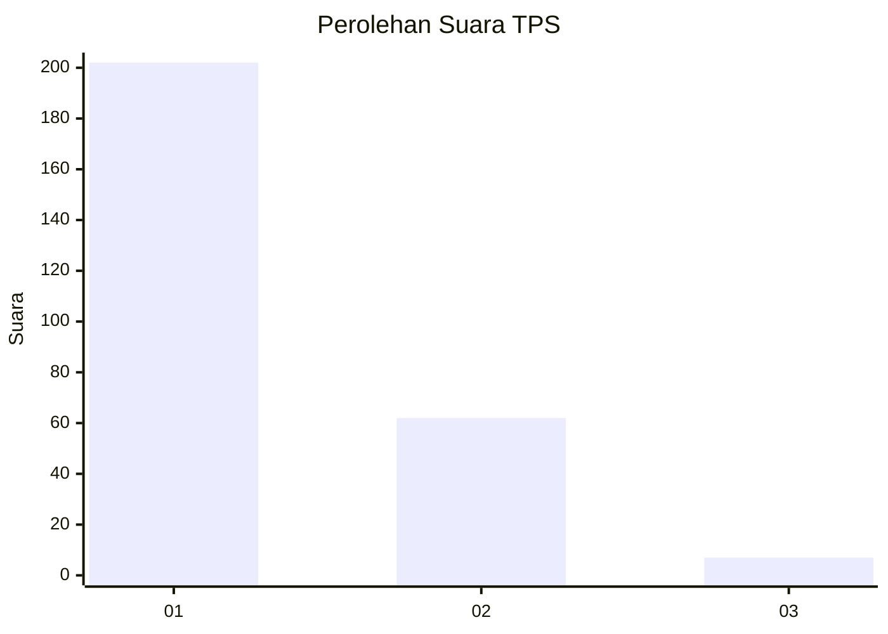
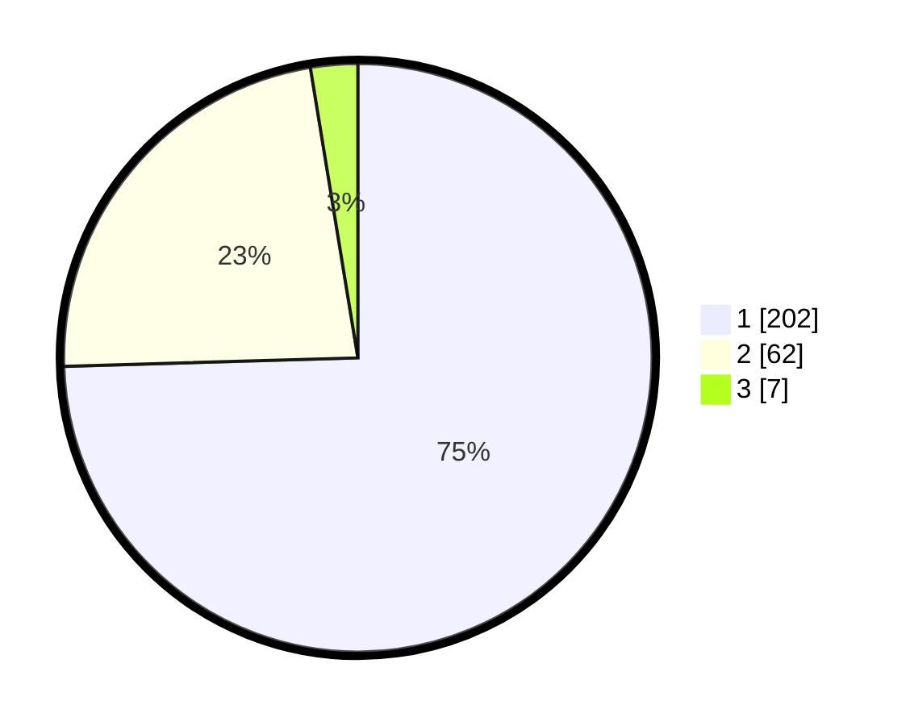

# Hasil

## Grafik

## Tabel

| No. | Nama Paslon    | Suara | Suara (raw) | Persentase |
|:--- |:-------------- | -----:| -----------:| ----------:|
| 1   | ANIES MUHAIMIN | 202   | [202][p-1]  | 74,54      |
| 2   | PRABOWO GIBRAN | 62    | [62][p-2]   | 22,88      |
| 3   | GANJAR MAHFUD  | 7     | [7][p-3]    | 2,58       |

[p-1]: https://github.com/gigit-pemilu/pemilu-2024-35-jawa-timur/blob/main/pilpres/hitung-suara/sub/35-jawa-timur/sub/28-pamekasan/sub/05-proppo/sub/2004-batu-kalangan/sub/007-tps/sub/paslon-1.txt
[p-2]: https://github.com/gigit-pemilu/pemilu-2024-35-jawa-timur/blob/main/pilpres/hitung-suara/sub/35-jawa-timur/sub/28-pamekasan/sub/05-proppo/sub/2004-batu-kalangan/sub/007-tps/sub/paslon-2.txt
[p-3]: https://github.com/gigit-pemilu/pemilu-2024-35-jawa-timur/blob/main/pilpres/hitung-suara/sub/35-jawa-timur/sub/28-pamekasan/sub/05-proppo/sub/2004-batu-kalangan/sub/007-tps/sub/paslon-3.txt

## Foto C Plano

https://sirekap-obj-formc.kpu.go.id/597a/pemilu/ppwp/35/28/05/20/04/3528052004007-20240214-221446--d33788f5-8926-4237-a799-52d16dcc1190.jpg

https://sirekap-obj-formc.kpu.go.id/597a/pemilu/ppwp/35/28/05/20/04/3528052004007-20240214-221557--7f7fc07b-9545-4f97-ad53-d37644a1f951.jpg

https://sirekap-obj-formc.kpu.go.id/597a/pemilu/ppwp/35/28/05/20/04/3528052004007-20240214-221729--a7be706e-0145-472a-95ac-a15de7a846b9.jpg

## Metadata

| Key        | Value               |
| ---------- | ------------------- |
| Time Stamp | 2024-02-15 16:30:25 |

