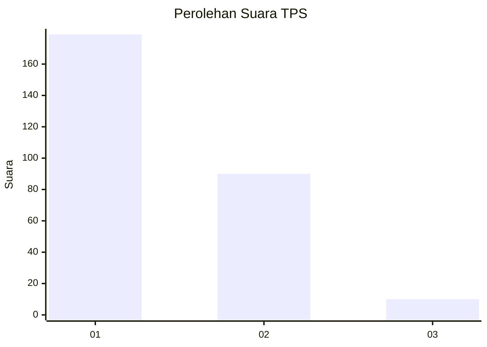
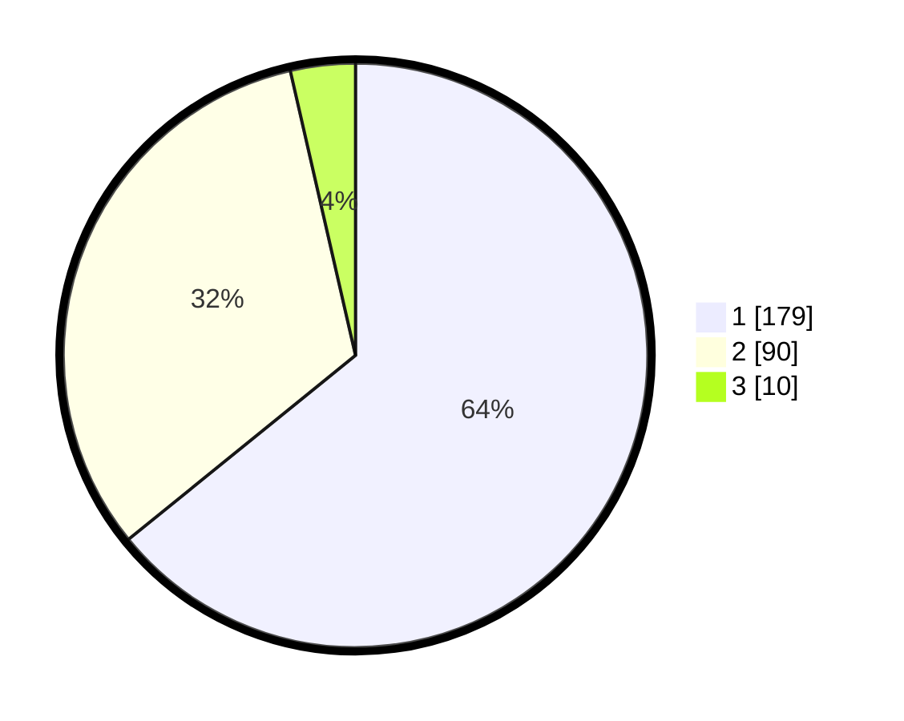

# Hasil

## Grafik

## Tabel

| No. | Nama Paslon    | Suara | Suara (raw) | Persentase |
|:--- |:-------------- | -----:| -----------:| ----------:|
| 1   | ANIES MUHAIMIN | 179   | [179][p-1]  | 64,16      |
| 2   | PRABOWO GIBRAN | 90    | [90][p-2]   | 32,26      |
| 3   | GANJAR MAHFUD  | 10    | [10][p-3]   | 3,58       |

[p-1]: https://github.com/gigit-pemilu/pemilu-2024-35-jawa-timur/blob/main/pilpres/hitung-suara/sub/35-jawa-timur/sub/28-pamekasan/sub/05-proppo/sub/2006-srambah/sub/001-tps/sub/paslon-1.txt
[p-2]: https://github.com/gigit-pemilu/pemilu-2024-35-jawa-timur/blob/main/pilpres/hitung-suara/sub/35-jawa-timur/sub/28-pamekasan/sub/05-proppo/sub/2006-srambah/sub/001-tps/sub/paslon-2.txt
[p-3]: https://github.com/gigit-pemilu/pemilu-2024-35-jawa-timur/blob/main/pilpres/hitung-suara/sub/35-jawa-timur/sub/28-pamekasan/sub/05-proppo/sub/2006-srambah/sub/001-tps/sub/paslon-3.txt

## Foto C Plano

https://sirekap-obj-formc.kpu.go.id/a6c9/pemilu/ppwp/35/28/05/20/06/3528052006001-20240215-082748--5f01a2d2-8736-439d-bebb-07bf20ce46b1.jpg

https://sirekap-obj-formc.kpu.go.id/a6c9/pemilu/ppwp/35/28/05/20/06/3528052006001-20240215-170805--f5e31c46-aff3-42e0-b8b2-f72004c7c1e0.jpg

https://sirekap-obj-formc.kpu.go.id/a6c9/pemilu/ppwp/35/28/05/20/06/3528052006001-20240215-170431--dd029fe2-5bcc-4ae1-ba60-44e80168c9a5.jpg

## Metadata

| Key        | Value               |
| ---------- | ------------------- |
| Time Stamp | 2024-02-24 22:31:28 |

## DATA PEMILIH TETAP

Jumlah pemilih dalam DPT: **282**.
 * L: **236**.
 * P: **646**.

## DATA PENGGUNA HAK PILIH

Jumlah pengguna hak pilih dalam DPT: **278**.
 * L: **733**.
 * P: **145**.

Jumlah pengguna hak pilih dalam DPTb: **901**.
 * L: **990**.
 * P: **5**.

Jumlah pengguna hak pilih dalam DPK: **0**.
 * L: **0**.
 * P: **600**.

Jumlah pengguna hak pilih: **239**.
 * L: **533**.
 * P: **145**.

## JUMLAH SUARA SAH DAN TIDAK SAH

JUMLAH SELURUH SUARA SAH: **0**.

JUMLAH SUARA TIDAK SAH: **0**.

JUMLAH SELURUH SUARA SAH DAN SUARA TIDAK SAH: **0**.

