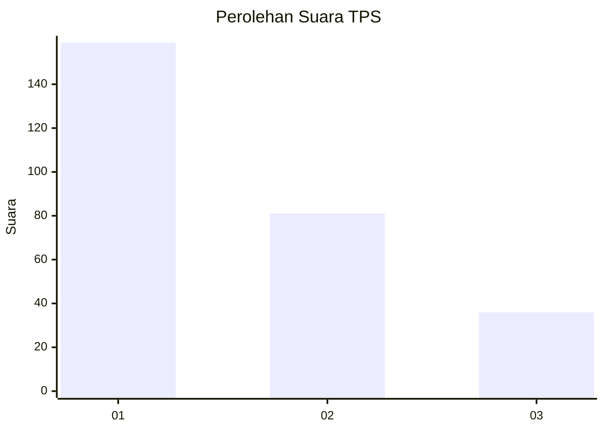
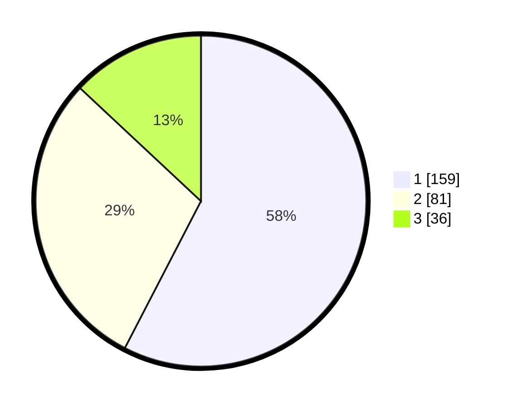

# Hasil

## Grafik

## Tabel

| No. | Nama Paslon    | Suara | Suara (raw) | Persentase |
|:--- |:-------------- | -----:| -----------:| ----------:|
| 1   | ANIES MUHAIMIN | 159   | [159][p-1]  | 57,61      |
| 2   | PRABOWO GIBRAN | 81    | [81][p-2]   | 29,35      |
| 3   | GANJAR MAHFUD  | 36    | [36][p-3]   | 13,04      |

[p-1]: https://github.com/gigit-pemilu/pemilu-2024/blob/main/pilpres/hitung-suara/sub/35-jawa-timur/sub/28-pamekasan/sub/05-proppo/sub/2007-pangtonggal/sub/001-tps/sub/paslon-1.txt
[p-2]: https://github.com/gigit-pemilu/pemilu-2024/blob/main/pilpres/hitung-suara/sub/35-jawa-timur/sub/28-pamekasan/sub/05-proppo/sub/2007-pangtonggal/sub/001-tps/sub/paslon-2.txt
[p-3]: https://github.com/gigit-pemilu/pemilu-2024/blob/main/pilpres/hitung-suara/sub/35-jawa-timur/sub/28-pamekasan/sub/05-proppo/sub/2007-pangtonggal/sub/001-tps/sub/paslon-3.txt

## Foto C Plano

https://sirekap-obj-formc.kpu.go.id/cb6c/pemilu/ppwp/35/28/05/20/07/3528052007001-20240215-203156--81b32ab4-19cc-49f0-8fa9-eb9aae88bd89.jpg

https://sirekap-obj-formc.kpu.go.id/cb6c/pemilu/ppwp/35/28/05/20/07/3528052007001-20240215-203229--4213b77a-669c-40e1-aadb-e8f84cba3b9f.jpg

https://sirekap-obj-formc.kpu.go.id/cb6c/pemilu/ppwp/35/28/05/20/07/3528052007001-20240215-203303--58ae5a1c-92a4-4274-9453-e71d5a129556.jpg

## Metadata

| Key        | Value               |
| ---------- | ------------------- |
| Time Stamp | 2024-02-24 22:31:28 |

