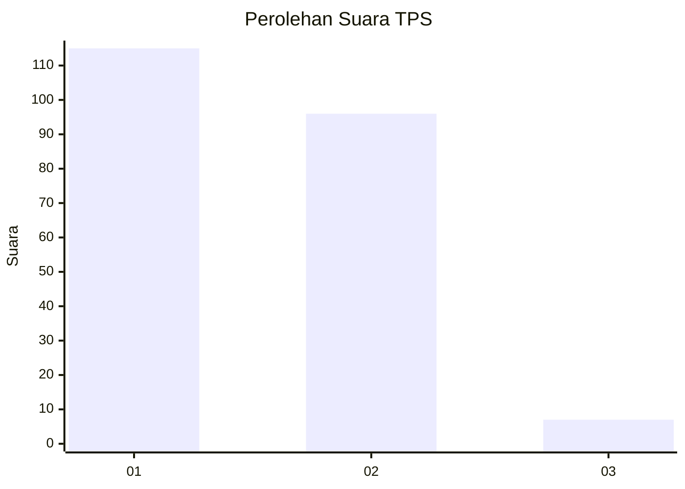
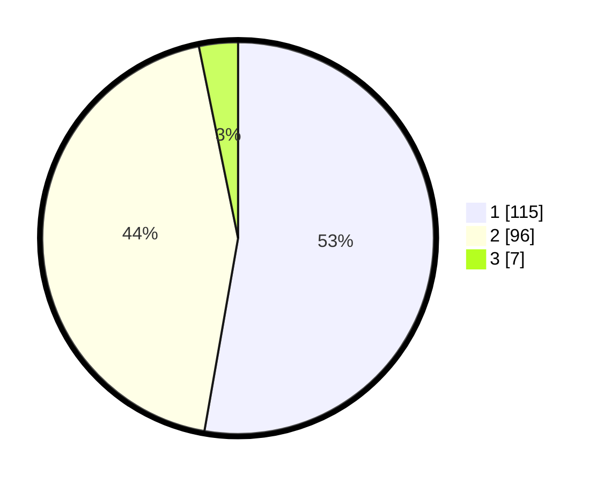

# Hasil

## Grafik

## Tabel

| No. | Nama Paslon    | Suara | Suara (raw) | Persentase |
|:--- |:-------------- | -----:| -----------:| ----------:|
| 1   | ANIES MUHAIMIN | 115   | [115][p-1]  | 52,75      |
| 2   | PRABOWO GIBRAN | 96    | [96][p-2]   | 44,04      |
| 3   | GANJAR MAHFUD  | 7     | [7][p-3]    | 3,21       |

[p-1]: https://github.com/gigit-pemilu/pemilu-2024/blob/main/pilpres/hitung-suara/sub/35-jawa-timur/sub/28-pamekasan/sub/05-proppo/sub/2007-pangtonggal/sub/002-tps/sub/paslon-1.txt
[p-2]: https://github.com/gigit-pemilu/pemilu-2024/blob/main/pilpres/hitung-suara/sub/35-jawa-timur/sub/28-pamekasan/sub/05-proppo/sub/2007-pangtonggal/sub/002-tps/sub/paslon-2.txt
[p-3]: https://github.com/gigit-pemilu/pemilu-2024/blob/main/pilpres/hitung-suara/sub/35-jawa-timur/sub/28-pamekasan/sub/05-proppo/sub/2007-pangtonggal/sub/002-tps/sub/paslon-3.txt

## Foto C Plano

https://sirekap-obj-formc.kpu.go.id/a346/pemilu/ppwp/35/28/05/20/07/3528052007002-20240214-213158--7fc4bc6d-d9c6-4e9d-b8c6-2f9826778d86.jpg

https://sirekap-obj-formc.kpu.go.id/a346/pemilu/ppwp/35/28/05/20/07/3528052007002-20240214-213548--5d397d17-921d-4cdc-b450-418a8c47c781.jpg

https://sirekap-obj-formc.kpu.go.id/a346/pemilu/ppwp/35/28/05/20/07/3528052007002-20240214-213707--b6b9356c-a151-4244-96e6-58a58771695a.jpg

## Metadata

| Key        | Value               |
| ---------- | ------------------- |
| Time Stamp | 2024-02-17 10:30:03 |

