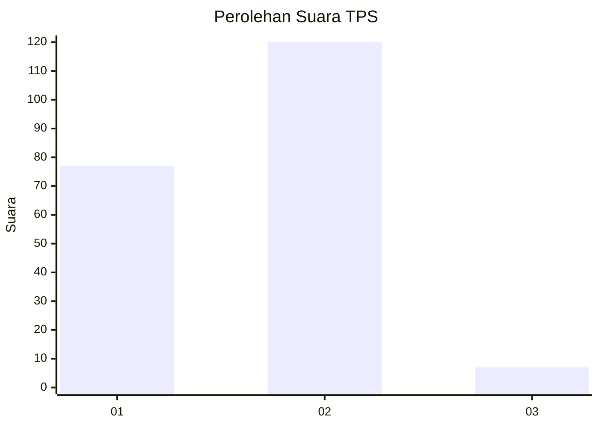
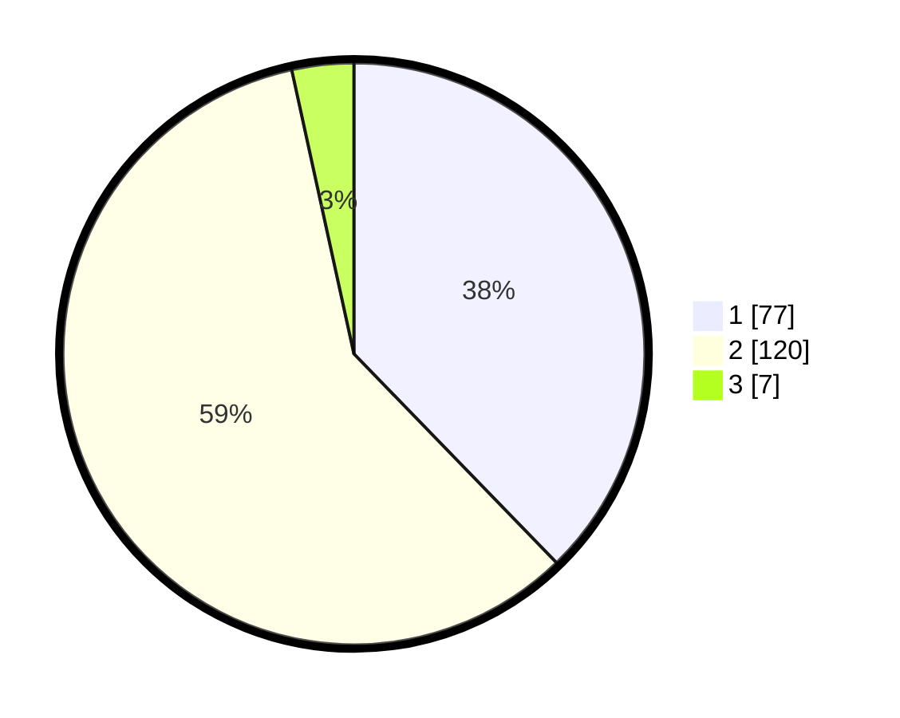

# Hasil

## Grafik

## Tabel

| No. | Nama Paslon    | Suara | Suara (raw) | Persentase |
|:--- |:-------------- | -----:| -----------:| ----------:|
| 1   | ANIES MUHAIMIN | 77    | [77][p-1]   | 37,75      |
| 2   | PRABOWO GIBRAN | 120   | [120][p-2]  | 58,82      |
| 3   | GANJAR MAHFUD  | 7     | [7][p-3]    | 3,43       |

[p-1]: https://github.com/gigit-pemilu/pemilu-2024-35-jawa-timur/blob/main/pilpres/hitung-suara/sub/35-jawa-timur/sub/28-pamekasan/sub/05-proppo/sub/2007-pangtonggal/sub/008-tps/sub/paslon-1.txt
[p-2]: https://github.com/gigit-pemilu/pemilu-2024-35-jawa-timur/blob/main/pilpres/hitung-suara/sub/35-jawa-timur/sub/28-pamekasan/sub/05-proppo/sub/2007-pangtonggal/sub/008-tps/sub/paslon-2.txt
[p-3]: https://github.com/gigit-pemilu/pemilu-2024-35-jawa-timur/blob/main/pilpres/hitung-suara/sub/35-jawa-timur/sub/28-pamekasan/sub/05-proppo/sub/2007-pangtonggal/sub/008-tps/sub/paslon-3.txt

## Foto C Plano

https://sirekap-obj-formc.kpu.go.id/3a03/pemilu/ppwp/35/28/05/20/07/3528052007008-20240215-200508--1eb37b03-332d-4cee-b1c8-ef6c2d6486ae.jpg

https://sirekap-obj-formc.kpu.go.id/3a03/pemilu/ppwp/35/28/05/20/07/3528052007008-20240215-200532--f517b8e5-2c5c-431a-9651-3508d9e532dd.jpg

https://sirekap-obj-formc.kpu.go.id/3a03/pemilu/ppwp/35/28/05/20/07/3528052007008-20240215-200547--5fa0e199-a9fa-42cb-a8a7-d0ce19a7e8d9.jpg

## Metadata

| Key        | Value               |
| ---------- | ------------------- |
| Time Stamp | 2024-02-19 06:16:00 |

