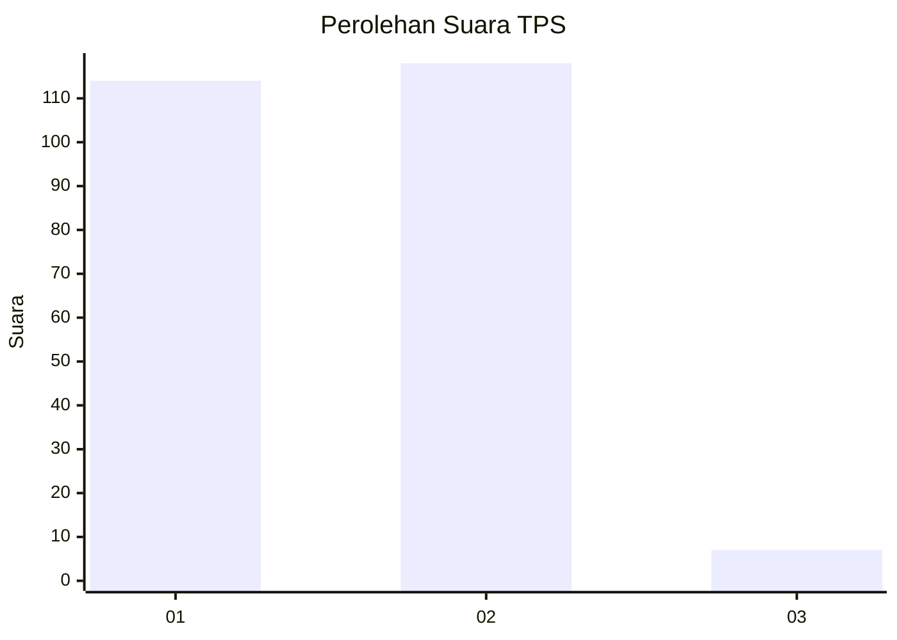
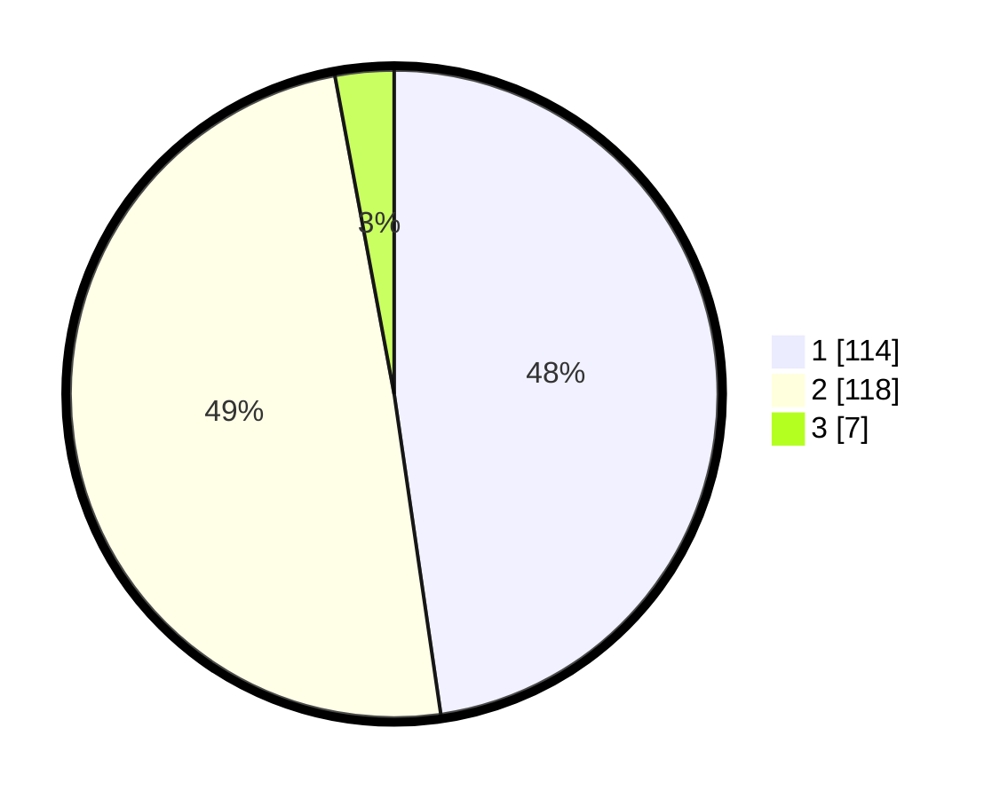

# Hasil

## Grafik

## Tabel

| No. | Nama Paslon    | Suara | Suara (raw) | Persentase |
|:--- |:-------------- | -----:| -----------:| ----------:|
| 1   | ANIES MUHAIMIN | 114   | [114][p-1]  | 47,70      |
| 2   | PRABOWO GIBRAN | 118   | [118][p-2]  | 49,37      |
| 3   | GANJAR MAHFUD  | 7     | [7][p-3]    | 2,93       |

[p-1]: https://github.com/gigit-pemilu/pemilu-2024/blob/main/pilpres/hitung-suara/sub/35-jawa-timur/sub/28-pamekasan/sub/05-proppo/sub/2008-samiran/sub/004-tps/sub/paslon-1.txt
[p-2]: https://github.com/gigit-pemilu/pemilu-2024/blob/main/pilpres/hitung-suara/sub/35-jawa-timur/sub/28-pamekasan/sub/05-proppo/sub/2008-samiran/sub/004-tps/sub/paslon-2.txt
[p-3]: https://github.com/gigit-pemilu/pemilu-2024/blob/main/pilpres/hitung-suara/sub/35-jawa-timur/sub/28-pamekasan/sub/05-proppo/sub/2008-samiran/sub/004-tps/sub/paslon-3.txt

## Foto C Plano

https://sirekap-obj-formc.kpu.go.id/8d53/pemilu/ppwp/35/28/05/20/08/3528052008004-20240214-213857--dc539d0c-c98e-4129-8e7b-8bd540774faf.jpg

https://sirekap-obj-formc.kpu.go.id/8d53/pemilu/ppwp/35/28/05/20/08/3528052008004-20240214-215506--76c12861-1ed3-4fff-95ec-19ba209eb350.jpg

https://sirekap-obj-formc.kpu.go.id/8d53/pemilu/ppwp/35/28/05/20/08/3528052008004-20240214-215908--f60b9a2b-3622-4b0f-b168-4c1593dc071b.jpg

## Metadata

| Key        | Value               |
| ---------- | ------------------- |
| Time Stamp | 2024-02-15 16:30:25 |

