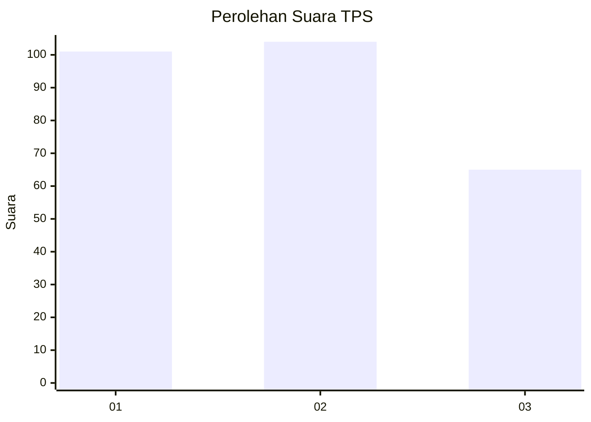
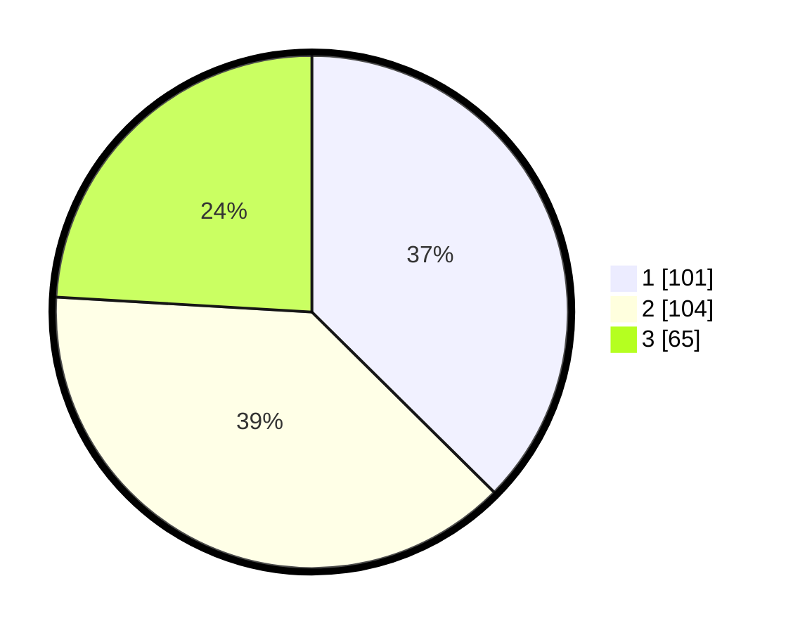

# Hasil

## Grafik

## Tabel

| No. | Nama Paslon    | Suara | Suara (raw) | Persentase |
|:--- |:-------------- | -----:| -----------:| ----------:|
| 1   | ANIES MUHAIMIN | 101   | [101][p-1]  | 37,41      |
| 2   | PRABOWO GIBRAN | 104   | [104][p-2]  | 38,52      |
| 3   | GANJAR MAHFUD  | 65    | [65][p-3]   | 24,07      |

[p-1]: https://github.com/gigit-pemilu/pemilu-2024-35-jawa-timur/blob/main/pilpres/hitung-suara/sub/35-jawa-timur/sub/28-pamekasan/sub/05-proppo/sub/2010-klampar/sub/002-tps/sub/paslon-1.txt
[p-2]: https://github.com/gigit-pemilu/pemilu-2024-35-jawa-timur/blob/main/pilpres/hitung-suara/sub/35-jawa-timur/sub/28-pamekasan/sub/05-proppo/sub/2010-klampar/sub/002-tps/sub/paslon-2.txt
[p-3]: https://github.com/gigit-pemilu/pemilu-2024-35-jawa-timur/blob/main/pilpres/hitung-suara/sub/35-jawa-timur/sub/28-pamekasan/sub/05-proppo/sub/2010-klampar/sub/002-tps/sub/paslon-3.txt

## Foto C Plano

https://sirekap-obj-formc.kpu.go.id/db37/pemilu/ppwp/35/28/05/20/10/3528052010002-20240214-225657--ee34f434-ff6d-4dc6-9480-d669fa972108.jpg

https://sirekap-obj-formc.kpu.go.id/db37/pemilu/ppwp/35/28/05/20/10/3528052010002-20240214-225823--9114419b-e2e7-4b43-b0d5-ce19a4196228.jpg

https://sirekap-obj-formc.kpu.go.id/db37/pemilu/ppwp/35/28/05/20/10/3528052010002-20240214-230011--13d8e63b-82f0-44ad-8156-4a58e7157eab.jpg

## Metadata

| Key        | Value               |
| ---------- | ------------------- |
| Time Stamp | 2024-02-15 16:30:25 |

