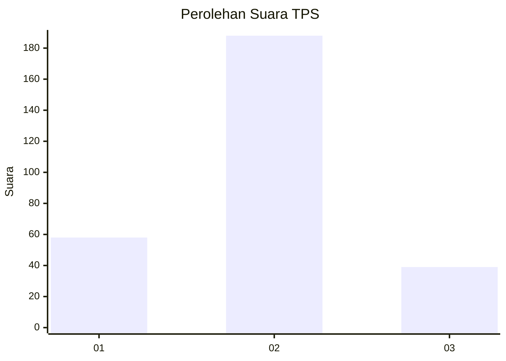
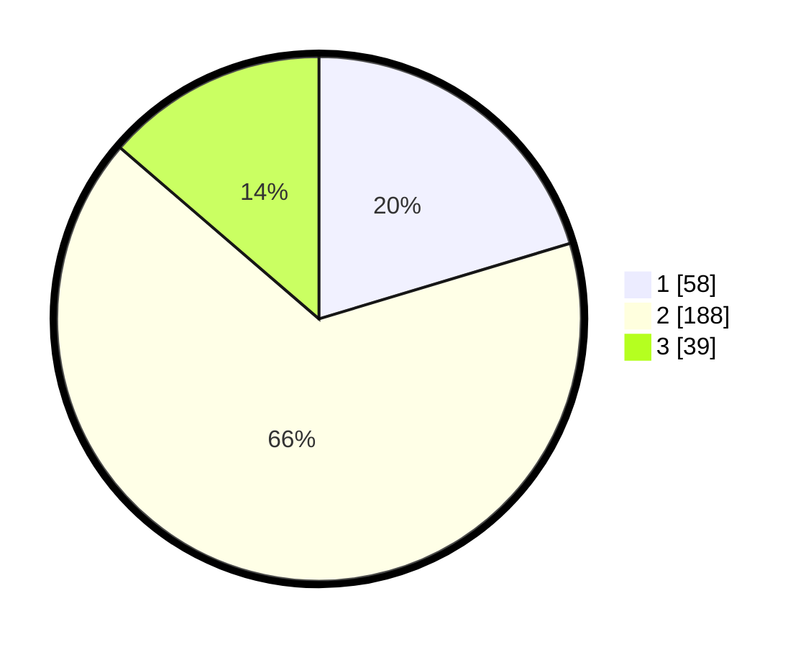

# Hasil

## Grafik

## Tabel

| No. | Nama Paslon    | Suara | Suara (raw) | Persentase |
|:--- |:-------------- | -----:| -----------:| ----------:|
| 1   | ANIES MUHAIMIN | 58    | [58][p-1]   | 20,35      |
| 2   | PRABOWO GIBRAN | 188   | [188][p-2]  | 65,96      |
| 3   | GANJAR MAHFUD  | 39    | [39][p-3]   | 13,68      |

[p-1]: https://github.com/gigit-pemilu/pemilu-2024/blob/main/pilpres/hitung-suara/sub/35-jawa-timur/sub/28-pamekasan/sub/05-proppo/sub/2011-samatan/sub/002-tps/sub/paslon-1.txt
[p-2]: https://github.com/gigit-pemilu/pemilu-2024/blob/main/pilpres/hitung-suara/sub/35-jawa-timur/sub/28-pamekasan/sub/05-proppo/sub/2011-samatan/sub/002-tps/sub/paslon-2.txt
[p-3]: https://github.com/gigit-pemilu/pemilu-2024/blob/main/pilpres/hitung-suara/sub/35-jawa-timur/sub/28-pamekasan/sub/05-proppo/sub/2011-samatan/sub/002-tps/sub/paslon-3.txt

## Foto C Plano

https://sirekap-obj-formc.kpu.go.id/0213/pemilu/ppwp/35/28/05/20/11/3528052011002-20240214-141136--e6695bbc-6890-412d-bc09-fba7015939dc.jpg

https://sirekap-obj-formc.kpu.go.id/0213/pemilu/ppwp/35/28/05/20/11/3528052011002-20240214-141213--f39b1178-4825-4a91-bc1b-5042721168d2.jpg

https://sirekap-obj-formc.kpu.go.id/0213/pemilu/ppwp/35/28/05/20/11/3528052011002-20240214-141226--ede84488-32f7-4212-940f-5c2bb5e7f3cf.jpg

## Metadata

| Key        | Value               |
| ---------- | ------------------- |
| Time Stamp | 2024-02-15 18:30:25 |

