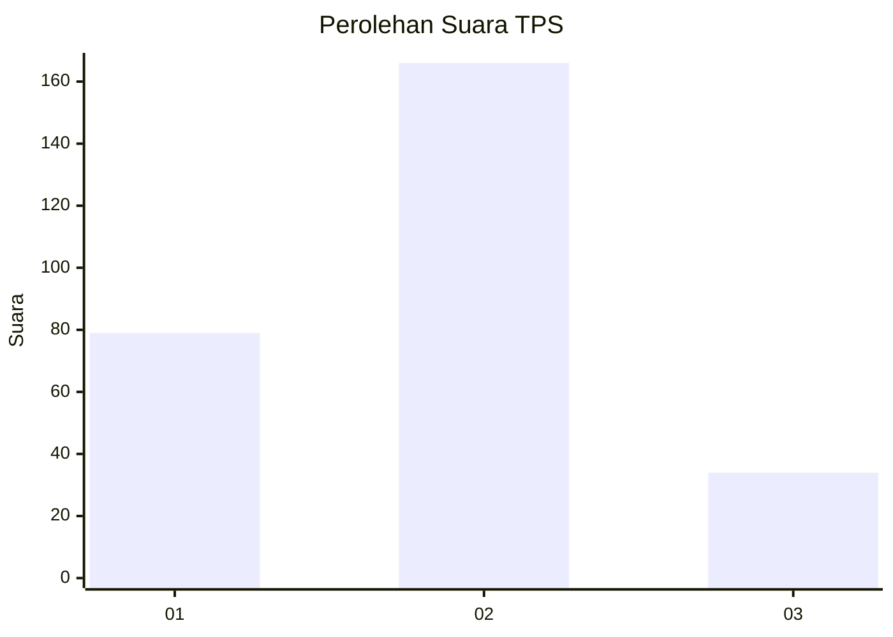
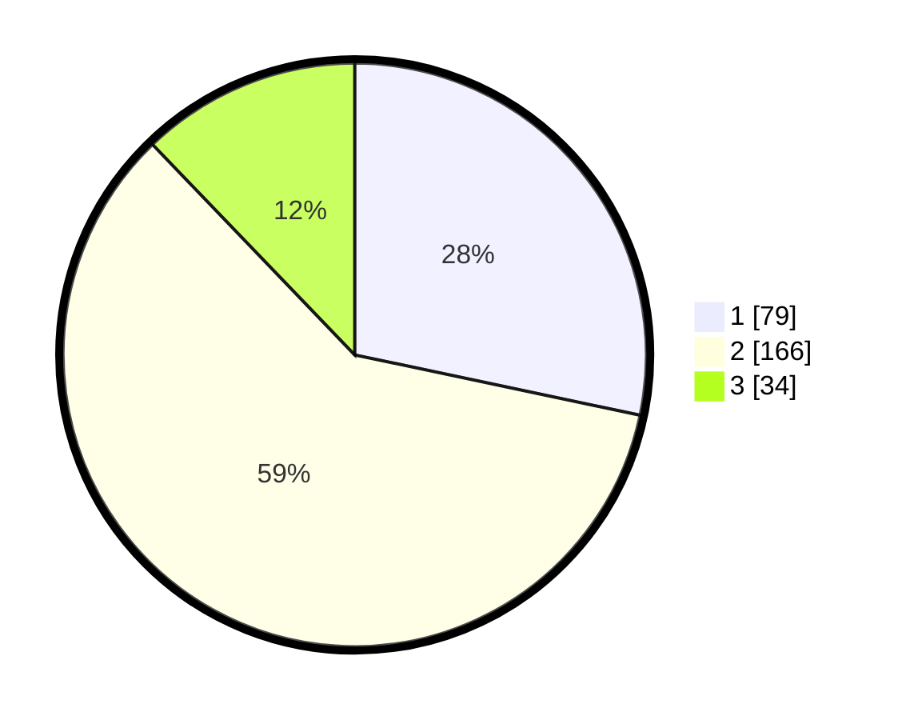

# Hasil

## Grafik

## Tabel

| No. | Nama Paslon    | Suara | Suara (raw) | Persentase |
|:--- |:-------------- | -----:| -----------:| ----------:|
| 1   | ANIES MUHAIMIN | 79    | [79][p-1]   | 28,32      |
| 2   | PRABOWO GIBRAN | 166   | [166][p-2]  | 59,50      |
| 3   | GANJAR MAHFUD  | 34    | [34][p-3]   | 12,19      |

[p-1]: https://github.com/gigit-pemilu/pemilu-2024-35-jawa-timur/blob/main/pilpres/hitung-suara/sub/35-jawa-timur/sub/28-pamekasan/sub/05-proppo/sub/2011-samatan/sub/003-tps/sub/paslon-1.txt
[p-2]: https://github.com/gigit-pemilu/pemilu-2024-35-jawa-timur/blob/main/pilpres/hitung-suara/sub/35-jawa-timur/sub/28-pamekasan/sub/05-proppo/sub/2011-samatan/sub/003-tps/sub/paslon-2.txt
[p-3]: https://github.com/gigit-pemilu/pemilu-2024-35-jawa-timur/blob/main/pilpres/hitung-suara/sub/35-jawa-timur/sub/28-pamekasan/sub/05-proppo/sub/2011-samatan/sub/003-tps/sub/paslon-3.txt

## Foto C Plano

https://sirekap-obj-formc.kpu.go.id/aa1e/pemilu/ppwp/35/28/05/20/11/3528052011003-20240214-231912--1450e2d0-815d-468d-ba86-d83cec79c388.jpg

https://sirekap-obj-formc.kpu.go.id/aa1e/pemilu/ppwp/35/28/05/20/11/3528052011003-20240214-232112--d0d3eac2-874c-4e0f-85e5-9d097fbd96be.jpg

https://sirekap-obj-formc.kpu.go.id/aa1e/pemilu/ppwp/35/28/05/20/11/3528052011003-20240214-184956--b889e57c-1cb2-4348-8c91-14d7b045b176.jpg

## Metadata

| Key        | Value               |
| ---------- | ------------------- |
| Time Stamp | 2024-02-24 23:00:00 |

