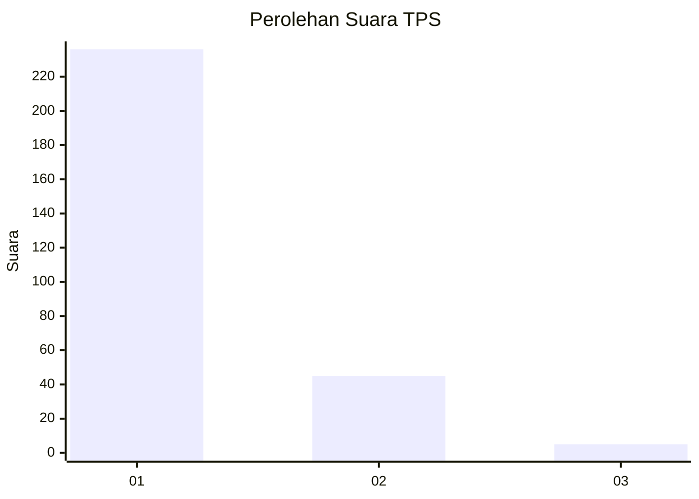
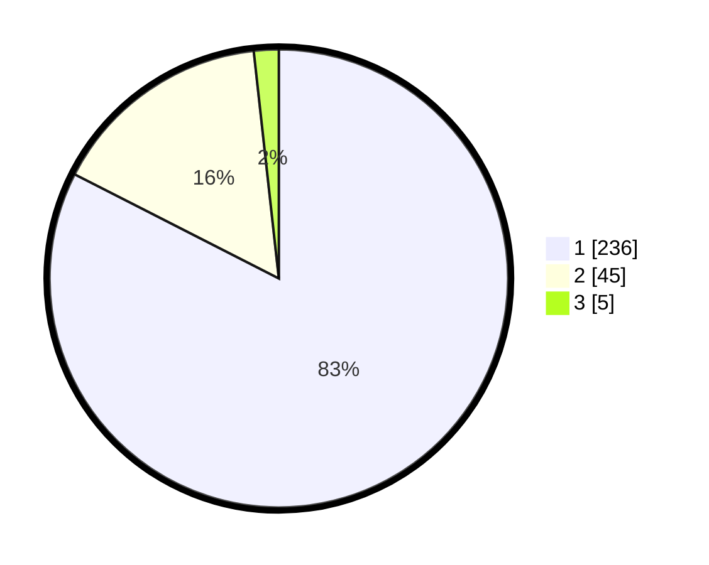

# Hasil

## Grafik

## Tabel

| No. | Nama Paslon    | Suara | Suara (raw) | Persentase |
|:--- |:-------------- | -----:| -----------:| ----------:|
| 1   | ANIES MUHAIMIN | 236   | [236][p-1]  | 82,52      |
| 2   | PRABOWO GIBRAN | 45    | [45][p-2]   | 15,73      |
| 3   | GANJAR MAHFUD  | 5     | [5][p-3]    | 1,75       |

[p-1]: https://github.com/gigit-pemilu/pemilu-2024-35-jawa-timur/blob/main/pilpres/hitung-suara/sub/35-jawa-timur/sub/28-pamekasan/sub/05-proppo/sub/2012-lenteng/sub/004-tps/sub/paslon-1.txt
[p-2]: https://github.com/gigit-pemilu/pemilu-2024-35-jawa-timur/blob/main/pilpres/hitung-suara/sub/35-jawa-timur/sub/28-pamekasan/sub/05-proppo/sub/2012-lenteng/sub/004-tps/sub/paslon-2.txt
[p-3]: https://github.com/gigit-pemilu/pemilu-2024-35-jawa-timur/blob/main/pilpres/hitung-suara/sub/35-jawa-timur/sub/28-pamekasan/sub/05-proppo/sub/2012-lenteng/sub/004-tps/sub/paslon-3.txt

## Foto C Plano

https://sirekap-obj-formc.kpu.go.id/4c27/pemilu/ppwp/35/28/05/20/12/3528052012004-20240214-234615--71f08ce7-05ae-4db7-a401-e8fd9523f514.jpg

https://sirekap-obj-formc.kpu.go.id/4c27/pemilu/ppwp/35/28/05/20/12/3528052012004-20240214-234838--878c826b-de70-47b5-ad71-04c53f3c1cf3.jpg

https://sirekap-obj-formc.kpu.go.id/4c27/pemilu/ppwp/35/28/05/20/12/3528052012004-20240214-234952--b54f2bab-5013-4acc-a3e1-1c8338a293e0.jpg

## Metadata

| Key        | Value               |
| ---------- | ------------------- |
| Time Stamp | 2024-02-15 19:30:26 |

