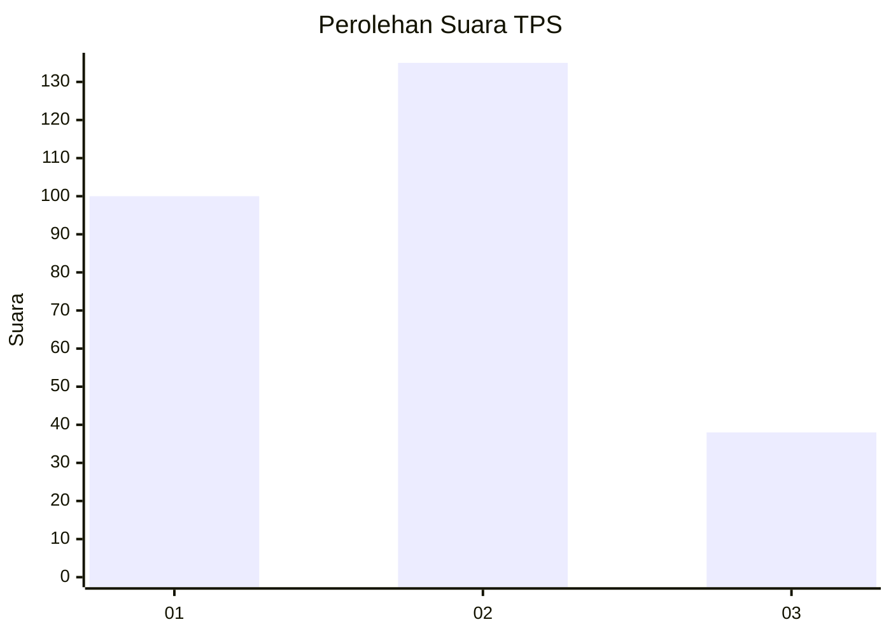
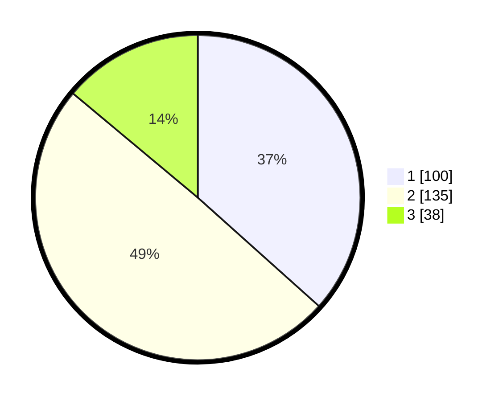

# Hasil

## Grafik

## Tabel

| No. | Nama Paslon    | Suara | Suara (raw) | Persentase |
|:--- |:-------------- | -----:| -----------:| ----------:|
| 1   | ANIES MUHAIMIN | 100   | [100][p-1]  | 36,63      |
| 2   | PRABOWO GIBRAN | 135   | [135][p-2]  | 49,45      |
| 3   | GANJAR MAHFUD  | 38    | [38][p-3]   | 13,92      |

[p-1]: https://github.com/gigit-pemilu/pemilu-2024-35-jawa-timur/blob/main/pilpres/hitung-suara/sub/35-jawa-timur/sub/28-pamekasan/sub/05-proppo/sub/2014-billa'an/sub/002-tps/sub/paslon-1.txt
[p-2]: https://github.com/gigit-pemilu/pemilu-2024-35-jawa-timur/blob/main/pilpres/hitung-suara/sub/35-jawa-timur/sub/28-pamekasan/sub/05-proppo/sub/2014-billa'an/sub/002-tps/sub/paslon-2.txt
[p-3]: https://github.com/gigit-pemilu/pemilu-2024-35-jawa-timur/blob/main/pilpres/hitung-suara/sub/35-jawa-timur/sub/28-pamekasan/sub/05-proppo/sub/2014-billa'an/sub/002-tps/sub/paslon-3.txt

## Foto C Plano

https://sirekap-obj-formc.kpu.go.id/83c2/pemilu/ppwp/35/28/05/20/14/3528052014002-20240215-000146--f5a2f3c2-191d-4f22-8da9-1b9758941945.jpg

https://sirekap-obj-formc.kpu.go.id/83c2/pemilu/ppwp/35/28/05/20/14/3528052014002-20240215-000336--ed999adc-b234-415a-b9f2-9b469087d336.jpg

https://sirekap-obj-formc.kpu.go.id/83c2/pemilu/ppwp/35/28/05/20/14/3528052014002-20240215-000504--3dfe5da7-c460-4b68-a5d7-5a6e60fe4580.jpg

## Metadata

| Key        | Value               |
| ---------- | ------------------- |
| Time Stamp | 2024-02-15 17:00:25 |

