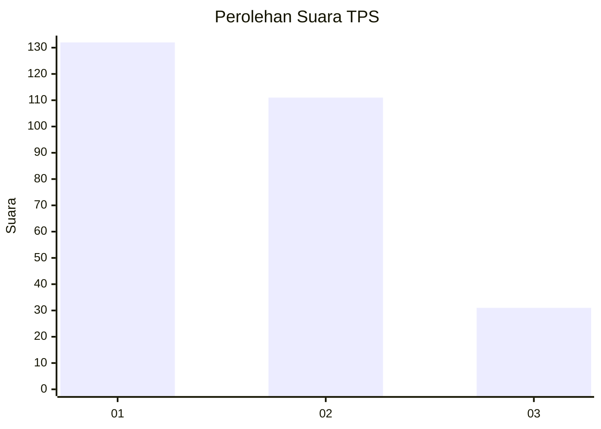
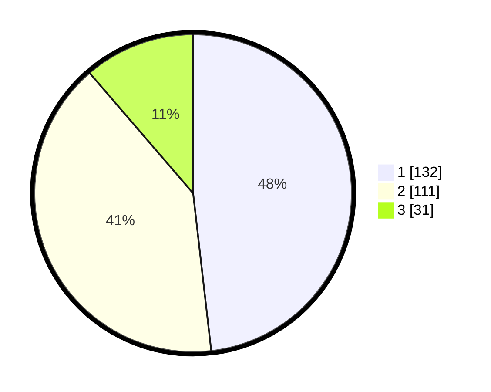

# Hasil

## Grafik

## Tabel

| No. | Nama Paslon    | Suara | Suara (raw) | Persentase |
|:--- |:-------------- | -----:| -----------:| ----------:|
| 1   | ANIES MUHAIMIN | 132   | [132][p-1]  | 48,18      |
| 2   | PRABOWO GIBRAN | 111   | [111][p-2]  | 40,51      |
| 3   | GANJAR MAHFUD  | 31    | [31][p-3]   | 11,31      |

[p-1]: https://github.com/gigit-pemilu/pemilu-2024-35-jawa-timur/blob/main/pilpres/hitung-suara/sub/35-jawa-timur/sub/28-pamekasan/sub/05-proppo/sub/2014-billa'an/sub/003-tps/sub/paslon-1.txt
[p-2]: https://github.com/gigit-pemilu/pemilu-2024-35-jawa-timur/blob/main/pilpres/hitung-suara/sub/35-jawa-timur/sub/28-pamekasan/sub/05-proppo/sub/2014-billa'an/sub/003-tps/sub/paslon-2.txt
[p-3]: https://github.com/gigit-pemilu/pemilu-2024-35-jawa-timur/blob/main/pilpres/hitung-suara/sub/35-jawa-timur/sub/28-pamekasan/sub/05-proppo/sub/2014-billa'an/sub/003-tps/sub/paslon-3.txt

## Foto C Plano

https://sirekap-obj-formc.kpu.go.id/e2a9/pemilu/ppwp/35/28/05/20/14/3528052014003-20240214-221806--fb186046-7b06-4765-ada1-4d5705d0abd2.jpg

https://sirekap-obj-formc.kpu.go.id/e2a9/pemilu/ppwp/35/28/05/20/14/3528052014003-20240214-220404--88df1ca6-0ae6-4dad-a39a-4c99ab2c726b.jpg

https://sirekap-obj-formc.kpu.go.id/e2a9/pemilu/ppwp/35/28/05/20/14/3528052014003-20240214-222056--7f7e15a1-8278-4753-9220-0778900c4715.jpg

## Metadata

| Key        | Value               |
| ---------- | ------------------- |
| Time Stamp | 2024-02-16 10:00:28 |

