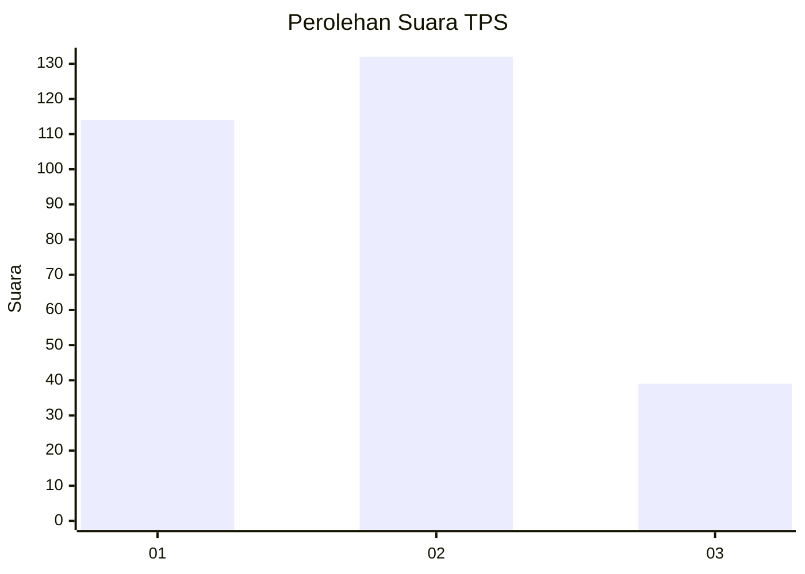
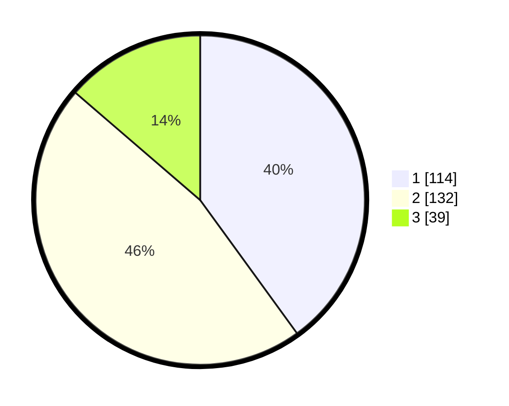

# Hasil

## Grafik

## Tabel

| No. | Nama Paslon    | Suara | Suara (raw) | Persentase |
|:--- |:-------------- | -----:| -----------:| ----------:|
| 1   | ANIES MUHAIMIN | 114   | [114][p-1]  | 40,00      |
| 2   | PRABOWO GIBRAN | 132   | [132][p-2]  | 46,32      |
| 3   | GANJAR MAHFUD  | 39    | [39][p-3]   | 13,68      |

[p-1]: https://github.com/gigit-pemilu/pemilu-2024/blob/main/pilpres/hitung-suara/sub/35-jawa-timur/sub/28-pamekasan/sub/05-proppo/sub/2014-billa'an/sub/004-tps/sub/paslon-1.txt
[p-2]: https://github.com/gigit-pemilu/pemilu-2024/blob/main/pilpres/hitung-suara/sub/35-jawa-timur/sub/28-pamekasan/sub/05-proppo/sub/2014-billa'an/sub/004-tps/sub/paslon-2.txt
[p-3]: https://github.com/gigit-pemilu/pemilu-2024/blob/main/pilpres/hitung-suara/sub/35-jawa-timur/sub/28-pamekasan/sub/05-proppo/sub/2014-billa'an/sub/004-tps/sub/paslon-3.txt

## Foto C Plano

https://sirekap-obj-formc.kpu.go.id/163a/pemilu/ppwp/35/28/05/20/14/3528052014004-20240215-074000--f5b15a92-5a0f-4115-bf1f-967b1555146f.jpg

https://sirekap-obj-formc.kpu.go.id/163a/pemilu/ppwp/35/28/05/20/14/3528052014004-20240215-074024--f5f35bbc-7b0b-48a5-8a68-be40e1e83f0d.jpg

## Metadata

| Key        | Value               |
| ---------- | ------------------- |
| Time Stamp | 2024-02-24 22:31:28 |

