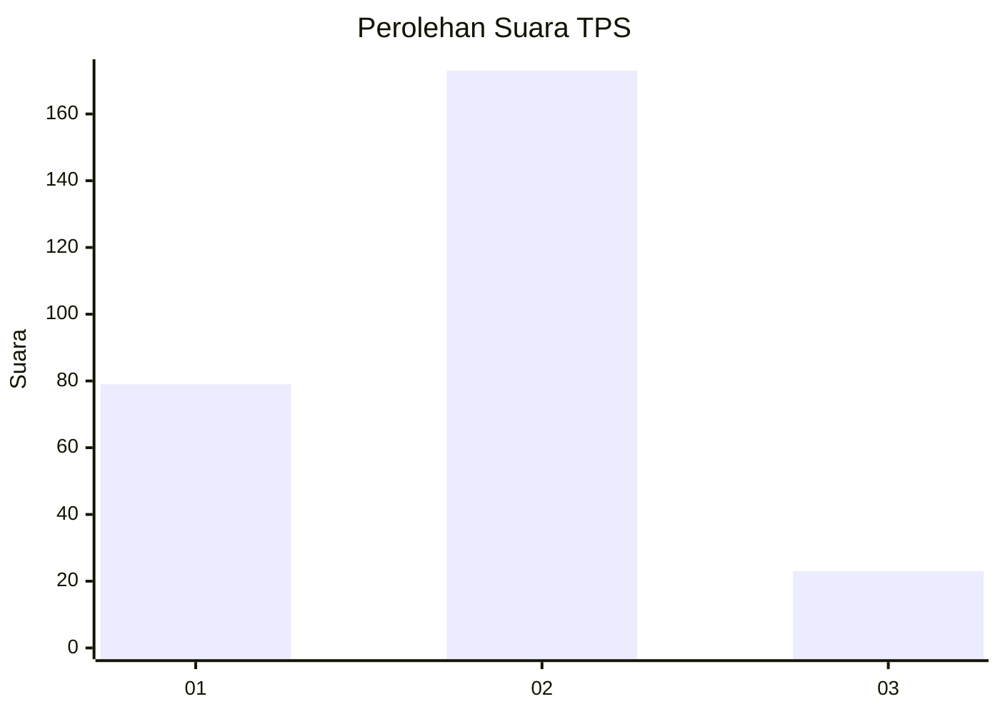
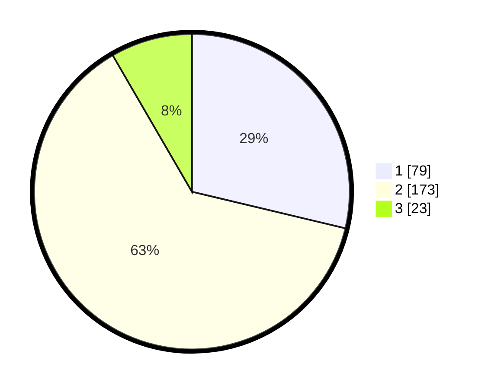

# Hasil

## Grafik

## Tabel

| No. | Nama Paslon    | Suara | Suara (raw) | Persentase |
|:--- |:-------------- | -----:| -----------:| ----------:|
| 1   | ANIES MUHAIMIN | 79    | [79][p-1]   | 28,73      |
| 2   | PRABOWO GIBRAN | 173   | [173][p-2]  | 62,91      |
| 3   | GANJAR MAHFUD  | 23    | [23][p-3]   | 8,36       |

[p-1]: https://github.com/gigit-pemilu/pemilu-2024-35-jawa-timur/blob/main/pilpres/hitung-suara/sub/35-jawa-timur/sub/28-pamekasan/sub/05-proppo/sub/2014-billa'an/sub/005-tps/sub/paslon-1.txt
[p-2]: https://github.com/gigit-pemilu/pemilu-2024-35-jawa-timur/blob/main/pilpres/hitung-suara/sub/35-jawa-timur/sub/28-pamekasan/sub/05-proppo/sub/2014-billa'an/sub/005-tps/sub/paslon-2.txt
[p-3]: https://github.com/gigit-pemilu/pemilu-2024-35-jawa-timur/blob/main/pilpres/hitung-suara/sub/35-jawa-timur/sub/28-pamekasan/sub/05-proppo/sub/2014-billa'an/sub/005-tps/sub/paslon-3.txt

## Foto C Plano

https://sirekap-obj-formc.kpu.go.id/682e/pemilu/ppwp/35/28/05/20/14/3528052014005-20240214-214204--504c6ef7-fa8f-4fa9-9c65-1c0b1c1f556f.jpg

https://sirekap-obj-formc.kpu.go.id/682e/pemilu/ppwp/35/28/05/20/14/3528052014005-20240214-214259--a2294788-3738-417b-8bf2-31743ad6ad36.jpg

https://sirekap-obj-formc.kpu.go.id/682e/pemilu/ppwp/35/28/05/20/14/3528052014005-20240214-214325--515277a0-8887-4f8a-8ba4-352b2efc21a7.jpg

## Metadata

| Key        | Value               |
| ---------- | ------------------- |
| Time Stamp | 2024-02-15 17:30:25 |

