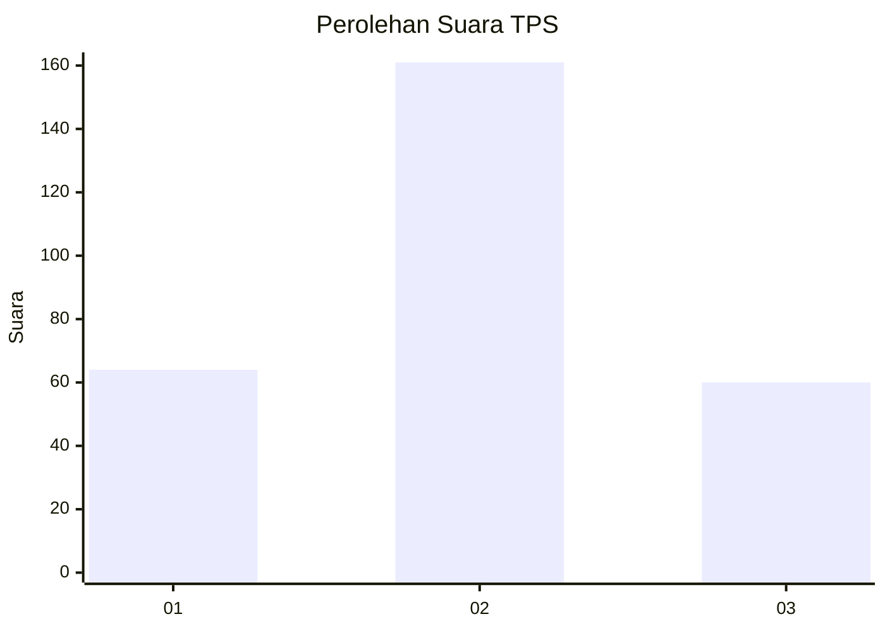
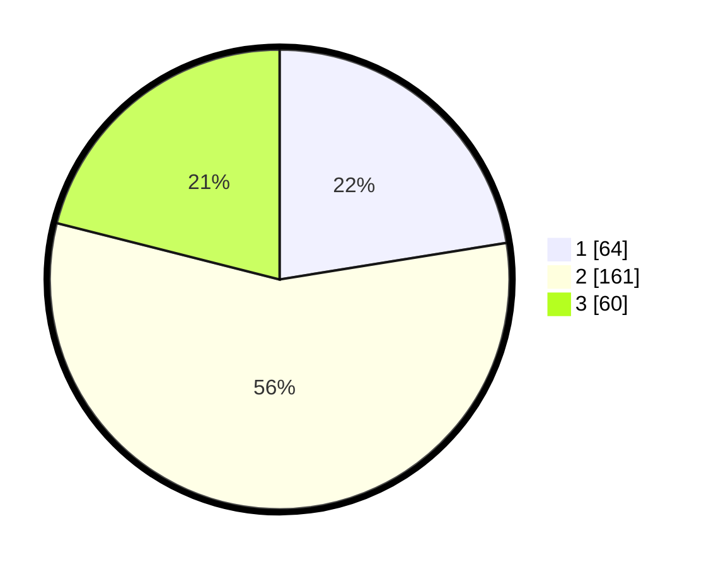

# Hasil

## Grafik

## Tabel

| No. | Nama Paslon    | Suara | Suara (raw) | Persentase |
|:--- |:-------------- | -----:| -----------:| ----------:|
| 1   | ANIES MUHAIMIN | 64    | [64][p-1]   | 22,46      |
| 2   | PRABOWO GIBRAN | 161   | [161][p-2]  | 56,49      |
| 3   | GANJAR MAHFUD  | 60    | [60][p-3]   | 21,05      |

[p-1]: https://github.com/gigit-pemilu/pemilu-2024-35-jawa-timur/blob/main/pilpres/hitung-suara/sub/35-jawa-timur/sub/28-pamekasan/sub/05-proppo/sub/2015-rangperang-laok/sub/001-tps/sub/paslon-1.txt
[p-2]: https://github.com/gigit-pemilu/pemilu-2024-35-jawa-timur/blob/main/pilpres/hitung-suara/sub/35-jawa-timur/sub/28-pamekasan/sub/05-proppo/sub/2015-rangperang-laok/sub/001-tps/sub/paslon-2.txt
[p-3]: https://github.com/gigit-pemilu/pemilu-2024-35-jawa-timur/blob/main/pilpres/hitung-suara/sub/35-jawa-timur/sub/28-pamekasan/sub/05-proppo/sub/2015-rangperang-laok/sub/001-tps/sub/paslon-3.txt

## Foto C Plano

https://sirekap-obj-formc.kpu.go.id/4dcb/pemilu/ppwp/35/28/05/20/15/3528052015001-20240214-225347--dc68b877-cb1b-42ec-923b-501a77f52ba3.jpg

https://sirekap-obj-formc.kpu.go.id/4dcb/pemilu/ppwp/35/28/05/20/15/3528052015001-20240214-225450--df043f06-6c94-4491-86b1-222d801d717a.jpg

https://sirekap-obj-formc.kpu.go.id/4dcb/pemilu/ppwp/35/28/05/20/15/3528052015001-20240214-225615--82dbcee1-fa0b-474b-b9c4-25703eff4364.jpg

## Metadata

| Key        | Value               |
| ---------- | ------------------- |
| Time Stamp | 2024-02-15 23:29:50 |

