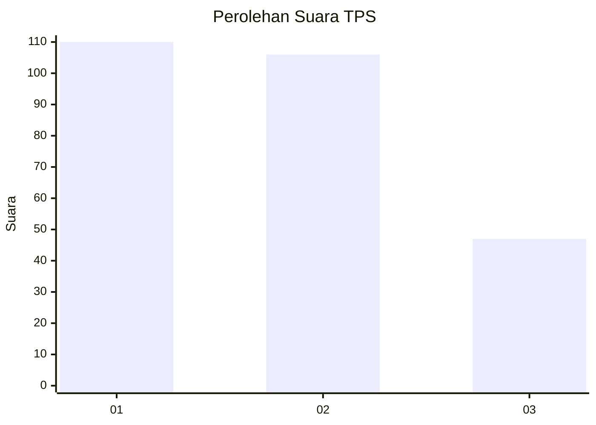
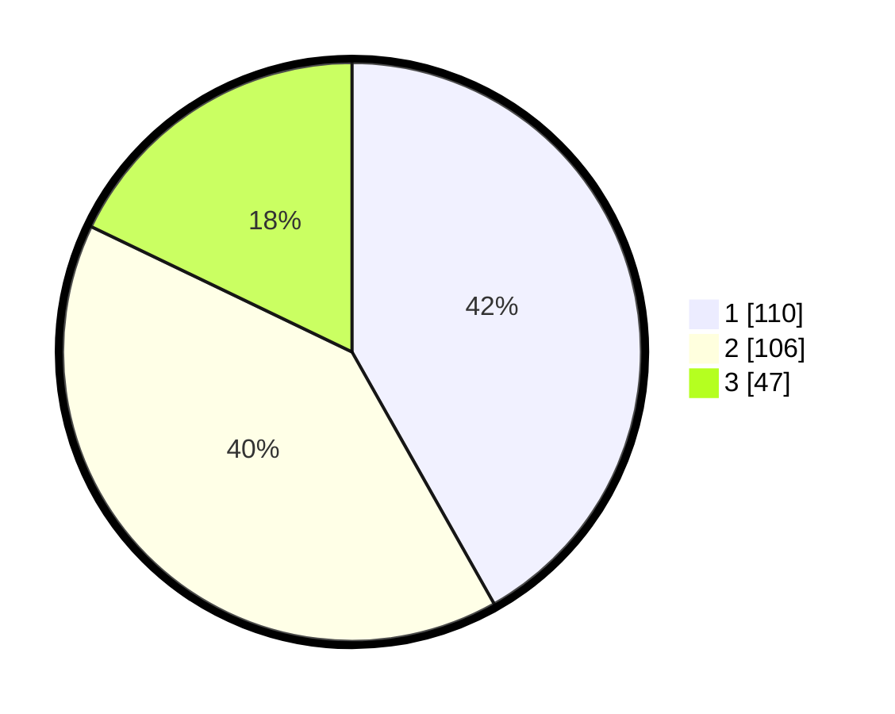

# Hasil

## Grafik

## Tabel

| No. | Nama Paslon    | Suara | Suara (raw) | Persentase |
|:--- |:-------------- | -----:| -----------:| ----------:|
| 1   | ANIES MUHAIMIN | 110   | [110][p-1]  | 41,83      |
| 2   | PRABOWO GIBRAN | 106   | [106][p-2]  | 40,30      |
| 3   | GANJAR MAHFUD  | 47    | [47][p-3]   | 17,87      |

[p-1]: https://github.com/gigit-pemilu/pemilu-2024/blob/main/pilpres/hitung-suara/sub/35-jawa-timur/sub/28-pamekasan/sub/05-proppo/sub/2015-rangperang-laok/sub/004-tps/sub/paslon-1.txt
[p-2]: https://github.com/gigit-pemilu/pemilu-2024/blob/main/pilpres/hitung-suara/sub/35-jawa-timur/sub/28-pamekasan/sub/05-proppo/sub/2015-rangperang-laok/sub/004-tps/sub/paslon-2.txt
[p-3]: https://github.com/gigit-pemilu/pemilu-2024/blob/main/pilpres/hitung-suara/sub/35-jawa-timur/sub/28-pamekasan/sub/05-proppo/sub/2015-rangperang-laok/sub/004-tps/sub/paslon-3.txt

## Foto C Plano

https://sirekap-obj-formc.kpu.go.id/1f82/pemilu/ppwp/35/28/05/20/15/3528052015004-20240215-070434--de64e470-8be2-4d1c-abdb-8b92948d42c4.jpg

https://sirekap-obj-formc.kpu.go.id/1f82/pemilu/ppwp/35/28/05/20/15/3528052015004-20240215-070512--ca91c922-b70a-417e-b206-36e717e4e032.jpg

https://sirekap-obj-formc.kpu.go.id/1f82/pemilu/ppwp/35/28/05/20/15/3528052015004-20240215-071215--96d839e4-2a19-475d-b6f0-8062fc95dd29.jpg

## Metadata

| Key        | Value               |
| ---------- | ------------------- |
| Time Stamp | 2024-02-17 16:00:02 |

