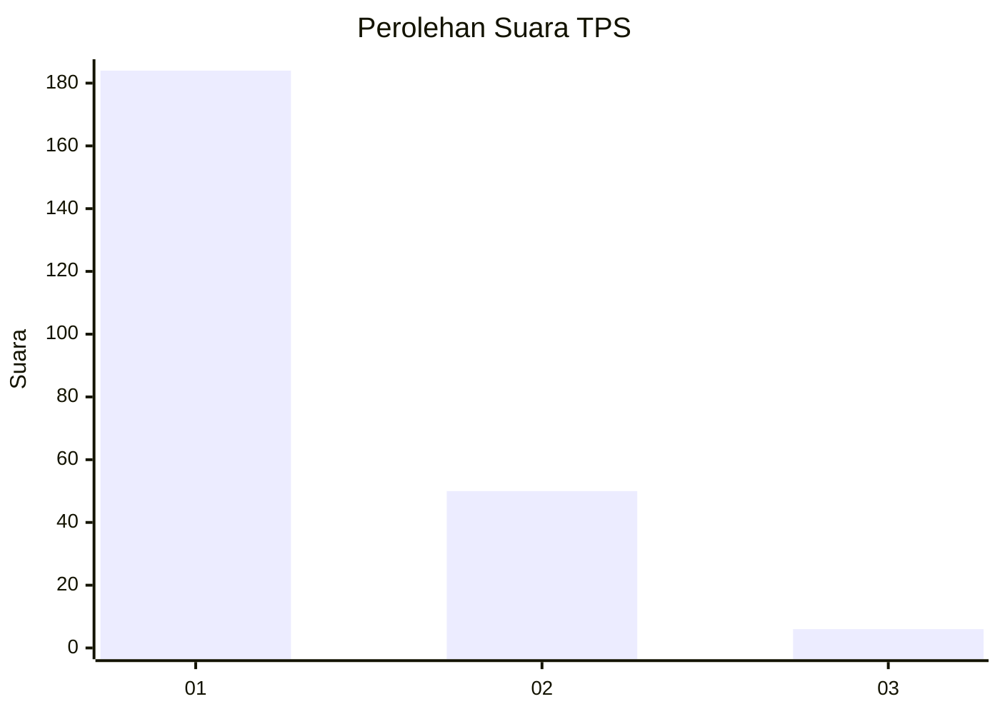
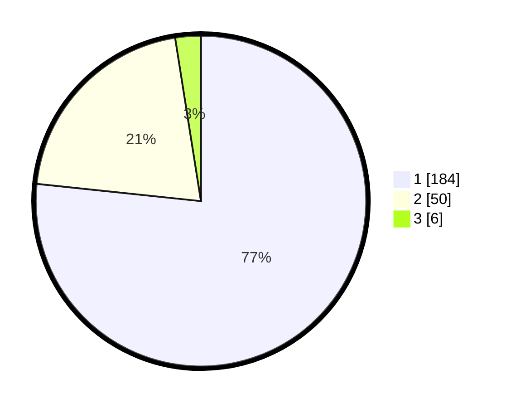

# Hasil

## Grafik

## Tabel

| No. | Nama Paslon    | Suara | Suara (raw) | Persentase |
|:--- |:-------------- | -----:| -----------:| ----------:|
| 1   | ANIES MUHAIMIN | 184   | [184][p-1]  | 76,67      |
| 2   | PRABOWO GIBRAN | 50    | [50][p-2]   | 20,83      |
| 3   | GANJAR MAHFUD  | 6     | [6][p-3]    | 2,50       |

[p-1]: https://github.com/gigit-pemilu/pemilu-2024/blob/main/pilpres/hitung-suara/sub/35-jawa-timur/sub/28-pamekasan/sub/05-proppo/sub/2015-rangperang-laok/sub/005-tps/sub/paslon-1.txt
[p-2]: https://github.com/gigit-pemilu/pemilu-2024/blob/main/pilpres/hitung-suara/sub/35-jawa-timur/sub/28-pamekasan/sub/05-proppo/sub/2015-rangperang-laok/sub/005-tps/sub/paslon-2.txt
[p-3]: https://github.com/gigit-pemilu/pemilu-2024/blob/main/pilpres/hitung-suara/sub/35-jawa-timur/sub/28-pamekasan/sub/05-proppo/sub/2015-rangperang-laok/sub/005-tps/sub/paslon-3.txt

## Foto C Plano

https://sirekap-obj-formc.kpu.go.id/d83a/pemilu/ppwp/35/28/05/20/15/3528052015005-20240214-212221--70886bdb-d882-4fb1-a7d6-27219728b604.jpg

https://sirekap-obj-formc.kpu.go.id/d83a/pemilu/ppwp/35/28/05/20/15/3528052015005-20240214-212313--f09282b3-2057-4092-be16-6c92ff2308c6.jpg

https://sirekap-obj-formc.kpu.go.id/d83a/pemilu/ppwp/35/28/05/20/15/3528052015005-20240214-212405--30c96750-fb52-45ad-adab-d0fe4bfc4cbe.jpg

## Metadata

| Key        | Value               |
| ---------- | ------------------- |
| Time Stamp | 2024-02-17 10:30:03 |

