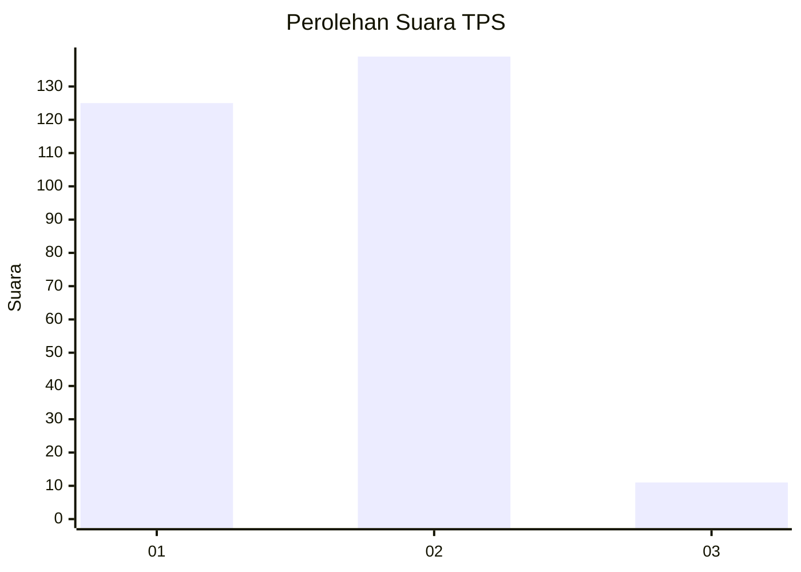
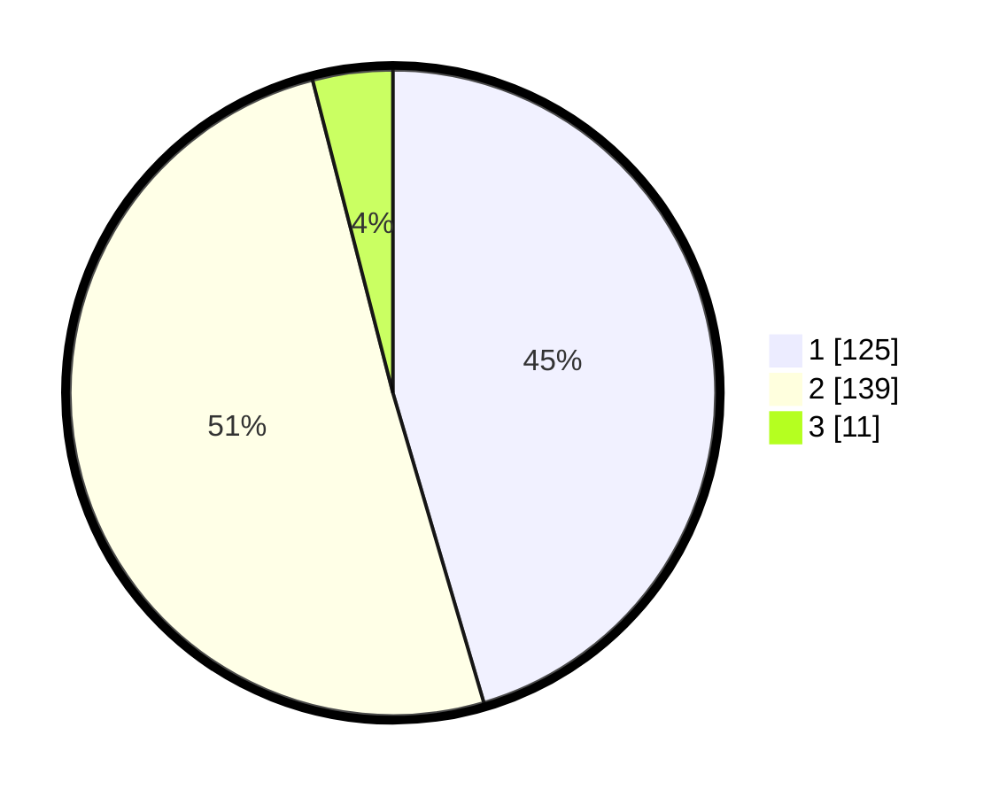

# Hasil

## Grafik

## Tabel

| No. | Nama Paslon    | Suara | Suara (raw) | Persentase |
|:--- |:-------------- | -----:| -----------:| ----------:|
| 1   | ANIES MUHAIMIN | 125   | [125][p-1]  | 45,45      |
| 2   | PRABOWO GIBRAN | 139   | [139][p-2]  | 50,55      |
| 3   | GANJAR MAHFUD  | 11    | [11][p-3]   | 4,00       |

[p-1]: https://github.com/gigit-pemilu/pemilu-2024/blob/main/pilpres/hitung-suara/sub/35-jawa-timur/sub/28-pamekasan/sub/05-proppo/sub/2016-rangperang-daja/sub/001-tps/sub/paslon-1.txt
[p-2]: https://github.com/gigit-pemilu/pemilu-2024/blob/main/pilpres/hitung-suara/sub/35-jawa-timur/sub/28-pamekasan/sub/05-proppo/sub/2016-rangperang-daja/sub/001-tps/sub/paslon-2.txt
[p-3]: https://github.com/gigit-pemilu/pemilu-2024/blob/main/pilpres/hitung-suara/sub/35-jawa-timur/sub/28-pamekasan/sub/05-proppo/sub/2016-rangperang-daja/sub/001-tps/sub/paslon-3.txt

## Foto C Plano

https://sirekap-obj-formc.kpu.go.id/7a7b/pemilu/ppwp/35/28/05/20/16/3528052016001-20240215-072101--90d5b9de-1aef-4f32-9621-709e113310e1.jpg

https://sirekap-obj-formc.kpu.go.id/7a7b/pemilu/ppwp/35/28/05/20/16/3528052016001-20240215-084845--fefe774a-2df4-4c51-87ad-9a7dc01194a7.jpg

https://sirekap-obj-formc.kpu.go.id/7a7b/pemilu/ppwp/35/28/05/20/16/3528052016001-20240215-084525--73fe7d2e-3b6c-4d2c-906d-b9eb7a68eae5.jpg

## Metadata

| Key        | Value               |
| ---------- | ------------------- |
| Time Stamp | 2024-02-17 16:00:02 |

