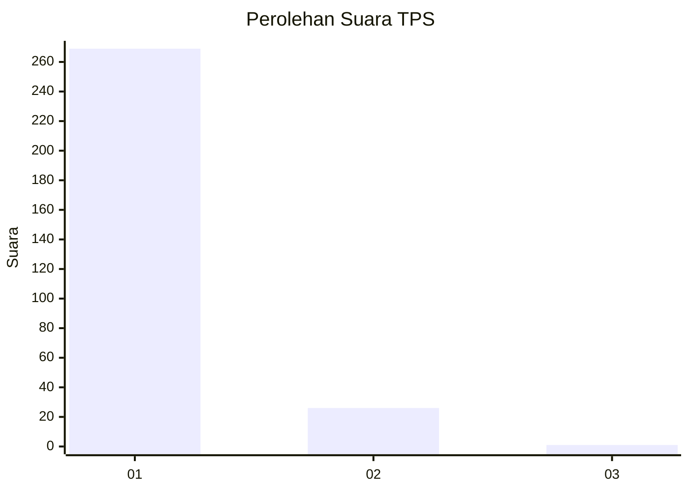
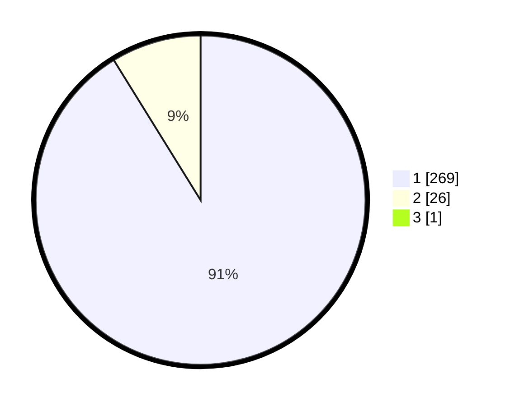

# Hasil

## Grafik

## Tabel

| No. | Nama Paslon    | Suara | Suara (raw) | Persentase |
|:--- |:-------------- | -----:| -----------:| ----------:|
| 1   | ANIES MUHAIMIN | 269   | [269][p-1]  | 90,88      |
| 2   | PRABOWO GIBRAN | 26    | [26][p-2]   | 8,78       |
| 3   | GANJAR MAHFUD  | 1     | [1][p-3]    | 0,34       |

[p-1]: https://github.com/gigit-pemilu/pemilu-2024/blob/main/pilpres/hitung-suara/sub/35-jawa-timur/sub/28-pamekasan/sub/05-proppo/sub/2016-rangperang-daja/sub/005-tps/sub/paslon-1.txt
[p-2]: https://github.com/gigit-pemilu/pemilu-2024/blob/main/pilpres/hitung-suara/sub/35-jawa-timur/sub/28-pamekasan/sub/05-proppo/sub/2016-rangperang-daja/sub/005-tps/sub/paslon-2.txt
[p-3]: https://github.com/gigit-pemilu/pemilu-2024/blob/main/pilpres/hitung-suara/sub/35-jawa-timur/sub/28-pamekasan/sub/05-proppo/sub/2016-rangperang-daja/sub/005-tps/sub/paslon-3.txt

## Foto C Plano

https://sirekap-obj-formc.kpu.go.id/1909/pemilu/ppwp/35/28/05/20/16/3528052016005-20240216-183646--6131b66e-ba3e-4d11-8644-b3cb2a127fb4.jpg

https://sirekap-obj-formc.kpu.go.id/1909/pemilu/ppwp/35/28/05/20/16/3528052016005-20240215-101003--20d8a437-466b-4780-8a11-69189a4a0a7a.jpg

https://sirekap-obj-formc.kpu.go.id/1909/pemilu/ppwp/35/28/05/20/16/3528052016005-20240215-101225--f77e8a03-f900-4f67-86f8-5c92d82d4be5.jpg

## Metadata

| Key        | Value               |
| ---------- | ------------------- |
| Time Stamp | 2024-02-16 21:01:00 |

