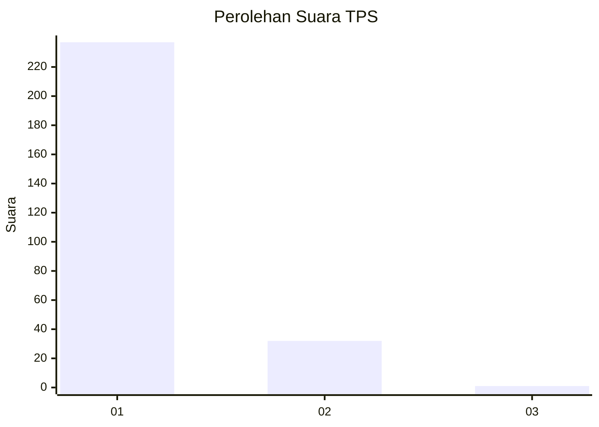
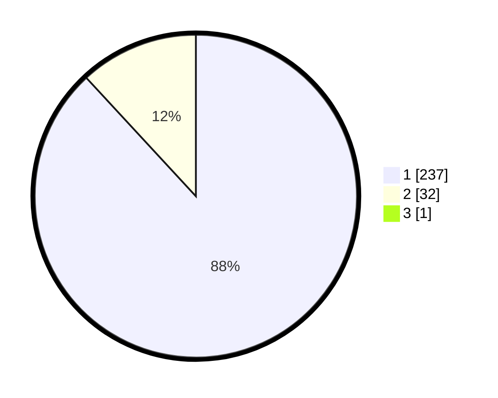

# Hasil

## Grafik

## Tabel

| No. | Nama Paslon    | Suara | Suara (raw) | Persentase |
|:--- |:-------------- | -----:| -----------:| ----------:|
| 1   | ANIES MUHAIMIN | 237   | [237][p-1]  | 87,78      |
| 2   | PRABOWO GIBRAN | 32    | [32][p-2]   | 11,85      |
| 3   | GANJAR MAHFUD  | 1     | [1][p-3]    | 0,37       |

[p-1]: https://github.com/gigit-pemilu/pemilu-2024-35-jawa-timur/blob/main/pilpres/hitung-suara/sub/35-jawa-timur/sub/28-pamekasan/sub/05-proppo/sub/2016-rangperang-daja/sub/006-tps/sub/paslon-1.txt
[p-2]: https://github.com/gigit-pemilu/pemilu-2024-35-jawa-timur/blob/main/pilpres/hitung-suara/sub/35-jawa-timur/sub/28-pamekasan/sub/05-proppo/sub/2016-rangperang-daja/sub/006-tps/sub/paslon-2.txt
[p-3]: https://github.com/gigit-pemilu/pemilu-2024-35-jawa-timur/blob/main/pilpres/hitung-suara/sub/35-jawa-timur/sub/28-pamekasan/sub/05-proppo/sub/2016-rangperang-daja/sub/006-tps/sub/paslon-3.txt

## Foto C Plano

https://sirekap-obj-formc.kpu.go.id/c29c/pemilu/ppwp/35/28/05/20/16/3528052016006-20240215-110939--e3950fa1-1413-444d-a50b-58b2bf512c54.jpg

https://sirekap-obj-formc.kpu.go.id/c29c/pemilu/ppwp/35/28/05/20/16/3528052016006-20240215-111113--afb6d6c8-c1b3-45b1-8bfd-0978c49259fa.jpg

https://sirekap-obj-formc.kpu.go.id/c29c/pemilu/ppwp/35/28/05/20/16/3528052016006-20240215-111222--8896d518-3ab1-41dc-9d1d-c78e7bac9c5d.jpg

## Metadata

| Key        | Value               |
| ---------- | ------------------- |
| Time Stamp | 2024-02-24 22:31:28 |

