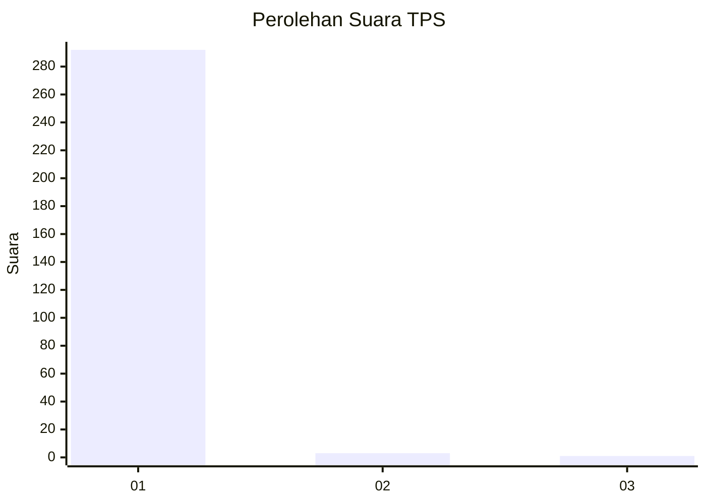
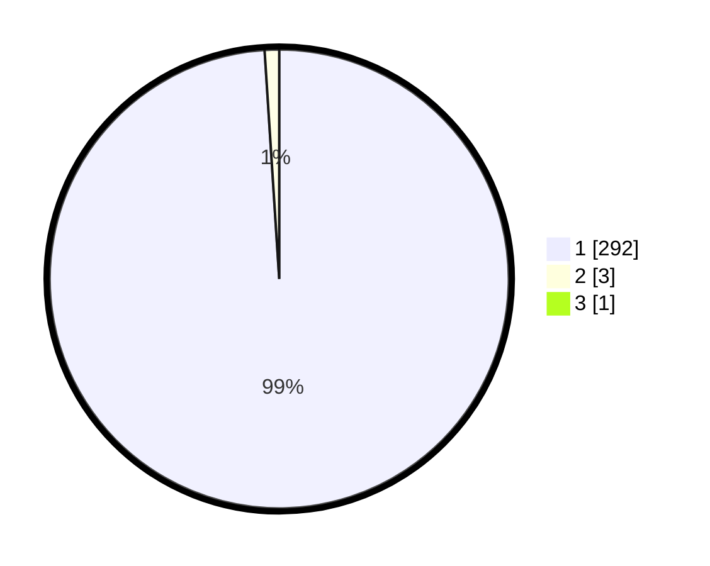

# Hasil

## Grafik

## Tabel

| No. | Nama Paslon    | Suara | Suara (raw) | Persentase |
|:--- |:-------------- | -----:| -----------:| ----------:|
| 1   | ANIES MUHAIMIN | 292   | [292][p-1]  | 98,65      |
| 2   | PRABOWO GIBRAN | 3     | [3][p-2]    | 1,01       |
| 3   | GANJAR MAHFUD  | 1     | [1][p-3]    | 0,34       |

[p-1]: https://github.com/gigit-pemilu/pemilu-2024-35-jawa-timur/blob/main/pilpres/hitung-suara/sub/35-jawa-timur/sub/28-pamekasan/sub/05-proppo/sub/2016-rangperang-daja/sub/009-tps/sub/paslon-1.txt
[p-2]: https://github.com/gigit-pemilu/pemilu-2024-35-jawa-timur/blob/main/pilpres/hitung-suara/sub/35-jawa-timur/sub/28-pamekasan/sub/05-proppo/sub/2016-rangperang-daja/sub/009-tps/sub/paslon-2.txt
[p-3]: https://github.com/gigit-pemilu/pemilu-2024-35-jawa-timur/blob/main/pilpres/hitung-suara/sub/35-jawa-timur/sub/28-pamekasan/sub/05-proppo/sub/2016-rangperang-daja/sub/009-tps/sub/paslon-3.txt

## Foto C Plano

https://sirekap-obj-formc.kpu.go.id/1950/pemilu/ppwp/35/28/05/20/16/3528052016009-20240215-001911--e4cd8710-f2d7-4310-bd39-ddbbf04c9442.jpg

https://sirekap-obj-formc.kpu.go.id/1950/pemilu/ppwp/35/28/05/20/16/3528052016009-20240215-002006--1f743af5-0cbd-4068-9ad6-eca5baa10843.jpg

https://sirekap-obj-formc.kpu.go.id/1950/pemilu/ppwp/35/28/05/20/16/3528052016009-20240215-002100--2ab1eee8-dfc7-435f-91c5-e21ca2a0eb97.jpg

## Metadata

| Key        | Value               |
| ---------- | ------------------- |
| Time Stamp | 2024-02-17 10:30:03 |

