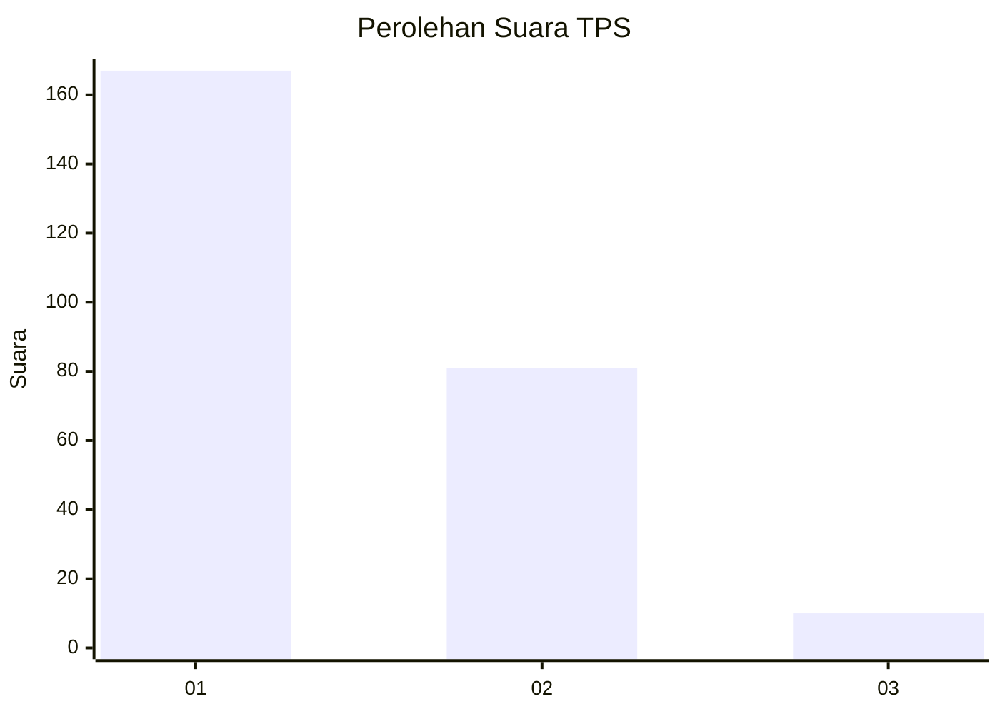
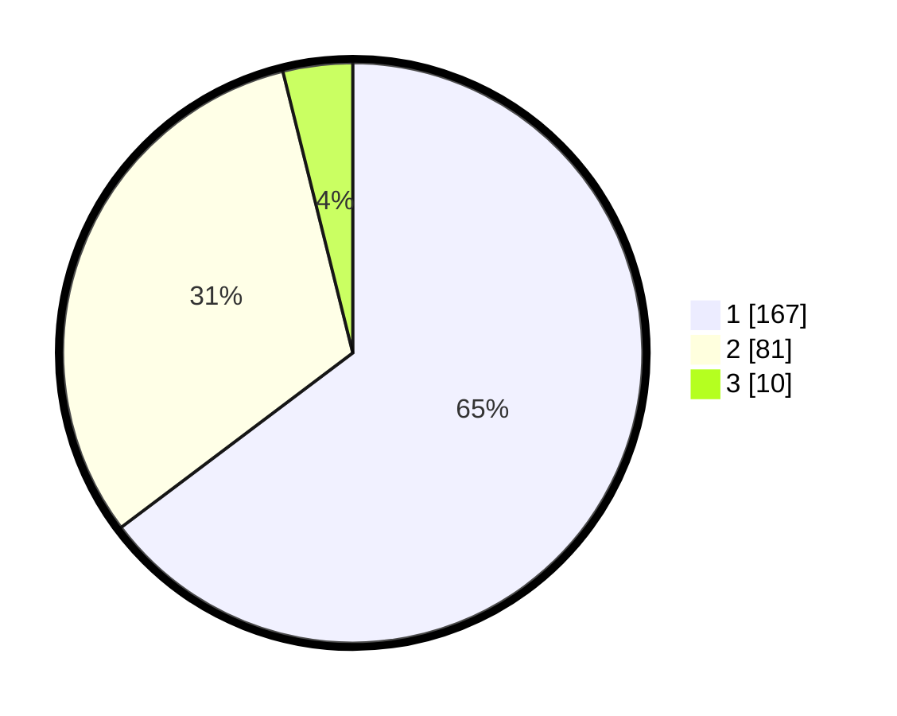

# Hasil

## Grafik

## Tabel

| No. | Nama Paslon    | Suara | Suara (raw) | Persentase |
|:--- |:-------------- | -----:| -----------:| ----------:|
| 1   | ANIES MUHAIMIN | 167   | [167][p-1]  | 64,73      |
| 2   | PRABOWO GIBRAN | 81    | [81][p-2]   | 31,40      |
| 3   | GANJAR MAHFUD  | 10    | [10][p-3]   | 3,88       |

[p-1]: https://github.com/gigit-pemilu/pemilu-2024/blob/main/pilpres/hitung-suara/sub/35-jawa-timur/sub/28-pamekasan/sub/05-proppo/sub/2017-banyubulu/sub/001-tps/sub/paslon-1.txt
[p-2]: https://github.com/gigit-pemilu/pemilu-2024/blob/main/pilpres/hitung-suara/sub/35-jawa-timur/sub/28-pamekasan/sub/05-proppo/sub/2017-banyubulu/sub/001-tps/sub/paslon-2.txt
[p-3]: https://github.com/gigit-pemilu/pemilu-2024/blob/main/pilpres/hitung-suara/sub/35-jawa-timur/sub/28-pamekasan/sub/05-proppo/sub/2017-banyubulu/sub/001-tps/sub/paslon-3.txt

## Foto C Plano

https://sirekap-obj-formc.kpu.go.id/e67c/pemilu/ppwp/35/28/05/20/17/3528052017001-20240214-232255--3357f7b8-2d37-4ac6-bfbe-c9dd91c2acf0.jpg

https://sirekap-obj-formc.kpu.go.id/e67c/pemilu/ppwp/35/28/05/20/17/3528052017001-20240214-232400--b604f455-4388-40c7-9070-17e5f0766e84.jpg

https://sirekap-obj-formc.kpu.go.id/e67c/pemilu/ppwp/35/28/05/20/17/3528052017001-20240214-232449--2366418c-4907-4f65-9f7d-87f74d7c2ae2.jpg

## Metadata

| Key        | Value               |
| ---------- | ------------------- |
| Time Stamp | 2024-02-17 10:30:03 |

