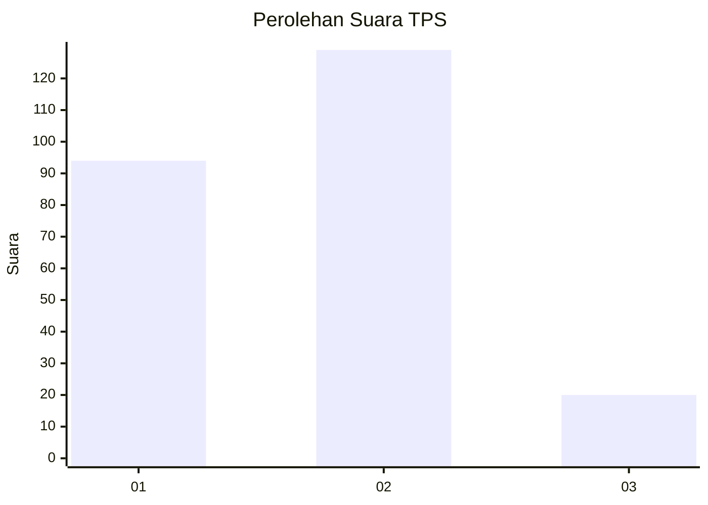
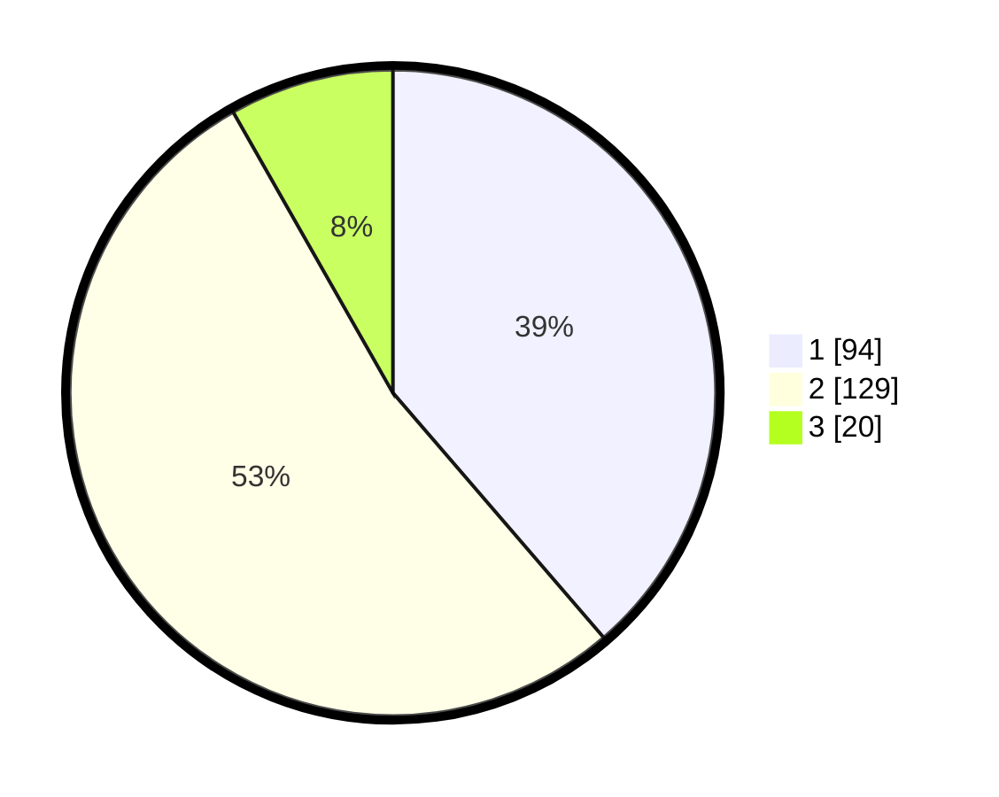

# Hasil

## Grafik

## Tabel

| No. | Nama Paslon    | Suara | Suara (raw) | Persentase |
|:--- |:-------------- | -----:| -----------:| ----------:|
| 1   | ANIES MUHAIMIN | 94    | [94][p-1]   | 38,68      |
| 2   | PRABOWO GIBRAN | 129   | [129][p-2]  | 53,09      |
| 3   | GANJAR MAHFUD  | 20    | [20][p-3]   | 8,23       |

[p-1]: https://github.com/gigit-pemilu/pemilu-2024-35-jawa-timur/blob/main/pilpres/hitung-suara/sub/35-jawa-timur/sub/28-pamekasan/sub/05-proppo/sub/2018-pangorayan/sub/004-tps/sub/paslon-1.txt
[p-2]: https://github.com/gigit-pemilu/pemilu-2024-35-jawa-timur/blob/main/pilpres/hitung-suara/sub/35-jawa-timur/sub/28-pamekasan/sub/05-proppo/sub/2018-pangorayan/sub/004-tps/sub/paslon-2.txt
[p-3]: https://github.com/gigit-pemilu/pemilu-2024-35-jawa-timur/blob/main/pilpres/hitung-suara/sub/35-jawa-timur/sub/28-pamekasan/sub/05-proppo/sub/2018-pangorayan/sub/004-tps/sub/paslon-3.txt

## Foto C Plano

https://sirekap-obj-formc.kpu.go.id/e8eb/pemilu/ppwp/35/28/05/20/18/3528052018004-20240214-215301--0e152062-a141-4376-b943-9a585c43e427.jpg

https://sirekap-obj-formc.kpu.go.id/e8eb/pemilu/ppwp/35/28/05/20/18/3528052018004-20240214-215426--3169d45e-b722-4e4a-8e25-6aceb2a1b348.jpg

https://sirekap-obj-formc.kpu.go.id/e8eb/pemilu/ppwp/35/28/05/20/18/3528052018004-20240214-215554--e652164c-7b16-4779-ab47-40fe80768088.jpg

## Metadata

| Key        | Value               |
| ---------- | ------------------- |
| Time Stamp | 2024-02-17 10:30:03 |

