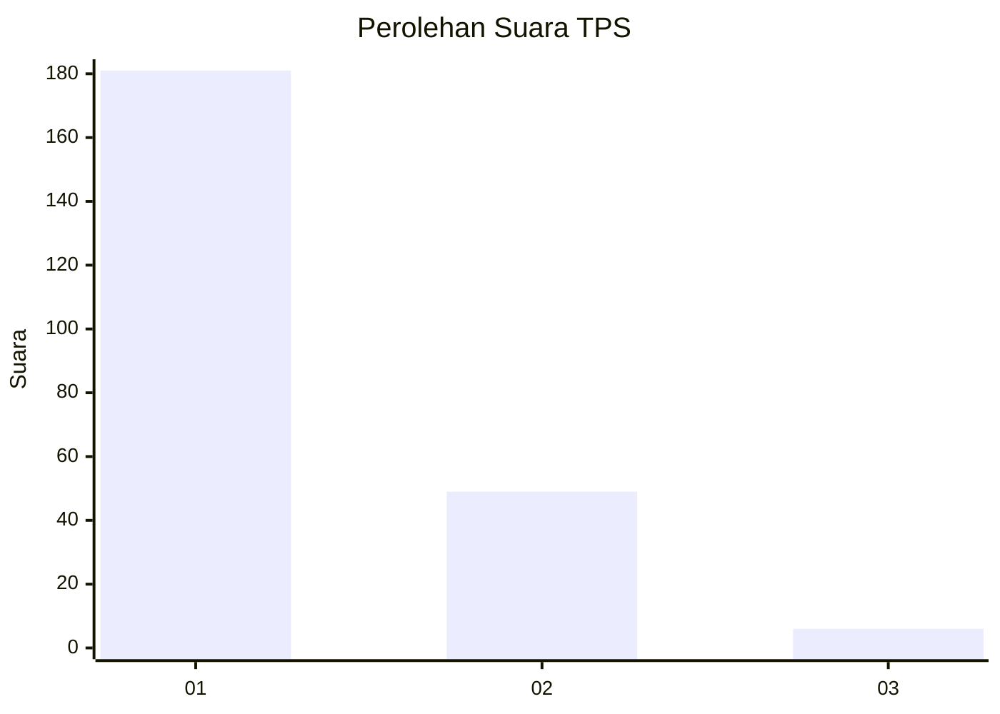
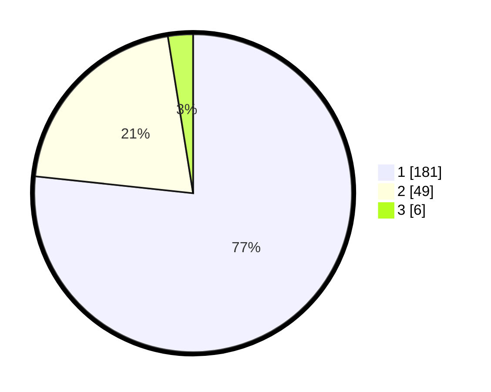

# Hasil

## Grafik

## Tabel

| No. | Nama Paslon    | Suara | Suara (raw) | Persentase |
|:--- |:-------------- | -----:| -----------:| ----------:|
| 1   | ANIES MUHAIMIN | 181   | [181][p-1]  | 76,69      |
| 2   | PRABOWO GIBRAN | 49    | [49][p-2]   | 20,76      |
| 3   | GANJAR MAHFUD  | 6     | [6][p-3]    | 2,54       |

[p-1]: https://github.com/gigit-pemilu/pemilu-2024/blob/main/pilpres/hitung-suara/sub/35-jawa-timur/sub/28-pamekasan/sub/05-proppo/sub/2020-mapper/sub/002-tps/sub/paslon-1.txt
[p-2]: https://github.com/gigit-pemilu/pemilu-2024/blob/main/pilpres/hitung-suara/sub/35-jawa-timur/sub/28-pamekasan/sub/05-proppo/sub/2020-mapper/sub/002-tps/sub/paslon-2.txt
[p-3]: https://github.com/gigit-pemilu/pemilu-2024/blob/main/pilpres/hitung-suara/sub/35-jawa-timur/sub/28-pamekasan/sub/05-proppo/sub/2020-mapper/sub/002-tps/sub/paslon-3.txt

## Foto C Plano

https://sirekap-obj-formc.kpu.go.id/ace2/pemilu/ppwp/35/28/05/20/20/3528052020002-20240215-073727--cf19e3e0-a7f8-44cd-8b95-f21094fae571.jpg

https://sirekap-obj-formc.kpu.go.id/ace2/pemilu/ppwp/35/28/05/20/20/3528052020002-20240215-073925--a5d86d52-d105-4c19-97b9-0da03a7b173d.jpg

https://sirekap-obj-formc.kpu.go.id/ace2/pemilu/ppwp/35/28/05/20/20/3528052020002-20240215-074153--3a96ca01-b1df-4c16-8804-06d94d2a9de3.jpg

## Metadata

| Key        | Value               |
| ---------- | ------------------- |
| Time Stamp | 2024-02-15 18:30:25 |

