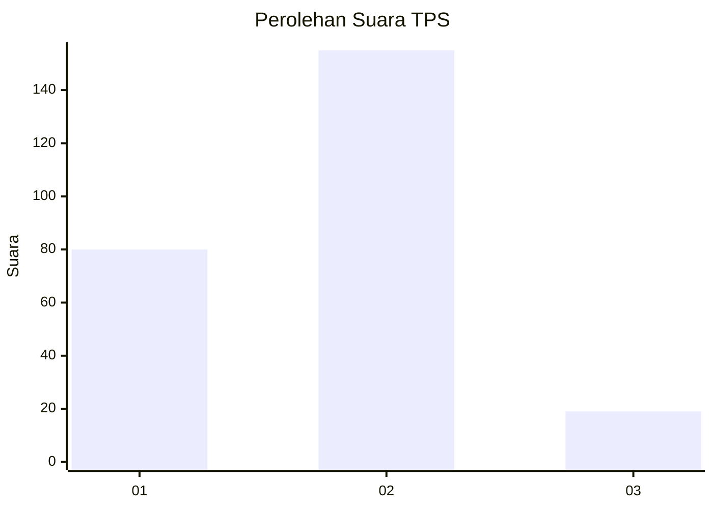
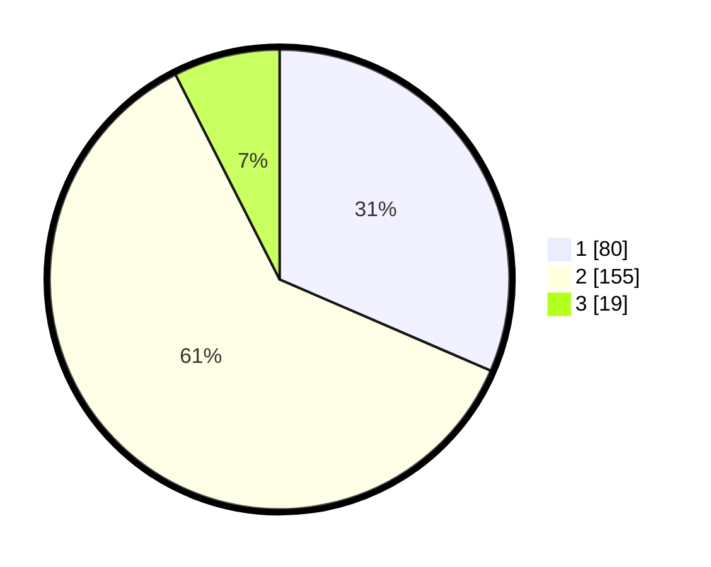

# Hasil

## Grafik

## Tabel

| No. | Nama Paslon    | Suara | Suara (raw) | Persentase |
|:--- |:-------------- | -----:| -----------:| ----------:|
| 1   | ANIES MUHAIMIN | 80    | [80][p-1]   | 31,50      |
| 2   | PRABOWO GIBRAN | 155   | [155][p-2]  | 61,02      |
| 3   | GANJAR MAHFUD  | 19    | [19][p-3]   | 7,48       |

[p-1]: https://github.com/gigit-pemilu/pemilu-2024-35-jawa-timur/blob/main/pilpres/hitung-suara/sub/35-jawa-timur/sub/28-pamekasan/sub/05-proppo/sub/2021-proppo/sub/002-tps/sub/paslon-1.txt
[p-2]: https://github.com/gigit-pemilu/pemilu-2024-35-jawa-timur/blob/main/pilpres/hitung-suara/sub/35-jawa-timur/sub/28-pamekasan/sub/05-proppo/sub/2021-proppo/sub/002-tps/sub/paslon-2.txt
[p-3]: https://github.com/gigit-pemilu/pemilu-2024-35-jawa-timur/blob/main/pilpres/hitung-suara/sub/35-jawa-timur/sub/28-pamekasan/sub/05-proppo/sub/2021-proppo/sub/002-tps/sub/paslon-3.txt

## Foto C Plano

https://sirekap-obj-formc.kpu.go.id/fe86/pemilu/ppwp/35/28/05/20/21/3528052021002-20240215-084006--24f747cb-1d27-401d-abd7-34b06b276c85.jpg

https://sirekap-obj-formc.kpu.go.id/fe86/pemilu/ppwp/35/28/05/20/21/3528052021002-20240215-084509--18f61a63-9d3f-4bfa-918f-de0c096c60f8.jpg

https://sirekap-obj-formc.kpu.go.id/fe86/pemilu/ppwp/35/28/05/20/21/3528052021002-20240215-084806--769bfa40-bfdc-4637-b819-fbefe5c96039.jpg

## Metadata

| Key        | Value               |
| ---------- | ------------------- |
| Time Stamp | 2024-02-17 11:00:02 |

