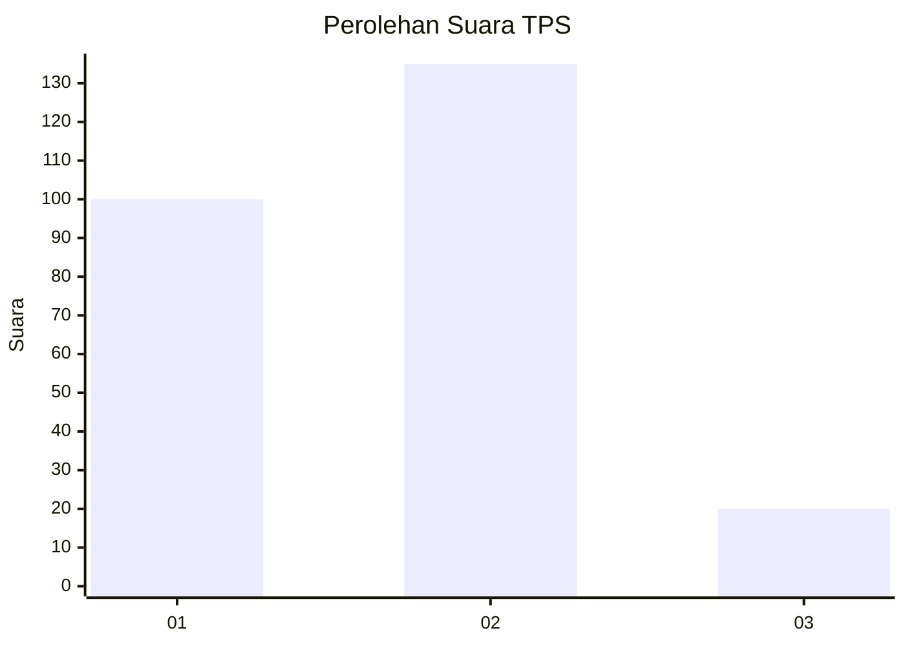
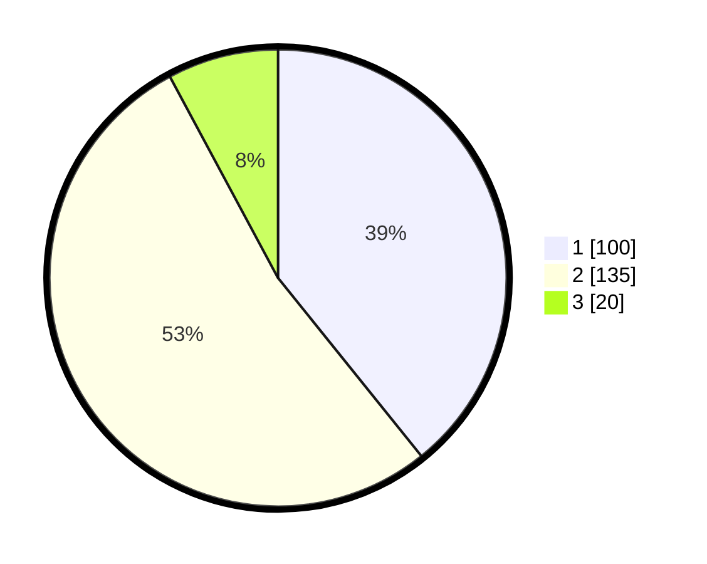

# Hasil

## Grafik

## Tabel

| No. | Nama Paslon    | Suara | Suara (raw) | Persentase |
|:--- |:-------------- | -----:| -----------:| ----------:|
| 1   | ANIES MUHAIMIN | 100   | [100][p-1]  | 39,22      |
| 2   | PRABOWO GIBRAN | 135   | [135][p-2]  | 52,94      |
| 3   | GANJAR MAHFUD  | 20    | [20][p-3]   | 7,84       |

[p-1]: https://github.com/gigit-pemilu/pemilu-2024-35-jawa-timur/blob/main/pilpres/hitung-suara/sub/35-jawa-timur/sub/28-pamekasan/sub/05-proppo/sub/2021-proppo/sub/003-tps/sub/paslon-1.txt
[p-2]: https://github.com/gigit-pemilu/pemilu-2024-35-jawa-timur/blob/main/pilpres/hitung-suara/sub/35-jawa-timur/sub/28-pamekasan/sub/05-proppo/sub/2021-proppo/sub/003-tps/sub/paslon-2.txt
[p-3]: https://github.com/gigit-pemilu/pemilu-2024-35-jawa-timur/blob/main/pilpres/hitung-suara/sub/35-jawa-timur/sub/28-pamekasan/sub/05-proppo/sub/2021-proppo/sub/003-tps/sub/paslon-3.txt

## Foto C Plano

https://sirekap-obj-formc.kpu.go.id/0f5e/pemilu/ppwp/35/28/05/20/21/3528052021003-20240215-132410--414dfcc0-636a-40b4-bf06-abcc734454b3.jpg

https://sirekap-obj-formc.kpu.go.id/0f5e/pemilu/ppwp/35/28/05/20/21/3528052021003-20240215-132458--0c4c50ee-9408-4b3b-b9be-a23e045af0f3.jpg

https://sirekap-obj-formc.kpu.go.id/0f5e/pemilu/ppwp/35/28/05/20/21/3528052021003-20240215-132539--816c0843-81b0-41c7-9755-3640203c2f86.jpg

## Metadata

| Key        | Value               |
| ---------- | ------------------- |
| Time Stamp | 2024-02-17 16:00:02 |

