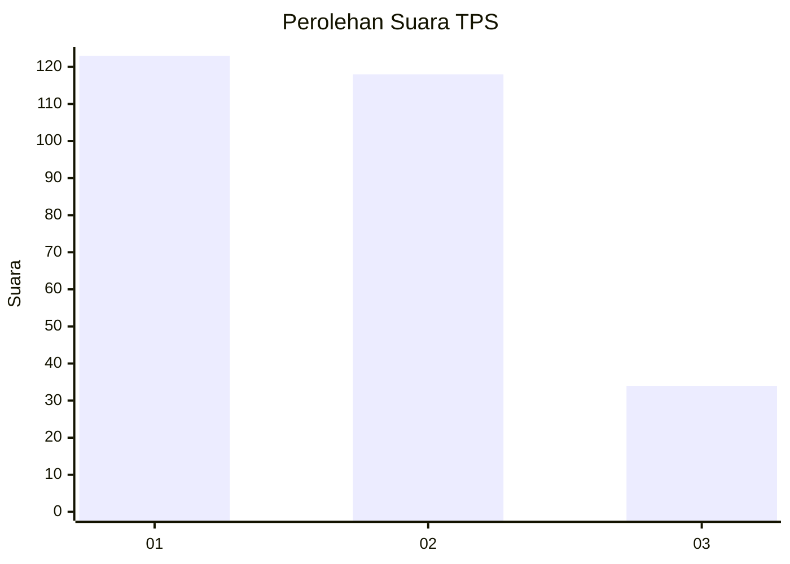
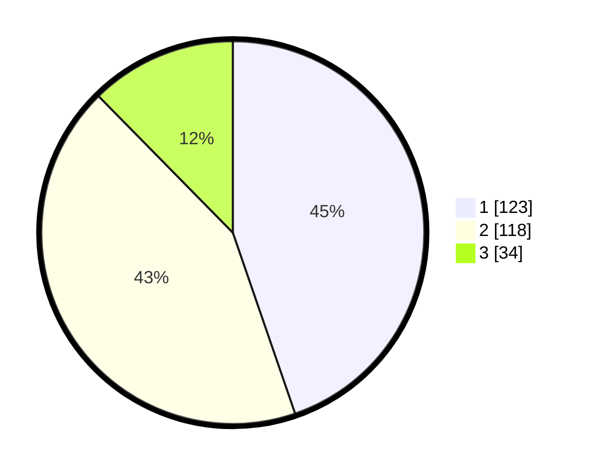

# Hasil

## Grafik

## Tabel

| No. | Nama Paslon    | Suara | Suara (raw) | Persentase |
|:--- |:-------------- | -----:| -----------:| ----------:|
| 1   | ANIES MUHAIMIN | 123   | [123][p-1]  | 44,73      |
| 2   | PRABOWO GIBRAN | 118   | [118][p-2]  | 42,91      |
| 3   | GANJAR MAHFUD  | 34    | [34][p-3]   | 12,36      |

[p-1]: https://github.com/gigit-pemilu/pemilu-2024/blob/main/pilpres/hitung-suara/sub/35-jawa-timur/sub/28-pamekasan/sub/05-proppo/sub/2021-proppo/sub/004-tps/sub/paslon-1.txt
[p-2]: https://github.com/gigit-pemilu/pemilu-2024/blob/main/pilpres/hitung-suara/sub/35-jawa-timur/sub/28-pamekasan/sub/05-proppo/sub/2021-proppo/sub/004-tps/sub/paslon-2.txt
[p-3]: https://github.com/gigit-pemilu/pemilu-2024/blob/main/pilpres/hitung-suara/sub/35-jawa-timur/sub/28-pamekasan/sub/05-proppo/sub/2021-proppo/sub/004-tps/sub/paslon-3.txt

## Foto C Plano

https://sirekap-obj-formc.kpu.go.id/9d9f/pemilu/ppwp/35/28/05/20/21/3528052021004-20240215-101634--526546c0-30b5-4695-8b7d-f17402a01fbb.jpg

https://sirekap-obj-formc.kpu.go.id/9d9f/pemilu/ppwp/35/28/05/20/21/3528052021004-20240215-101758--39a82ae5-9819-439d-afdf-bb95e26ce0fb.jpg

https://sirekap-obj-formc.kpu.go.id/9d9f/pemilu/ppwp/35/28/05/20/21/3528052021004-20240215-101836--b6610ed2-83b7-4a0a-901f-bc6ea3cf0eeb.jpg

## Metadata

| Key        | Value               |
| ---------- | ------------------- |
| Time Stamp | 2024-02-17 16:00:02 |

