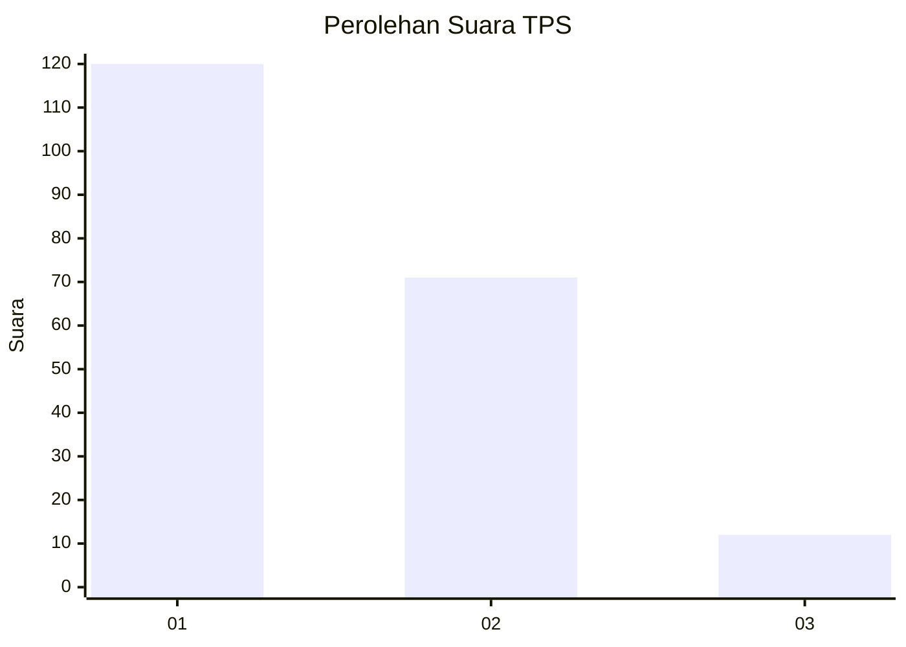
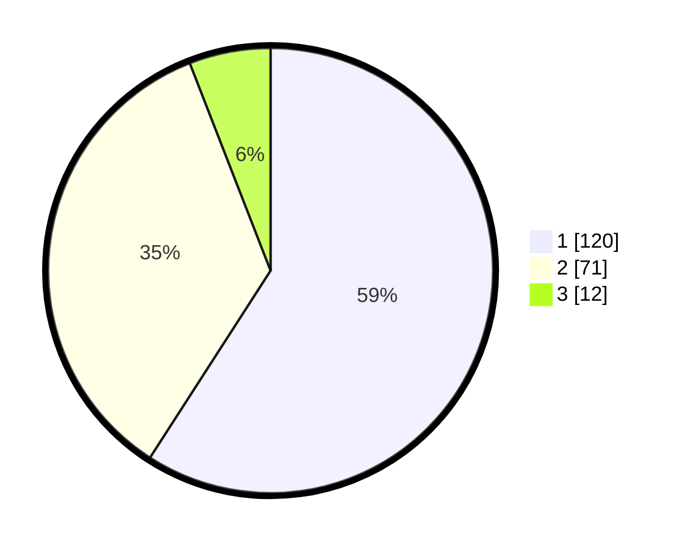

# Hasil

## Grafik

## Tabel

| No. | Nama Paslon    | Suara | Suara (raw) | Persentase |
|:--- |:-------------- | -----:| -----------:| ----------:|
| 1   | ANIES MUHAIMIN | 120   | [120][p-1]  | 59,11      |
| 2   | PRABOWO GIBRAN | 71    | [71][p-2]   | 34,98      |
| 3   | GANJAR MAHFUD  | 12    | [12][p-3]   | 5,91       |

[p-1]: https://github.com/gigit-pemilu/pemilu-2024/blob/main/pilpres/hitung-suara/sub/35-jawa-timur/sub/28-pamekasan/sub/05-proppo/sub/2021-proppo/sub/005-tps/sub/paslon-1.txt
[p-2]: https://github.com/gigit-pemilu/pemilu-2024/blob/main/pilpres/hitung-suara/sub/35-jawa-timur/sub/28-pamekasan/sub/05-proppo/sub/2021-proppo/sub/005-tps/sub/paslon-2.txt
[p-3]: https://github.com/gigit-pemilu/pemilu-2024/blob/main/pilpres/hitung-suara/sub/35-jawa-timur/sub/28-pamekasan/sub/05-proppo/sub/2021-proppo/sub/005-tps/sub/paslon-3.txt

## Foto C Plano

https://sirekap-obj-formc.kpu.go.id/0a74/pemilu/ppwp/35/28/05/20/21/3528052021005-20240215-121339--a94969a7-01d8-4660-8fdd-74b1588dcbe7.jpg

https://sirekap-obj-formc.kpu.go.id/0a74/pemilu/ppwp/35/28/05/20/21/3528052021005-20240215-121520--1d3de4c6-4d6c-4da5-87a5-cdb0e522d6eb.jpg

https://sirekap-obj-formc.kpu.go.id/0a74/pemilu/ppwp/35/28/05/20/21/3528052021005-20240215-121632--c86dc6e1-aed6-488f-ab4b-f5bb89a39aaf.jpg

## Metadata

| Key        | Value               |
| ---------- | ------------------- |
| Time Stamp | 2024-02-17 16:00:02 |

