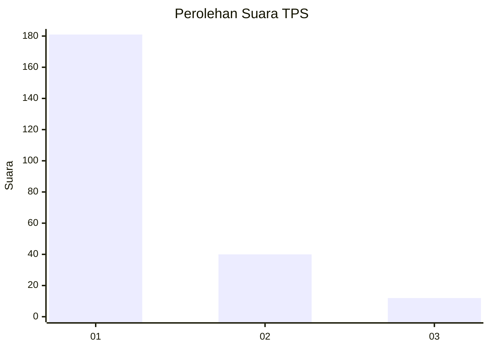
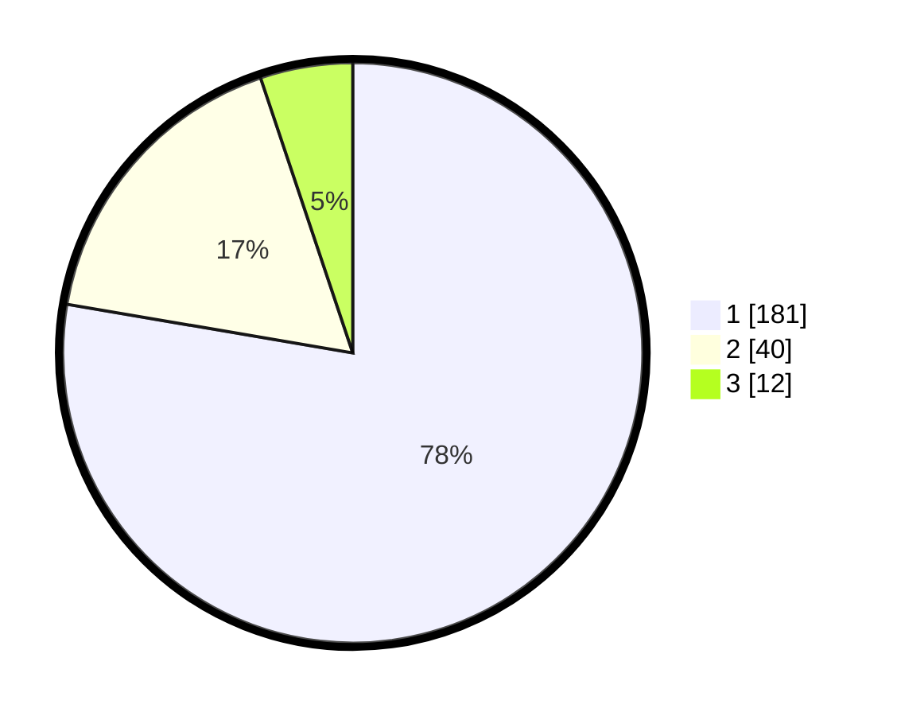

# Hasil

## Grafik

## Tabel

| No. | Nama Paslon    | Suara | Suara (raw) | Persentase |
|:--- |:-------------- | -----:| -----------:| ----------:|
| 1   | ANIES MUHAIMIN | 181   | [181][p-1]  | 77,68      |
| 2   | PRABOWO GIBRAN | 40    | [40][p-2]   | 17,17      |
| 3   | GANJAR MAHFUD  | 12    | [12][p-3]   | 5,15       |

[p-1]: https://github.com/gigit-pemilu/pemilu-2024/blob/main/pilpres/hitung-suara/sub/35-jawa-timur/sub/28-pamekasan/sub/05-proppo/sub/2021-proppo/sub/006-tps/sub/paslon-1.txt
[p-2]: https://github.com/gigit-pemilu/pemilu-2024/blob/main/pilpres/hitung-suara/sub/35-jawa-timur/sub/28-pamekasan/sub/05-proppo/sub/2021-proppo/sub/006-tps/sub/paslon-2.txt
[p-3]: https://github.com/gigit-pemilu/pemilu-2024/blob/main/pilpres/hitung-suara/sub/35-jawa-timur/sub/28-pamekasan/sub/05-proppo/sub/2021-proppo/sub/006-tps/sub/paslon-3.txt

## Foto C Plano

https://sirekap-obj-formc.kpu.go.id/9625/pemilu/ppwp/35/28/05/20/21/3528052021006-20240215-155854--e5bc4508-9d5d-48e4-bdaa-4a7f8b0a2aeb.jpg

https://sirekap-obj-formc.kpu.go.id/9625/pemilu/ppwp/35/28/05/20/21/3528052021006-20240215-160020--24df2891-45b4-4e2a-92c2-c0b29ed9e520.jpg

https://sirekap-obj-formc.kpu.go.id/9625/pemilu/ppwp/35/28/05/20/21/3528052021006-20240215-155945--d771b5da-6dbd-4520-953d-847f1d818dca.jpg

## Metadata

| Key        | Value               |
| ---------- | ------------------- |
| Time Stamp | 2024-02-17 14:45:18 |

