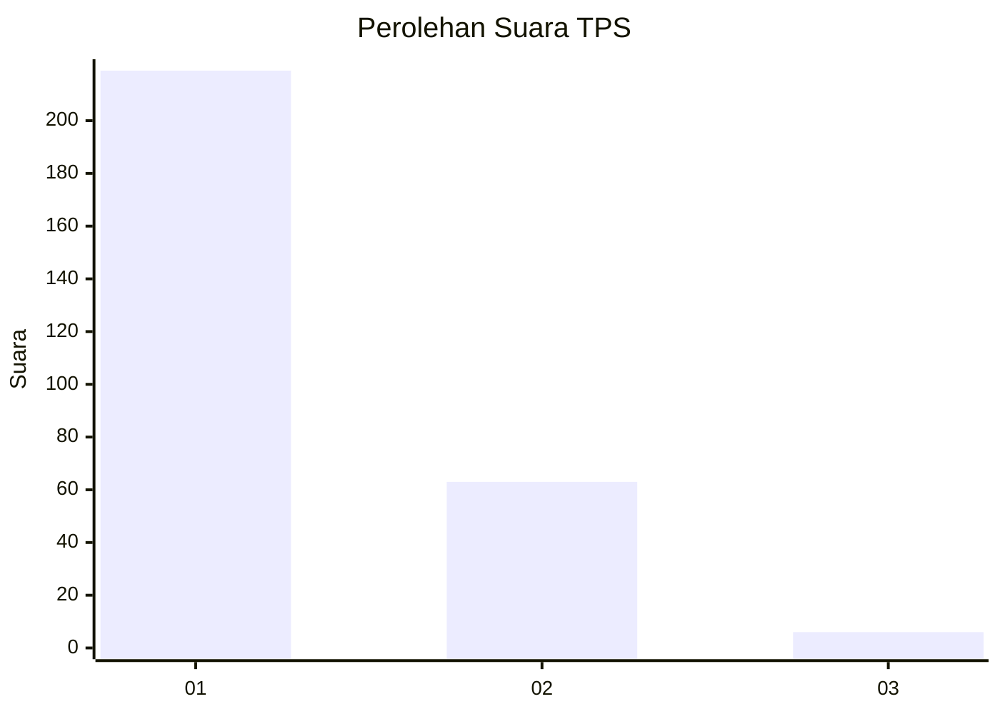
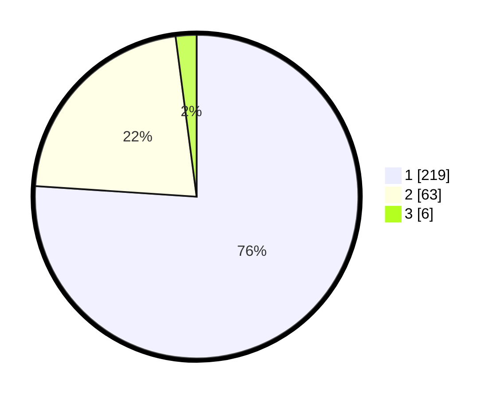

# Hasil

## Grafik

## Tabel

| No. | Nama Paslon    | Suara | Suara (raw) | Persentase |
|:--- |:-------------- | -----:| -----------:| ----------:|
| 1   | ANIES MUHAIMIN | 219   | [219][p-1]  | 76,04      |
| 2   | PRABOWO GIBRAN | 63    | [63][p-2]   | 21,88      |
| 3   | GANJAR MAHFUD  | 6     | [6][p-3]    | 2,08       |

[p-1]: https://github.com/gigit-pemilu/pemilu-2024-35-jawa-timur/blob/main/pilpres/hitung-suara/sub/35-jawa-timur/sub/28-pamekasan/sub/05-proppo/sub/2022-jambringin/sub/001-tps/sub/paslon-1.txt
[p-2]: https://github.com/gigit-pemilu/pemilu-2024-35-jawa-timur/blob/main/pilpres/hitung-suara/sub/35-jawa-timur/sub/28-pamekasan/sub/05-proppo/sub/2022-jambringin/sub/001-tps/sub/paslon-2.txt
[p-3]: https://github.com/gigit-pemilu/pemilu-2024-35-jawa-timur/blob/main/pilpres/hitung-suara/sub/35-jawa-timur/sub/28-pamekasan/sub/05-proppo/sub/2022-jambringin/sub/001-tps/sub/paslon-3.txt

## Foto C Plano

https://sirekap-obj-formc.kpu.go.id/8502/pemilu/ppwp/35/28/05/20/22/3528052022001-20240214-214129--5e752ff4-c7d5-4f77-bad3-63b2ca840277.jpg

https://sirekap-obj-formc.kpu.go.id/8502/pemilu/ppwp/35/28/05/20/22/3528052022001-20240214-214326--51e035de-53ce-4243-b02e-9024cae24c6a.jpg

https://sirekap-obj-formc.kpu.go.id/8502/pemilu/ppwp/35/28/05/20/22/3528052022001-20240214-214828--1eeda10d-ef01-41ab-aec6-20d880952ba2.jpg

## Metadata

| Key        | Value               |
| ---------- | ------------------- |
| Time Stamp | 2024-02-17 14:45:18 |

