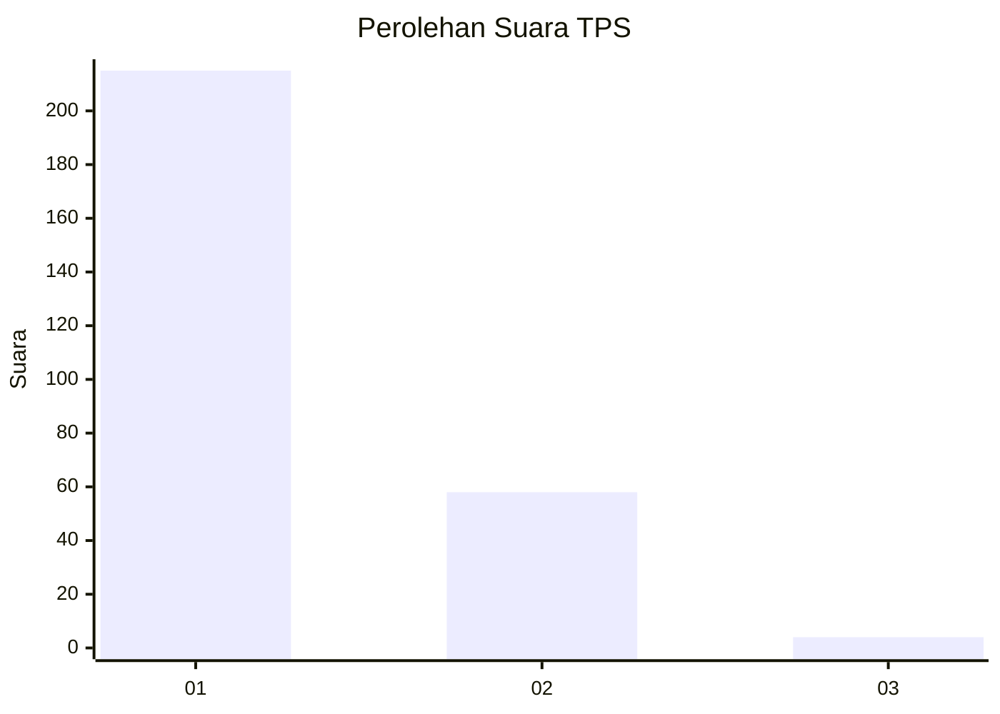
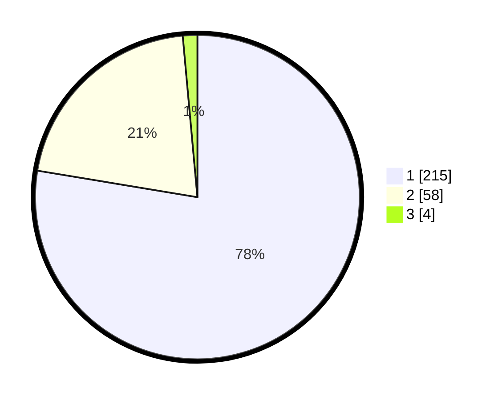

# Hasil

## Grafik

## Tabel

| No. | Nama Paslon    | Suara | Suara (raw) | Persentase |
|:--- |:-------------- | -----:| -----------:| ----------:|
| 1   | ANIES MUHAIMIN | 215   | [215][p-1]  | 77,62      |
| 2   | PRABOWO GIBRAN | 58    | [58][p-2]   | 20,94      |
| 3   | GANJAR MAHFUD  | 4     | [4][p-3]    | 1,44       |

[p-1]: https://github.com/gigit-pemilu/pemilu-2024-35-jawa-timur/blob/main/pilpres/hitung-suara/sub/35-jawa-timur/sub/28-pamekasan/sub/05-proppo/sub/2022-jambringin/sub/002-tps/sub/paslon-1.txt
[p-2]: https://github.com/gigit-pemilu/pemilu-2024-35-jawa-timur/blob/main/pilpres/hitung-suara/sub/35-jawa-timur/sub/28-pamekasan/sub/05-proppo/sub/2022-jambringin/sub/002-tps/sub/paslon-2.txt
[p-3]: https://github.com/gigit-pemilu/pemilu-2024-35-jawa-timur/blob/main/pilpres/hitung-suara/sub/35-jawa-timur/sub/28-pamekasan/sub/05-proppo/sub/2022-jambringin/sub/002-tps/sub/paslon-3.txt

## Foto C Plano

https://sirekap-obj-formc.kpu.go.id/be75/pemilu/ppwp/35/28/05/20/22/3528052022002-20240215-095000--ee6587d1-a726-43fc-a81a-67ef76fc6cd7.jpg

https://sirekap-obj-formc.kpu.go.id/be75/pemilu/ppwp/35/28/05/20/22/3528052022002-20240215-095052--bf011111-732e-4e66-beda-ff230f360de5.jpg

https://sirekap-obj-formc.kpu.go.id/be75/pemilu/ppwp/35/28/05/20/22/3528052022002-20240215-095122--75b11f91-c843-420b-b030-5a5cfbfa72ed.jpg

## Metadata

| Key        | Value               |
| ---------- | ------------------- |
| Time Stamp | 2024-02-20 12:00:00 |

