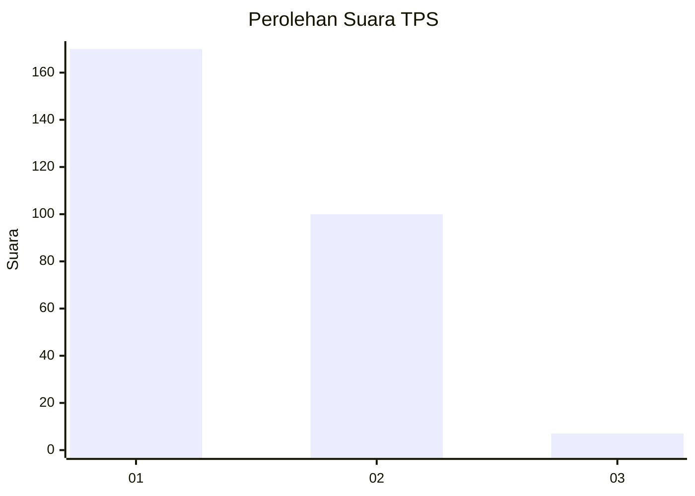
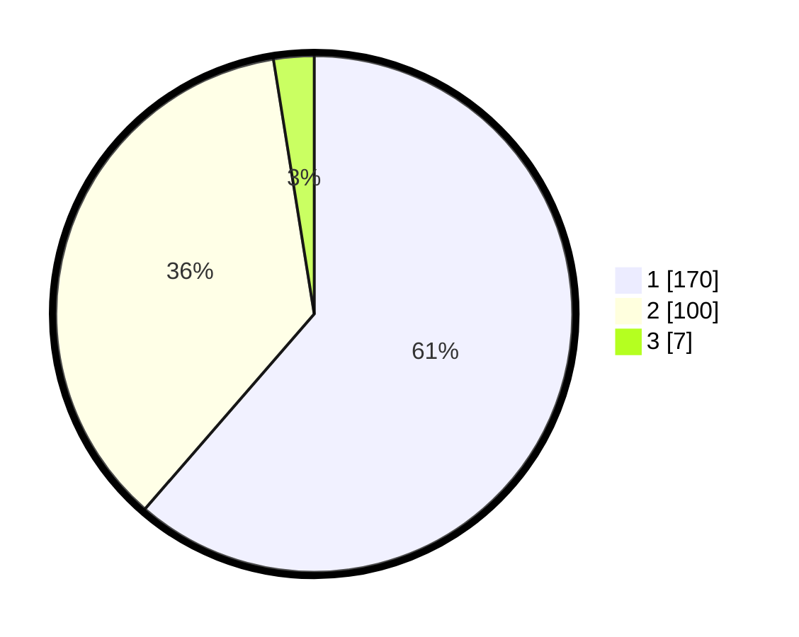

# Hasil

## Grafik

## Tabel

| No. | Nama Paslon    | Suara | Suara (raw) | Persentase |
|:--- |:-------------- | -----:| -----------:| ----------:|
| 1   | ANIES MUHAIMIN | 170   | [170][p-1]  | 61,37      |
| 2   | PRABOWO GIBRAN | 100   | [100][p-2]  | 36,10      |
| 3   | GANJAR MAHFUD  | 7     | [7][p-3]    | 2,53       |

[p-1]: https://github.com/gigit-pemilu/pemilu-2024/blob/main/pilpres/hitung-suara/sub/35-jawa-timur/sub/28-pamekasan/sub/05-proppo/sub/2022-jambringin/sub/003-tps/sub/paslon-1.txt
[p-2]: https://github.com/gigit-pemilu/pemilu-2024/blob/main/pilpres/hitung-suara/sub/35-jawa-timur/sub/28-pamekasan/sub/05-proppo/sub/2022-jambringin/sub/003-tps/sub/paslon-2.txt
[p-3]: https://github.com/gigit-pemilu/pemilu-2024/blob/main/pilpres/hitung-suara/sub/35-jawa-timur/sub/28-pamekasan/sub/05-proppo/sub/2022-jambringin/sub/003-tps/sub/paslon-3.txt

## Foto C Plano

https://sirekap-obj-formc.kpu.go.id/0fb3/pemilu/ppwp/35/28/05/20/22/3528052022003-20240215-094058--1e1b8e15-d912-42d9-8af5-1a3cf9c59c06.jpg

https://sirekap-obj-formc.kpu.go.id/0fb3/pemilu/ppwp/35/28/05/20/22/3528052022003-20240215-094236--a418d27a-3837-437a-9fa0-c4dd5b1eabd6.jpg

https://sirekap-obj-formc.kpu.go.id/0fb3/pemilu/ppwp/35/28/05/20/22/3528052022003-20240215-094452--2b3c670c-cdcf-4bcb-b8f7-6cb14d03b26b.jpg

## Metadata

| Key        | Value               |
| ---------- | ------------------- |
| Time Stamp | 2024-02-25 15:00:00 |

