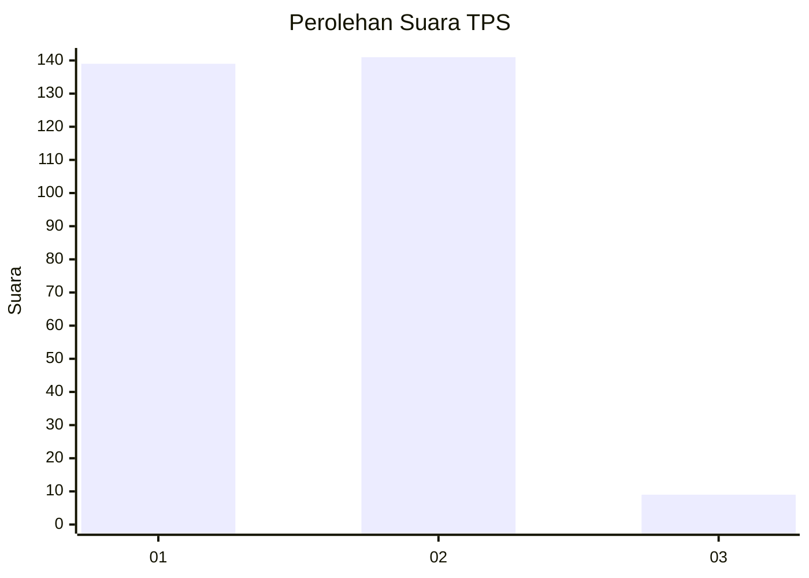
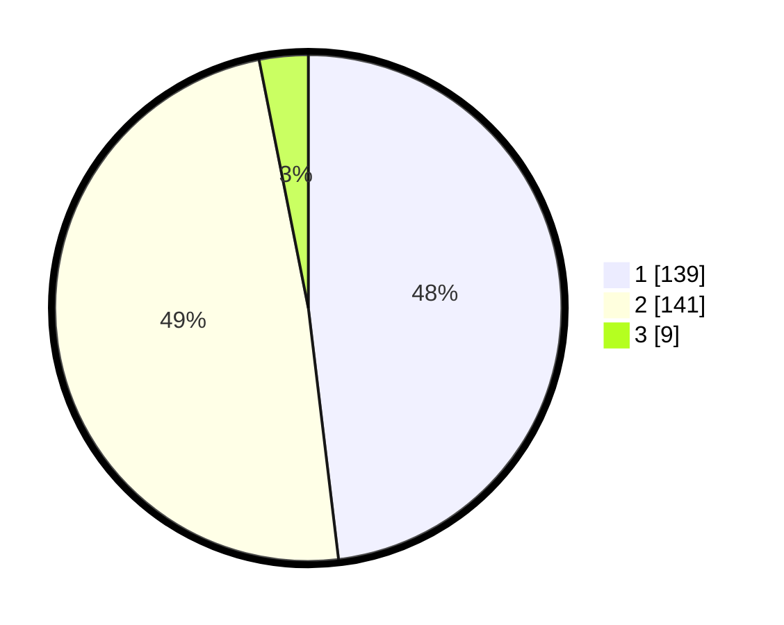

# Hasil

## Grafik

## Tabel

| No. | Nama Paslon    | Suara | Suara (raw) | Persentase |
|:--- |:-------------- | -----:| -----------:| ----------:|
| 1   | ANIES MUHAIMIN | 139   | [139][p-1]  | 48,10      |
| 2   | PRABOWO GIBRAN | 141   | [141][p-2]  | 48,79      |
| 3   | GANJAR MAHFUD  | 9     | [9][p-3]    | 3,11       |

[p-1]: https://github.com/gigit-pemilu/pemilu-2024-35-jawa-timur/blob/main/pilpres/hitung-suara/sub/35-jawa-timur/sub/28-pamekasan/sub/05-proppo/sub/2022-jambringin/sub/007-tps/sub/paslon-1.txt
[p-2]: https://github.com/gigit-pemilu/pemilu-2024-35-jawa-timur/blob/main/pilpres/hitung-suara/sub/35-jawa-timur/sub/28-pamekasan/sub/05-proppo/sub/2022-jambringin/sub/007-tps/sub/paslon-2.txt
[p-3]: https://github.com/gigit-pemilu/pemilu-2024-35-jawa-timur/blob/main/pilpres/hitung-suara/sub/35-jawa-timur/sub/28-pamekasan/sub/05-proppo/sub/2022-jambringin/sub/007-tps/sub/paslon-3.txt

## Foto C Plano

https://sirekap-obj-formc.kpu.go.id/8b0b/pemilu/ppwp/35/28/05/20/22/3528052022007-20240215-092725--3615ab7a-988b-4cc0-8689-aae68f0d05d2.jpg

https://sirekap-obj-formc.kpu.go.id/8b0b/pemilu/ppwp/35/28/05/20/22/3528052022007-20240215-093129--1883f6a9-608d-4b38-b49c-cb3e01b8817a.jpg

https://sirekap-obj-formc.kpu.go.id/8b0b/pemilu/ppwp/35/28/05/20/22/3528052022007-20240215-093226--399d45a0-8e9d-410c-9166-bd5c580dd385.jpg

## Metadata

| Key        | Value               |
| ---------- | ------------------- |
| Time Stamp | 2024-02-24 22:31:28 |

