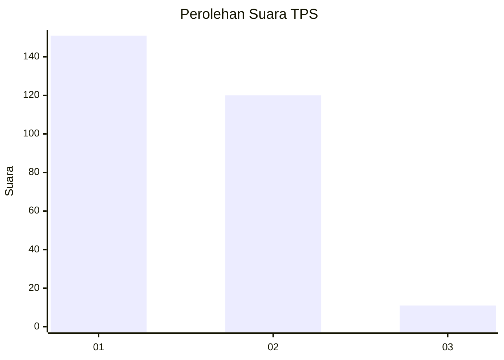
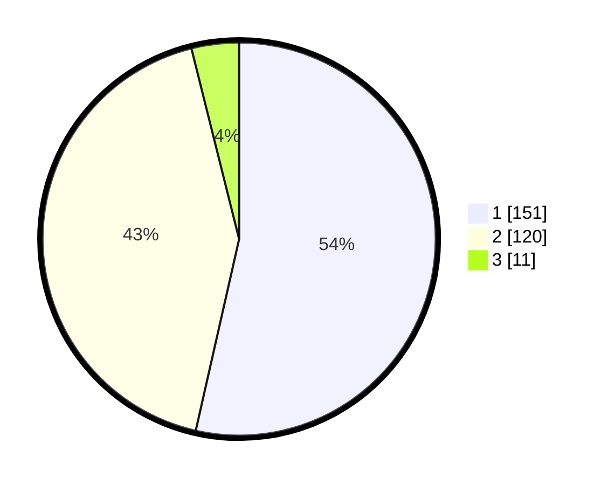

# Hasil

## Grafik

## Tabel

| No. | Nama Paslon    | Suara | Suara (raw) | Persentase |
|:--- |:-------------- | -----:| -----------:| ----------:|
| 1   | ANIES MUHAIMIN | 151   | [151][p-1]  | 53,55      |
| 2   | PRABOWO GIBRAN | 120   | [120][p-2]  | 42,55      |
| 3   | GANJAR MAHFUD  | 11    | [11][p-3]   | 3,90       |

[p-1]: https://github.com/gigit-pemilu/pemilu-2024-35-jawa-timur/blob/main/pilpres/hitung-suara/sub/35-jawa-timur/sub/28-pamekasan/sub/05-proppo/sub/2022-jambringin/sub/008-tps/sub/paslon-1.txt
[p-2]: https://github.com/gigit-pemilu/pemilu-2024-35-jawa-timur/blob/main/pilpres/hitung-suara/sub/35-jawa-timur/sub/28-pamekasan/sub/05-proppo/sub/2022-jambringin/sub/008-tps/sub/paslon-2.txt
[p-3]: https://github.com/gigit-pemilu/pemilu-2024-35-jawa-timur/blob/main/pilpres/hitung-suara/sub/35-jawa-timur/sub/28-pamekasan/sub/05-proppo/sub/2022-jambringin/sub/008-tps/sub/paslon-3.txt

## Foto C Plano

https://sirekap-obj-formc.kpu.go.id/63d8/pemilu/ppwp/35/28/05/20/22/3528052022008-20240215-085226--4894179b-8515-4bab-b8a9-87609e0ecb43.jpg

https://sirekap-obj-formc.kpu.go.id/63d8/pemilu/ppwp/35/28/05/20/22/3528052022008-20240215-085433--8520f000-e7cb-4c92-8388-d402e5b186fe.jpg

https://sirekap-obj-formc.kpu.go.id/63d8/pemilu/ppwp/35/28/05/20/22/3528052022008-20240215-085532--f0e31119-3f12-464e-ba10-cc8689d45ecc.jpg

## Metadata

| Key        | Value               |
| ---------- | ------------------- |
| Time Stamp | 2024-02-17 14:45:18 |

