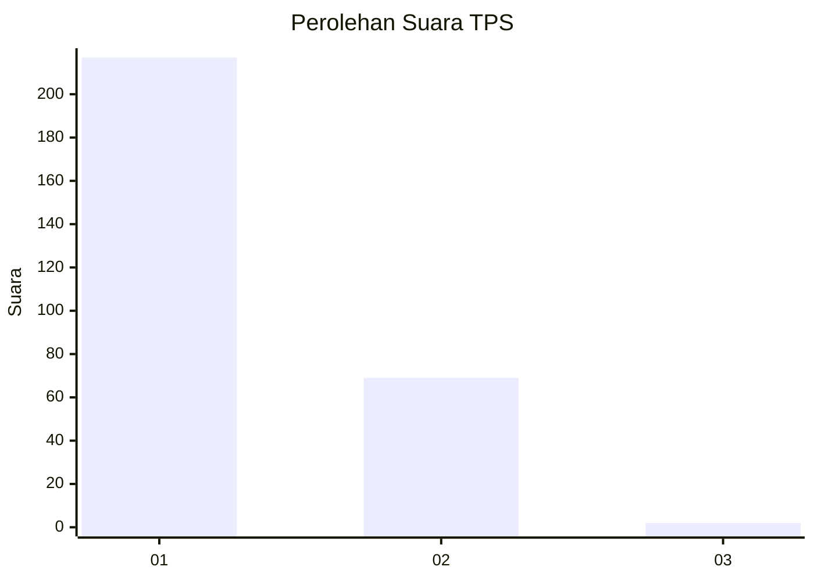
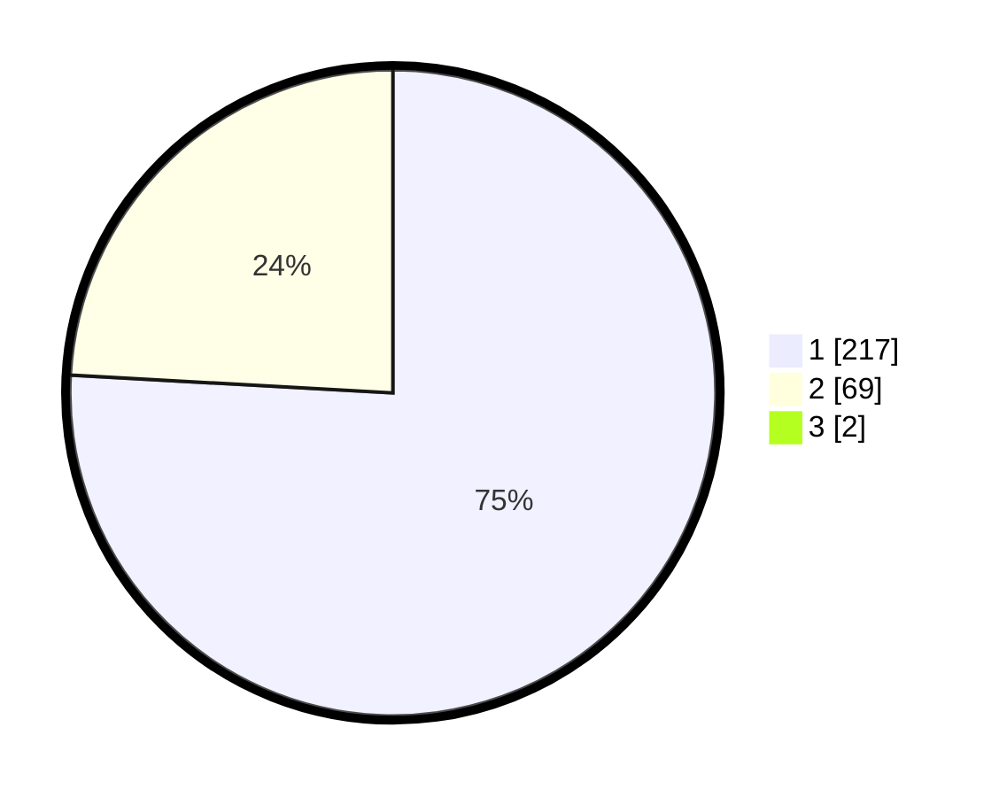

# Hasil

## Grafik

## Tabel

| No. | Nama Paslon    | Suara | Suara (raw) | Persentase |
|:--- |:-------------- | -----:| -----------:| ----------:|
| 1   | ANIES MUHAIMIN | 217   | [217][p-1]  | 75,35      |
| 2   | PRABOWO GIBRAN | 69    | [69][p-2]   | 23,96      |
| 3   | GANJAR MAHFUD  | 2     | [2][p-3]    | 0,69       |

[p-1]: https://github.com/gigit-pemilu/pemilu-2024/blob/main/pilpres/hitung-suara/sub/35-jawa-timur/sub/28-pamekasan/sub/05-proppo/sub/2022-jambringin/sub/010-tps/sub/paslon-1.txt
[p-2]: https://github.com/gigit-pemilu/pemilu-2024/blob/main/pilpres/hitung-suara/sub/35-jawa-timur/sub/28-pamekasan/sub/05-proppo/sub/2022-jambringin/sub/010-tps/sub/paslon-2.txt
[p-3]: https://github.com/gigit-pemilu/pemilu-2024/blob/main/pilpres/hitung-suara/sub/35-jawa-timur/sub/28-pamekasan/sub/05-proppo/sub/2022-jambringin/sub/010-tps/sub/paslon-3.txt

## Foto C Plano

https://sirekap-obj-formc.kpu.go.id/a96c/pemilu/ppwp/35/28/05/20/22/3528052022010-20240215-095100--e5e7f396-7180-42ad-ad11-c2e3c361f647.jpg

https://sirekap-obj-formc.kpu.go.id/a96c/pemilu/ppwp/35/28/05/20/22/3528052022010-20240215-095200--e568b070-0727-4bb3-87a9-2e6c6359afb4.jpg

https://sirekap-obj-formc.kpu.go.id/a96c/pemilu/ppwp/35/28/05/20/22/3528052022010-20240215-095303--d7f7ff41-35d1-4fa4-aa35-54ebbe811ada.jpg

## Metadata

| Key        | Value               |
| ---------- | ------------------- |
| Time Stamp | 2024-02-17 14:45:18 |

