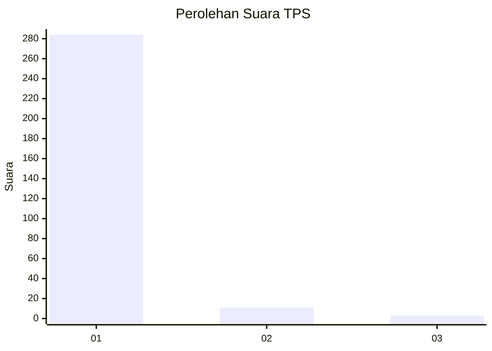
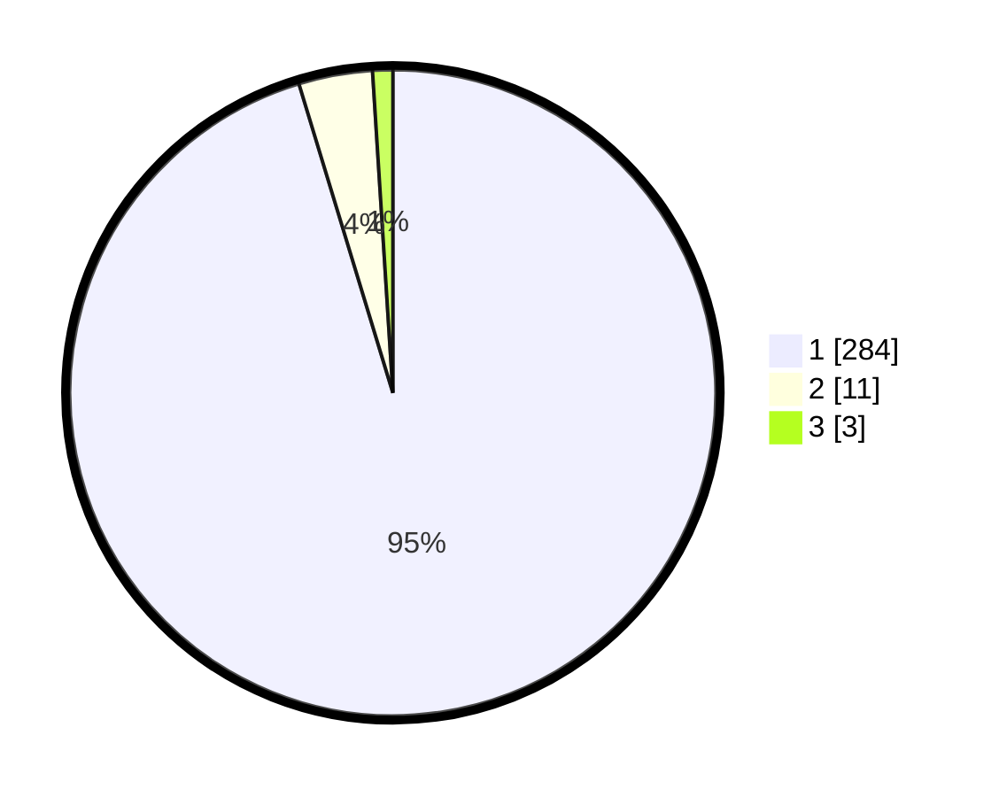

# Hasil

## Grafik

## Tabel

| No. | Nama Paslon    | Suara | Suara (raw) | Persentase |
|:--- |:-------------- | -----:| -----------:| ----------:|
| 1   | ANIES MUHAIMIN | 284   | [284][p-1]  | 95,30      |
| 2   | PRABOWO GIBRAN | 11    | [11][p-2]   | 3,69       |
| 3   | GANJAR MAHFUD  | 3     | [3][p-3]    | 1,01       |

[p-1]: https://github.com/gigit-pemilu/pemilu-2024/blob/main/pilpres/hitung-suara/sub/35-jawa-timur/sub/28-pamekasan/sub/05-proppo/sub/2022-jambringin/sub/012-tps/sub/paslon-1.txt
[p-2]: https://github.com/gigit-pemilu/pemilu-2024/blob/main/pilpres/hitung-suara/sub/35-jawa-timur/sub/28-pamekasan/sub/05-proppo/sub/2022-jambringin/sub/012-tps/sub/paslon-2.txt
[p-3]: https://github.com/gigit-pemilu/pemilu-2024/blob/main/pilpres/hitung-suara/sub/35-jawa-timur/sub/28-pamekasan/sub/05-proppo/sub/2022-jambringin/sub/012-tps/sub/paslon-3.txt

## Foto C Plano

https://sirekap-obj-formc.kpu.go.id/8f27/pemilu/ppwp/35/28/05/20/22/3528052022012-20240215-073604--4b56d653-7132-4a9b-b02f-0aa91054a58b.jpg

https://sirekap-obj-formc.kpu.go.id/8f27/pemilu/ppwp/35/28/05/20/22/3528052022012-20240215-074600--bfaf6112-4fa7-4865-b8d1-168ad5b839b2.jpg

https://sirekap-obj-formc.kpu.go.id/8f27/pemilu/ppwp/35/28/05/20/22/3528052022012-20240215-074651--54db2275-3524-4876-9d0b-74527519d06b.jpg

## Metadata

| Key        | Value               |
| ---------- | ------------------- |
| Time Stamp | 2024-02-17 11:00:02 |

