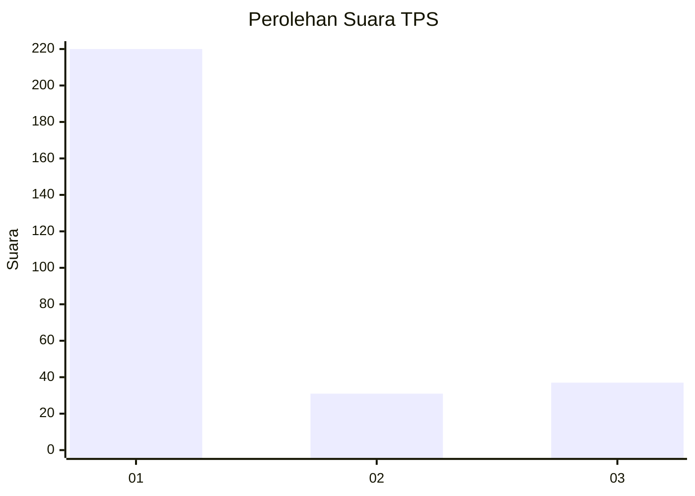
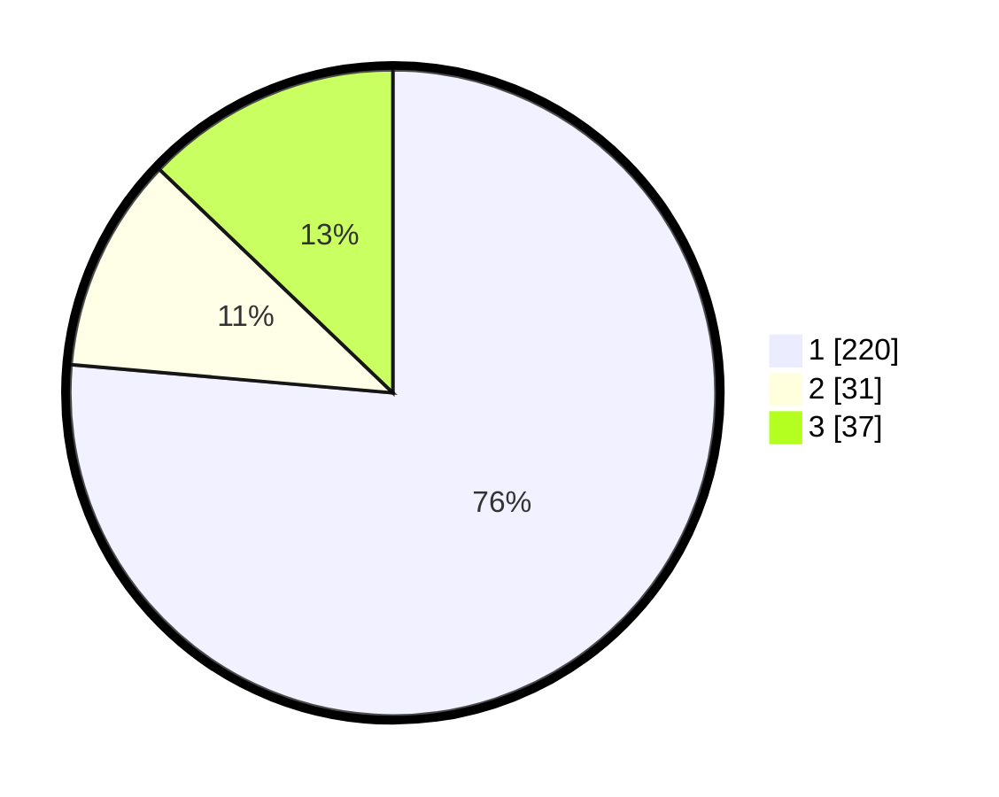

# Hasil

## Grafik

## Tabel

| No. | Nama Paslon    | Suara | Suara (raw) | Persentase |
|:--- |:-------------- | -----:| -----------:| ----------:|
| 1   | ANIES MUHAIMIN | 220   | [220][p-1]  | 76,39      |
| 2   | PRABOWO GIBRAN | 31    | [31][p-2]   | 10,76      |
| 3   | GANJAR MAHFUD  | 37    | [37][p-3]   | 12,85      |

[p-1]: https://github.com/gigit-pemilu/pemilu-2024-35-jawa-timur/blob/main/pilpres/hitung-suara/sub/35-jawa-timur/sub/28-pamekasan/sub/05-proppo/sub/2022-jambringin/sub/013-tps/sub/paslon-1.txt
[p-2]: https://github.com/gigit-pemilu/pemilu-2024-35-jawa-timur/blob/main/pilpres/hitung-suara/sub/35-jawa-timur/sub/28-pamekasan/sub/05-proppo/sub/2022-jambringin/sub/013-tps/sub/paslon-2.txt
[p-3]: https://github.com/gigit-pemilu/pemilu-2024-35-jawa-timur/blob/main/pilpres/hitung-suara/sub/35-jawa-timur/sub/28-pamekasan/sub/05-proppo/sub/2022-jambringin/sub/013-tps/sub/paslon-3.txt

## Foto C Plano

https://sirekap-obj-formc.kpu.go.id/6f81/pemilu/ppwp/35/28/05/20/22/3528052022013-20240215-073602--dc7e7509-7e3a-4266-b116-a10c2436d219.jpg

https://sirekap-obj-formc.kpu.go.id/6f81/pemilu/ppwp/35/28/05/20/22/3528052022013-20240215-073903--2c539811-aff7-48d5-918c-e348688e77e8.jpg

https://sirekap-obj-formc.kpu.go.id/6f81/pemilu/ppwp/35/28/05/20/22/3528052022013-20240215-073737--3e15fdd3-4a0e-4be0-90ca-31f2aba27a78.jpg

## Metadata

| Key        | Value               |
| ---------- | ------------------- |
| Time Stamp | 2024-02-17 11:00:02 |

