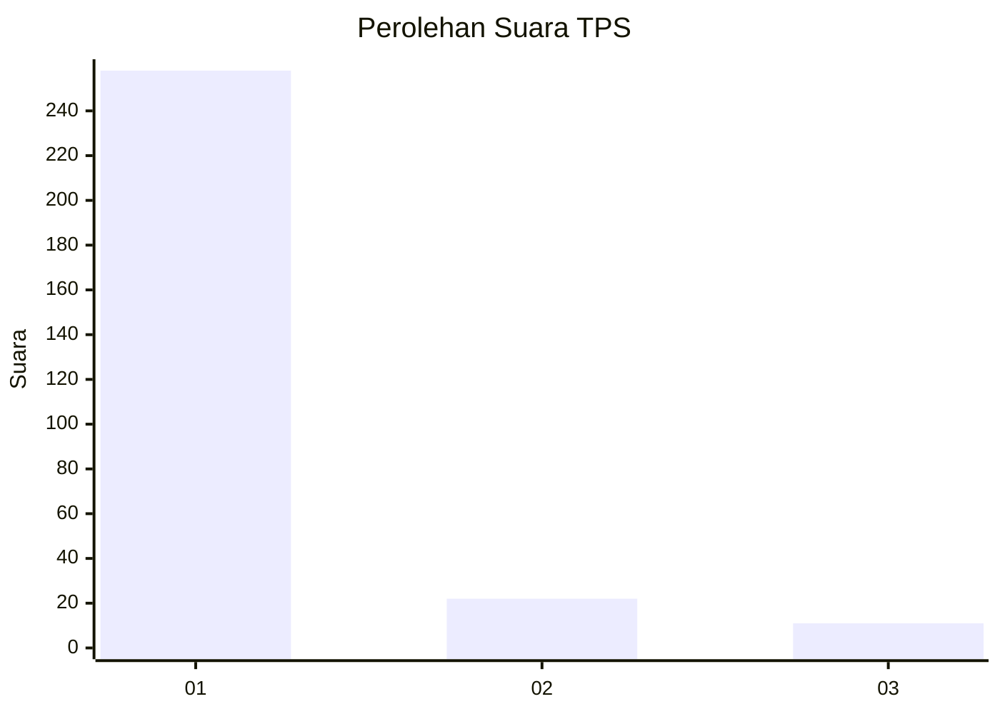
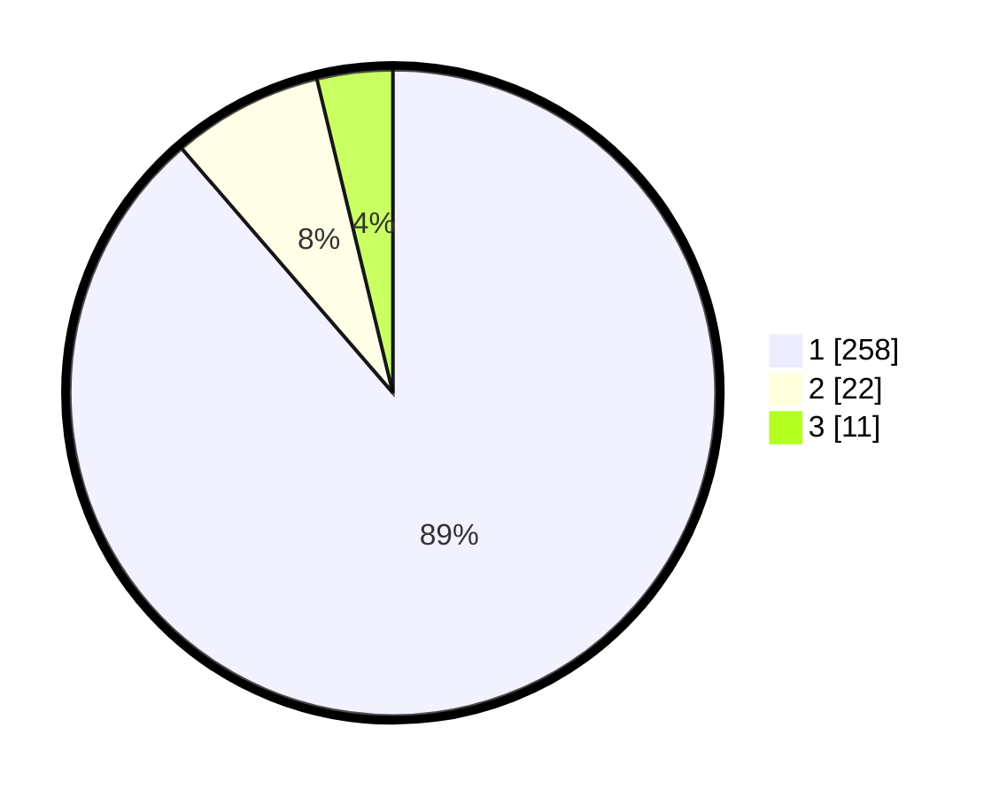

# Hasil

## Grafik

## Tabel

| No. | Nama Paslon    | Suara | Suara (raw) | Persentase |
|:--- |:-------------- | -----:| -----------:| ----------:|
| 1   | ANIES MUHAIMIN | 258   | [258][p-1]  | 88,66      |
| 2   | PRABOWO GIBRAN | 22    | [22][p-2]   | 7,56       |
| 3   | GANJAR MAHFUD  | 11    | [11][p-3]   | 3,78       |

[p-1]: https://github.com/gigit-pemilu/pemilu-2024-35-jawa-timur/blob/main/pilpres/hitung-suara/sub/35-jawa-timur/sub/28-pamekasan/sub/05-proppo/sub/2022-jambringin/sub/014-tps/sub/paslon-1.txt
[p-2]: https://github.com/gigit-pemilu/pemilu-2024-35-jawa-timur/blob/main/pilpres/hitung-suara/sub/35-jawa-timur/sub/28-pamekasan/sub/05-proppo/sub/2022-jambringin/sub/014-tps/sub/paslon-2.txt
[p-3]: https://github.com/gigit-pemilu/pemilu-2024-35-jawa-timur/blob/main/pilpres/hitung-suara/sub/35-jawa-timur/sub/28-pamekasan/sub/05-proppo/sub/2022-jambringin/sub/014-tps/sub/paslon-3.txt

## Foto C Plano

https://sirekap-obj-formc.kpu.go.id/d89e/pemilu/ppwp/35/28/05/20/22/3528052022014-20240215-124255--471b5493-8e8a-4b1d-8417-a61edad0892c.jpg

https://sirekap-obj-formc.kpu.go.id/d89e/pemilu/ppwp/35/28/05/20/22/3528052022014-20240215-124328--68f6cc7b-e3ab-4f23-876d-4b4fd4831c31.jpg

https://sirekap-obj-formc.kpu.go.id/d89e/pemilu/ppwp/35/28/05/20/22/3528052022014-20240215-124356--6703307e-2232-47fc-a447-3b7579003904.jpg

## Metadata

| Key        | Value               |
| ---------- | ------------------- |
| Time Stamp | 2024-02-17 14:45:18 |

