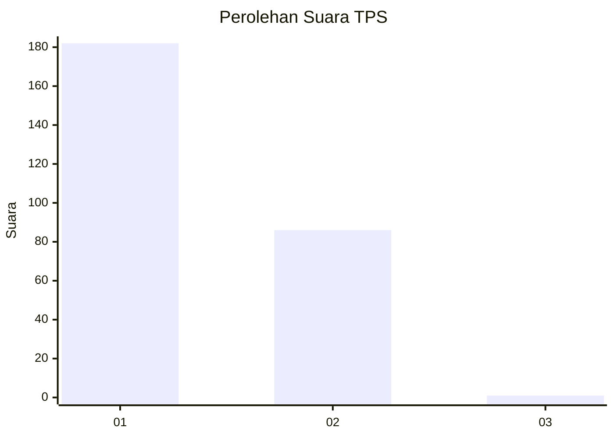
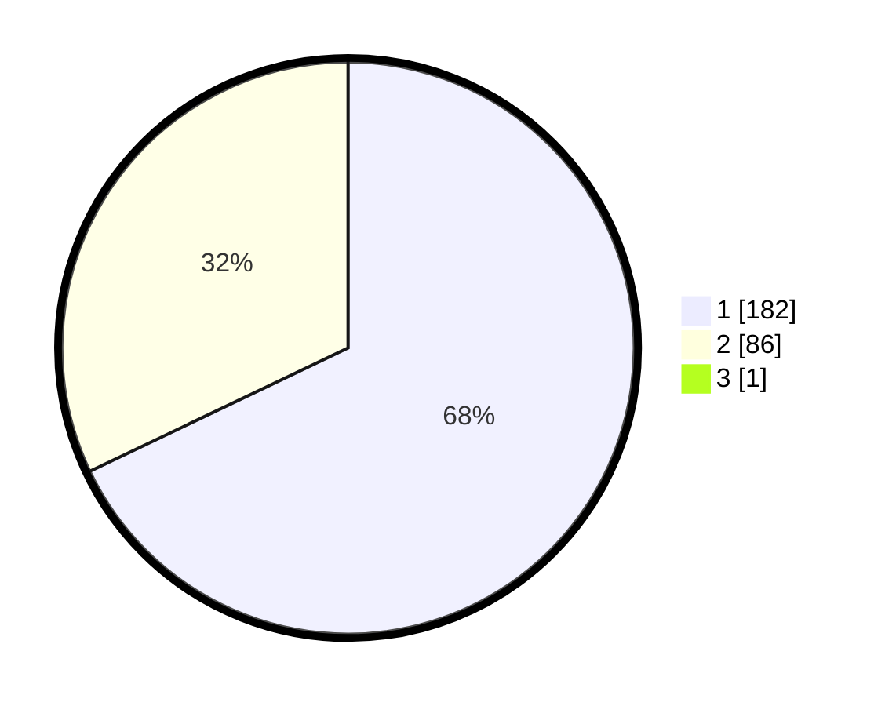

# Hasil

## Grafik

## Tabel

| No. | Nama Paslon    | Suara | Suara (raw) | Persentase |
|:--- |:-------------- | -----:| -----------:| ----------:|
| 1   | ANIES MUHAIMIN | 182   | [182][p-1]  | 67,66      |
| 2   | PRABOWO GIBRAN | 86    | [86][p-2]   | 31,97      |
| 3   | GANJAR MAHFUD  | 1     | [1][p-3]    | 0,37       |

[p-1]: https://github.com/gigit-pemilu/pemilu-2024/blob/main/pilpres/hitung-suara/sub/35-jawa-timur/sub/28-pamekasan/sub/05-proppo/sub/2022-jambringin/sub/015-tps/sub/paslon-1.txt
[p-2]: https://github.com/gigit-pemilu/pemilu-2024/blob/main/pilpres/hitung-suara/sub/35-jawa-timur/sub/28-pamekasan/sub/05-proppo/sub/2022-jambringin/sub/015-tps/sub/paslon-2.txt
[p-3]: https://github.com/gigit-pemilu/pemilu-2024/blob/main/pilpres/hitung-suara/sub/35-jawa-timur/sub/28-pamekasan/sub/05-proppo/sub/2022-jambringin/sub/015-tps/sub/paslon-3.txt

## Foto C Plano

https://sirekap-obj-formc.kpu.go.id/51e5/pemilu/ppwp/35/28/05/20/22/3528052022015-20240215-074803--95b27e31-2150-48a4-8af1-72f829e1959e.jpg

https://sirekap-obj-formc.kpu.go.id/51e5/pemilu/ppwp/35/28/05/20/22/3528052022015-20240215-074902--23a5d22c-1efc-478b-a607-efea746484c4.jpg

https://sirekap-obj-formc.kpu.go.id/51e5/pemilu/ppwp/35/28/05/20/22/3528052022015-20240215-075010--248f9c9e-2ccb-4273-a856-fa158ec3cbca.jpg

## Metadata

| Key        | Value               |
| ---------- | ------------------- |
| Time Stamp | 2024-02-17 14:45:18 |

