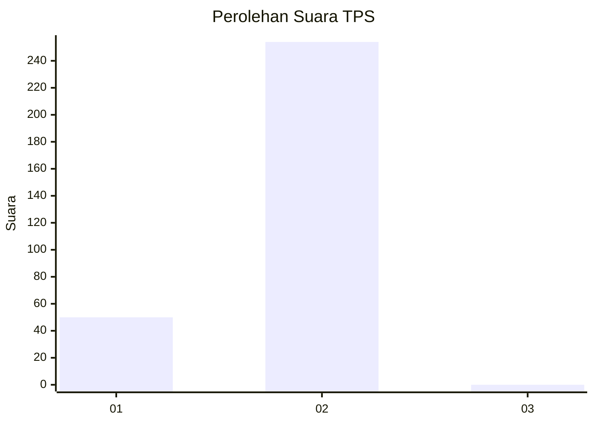
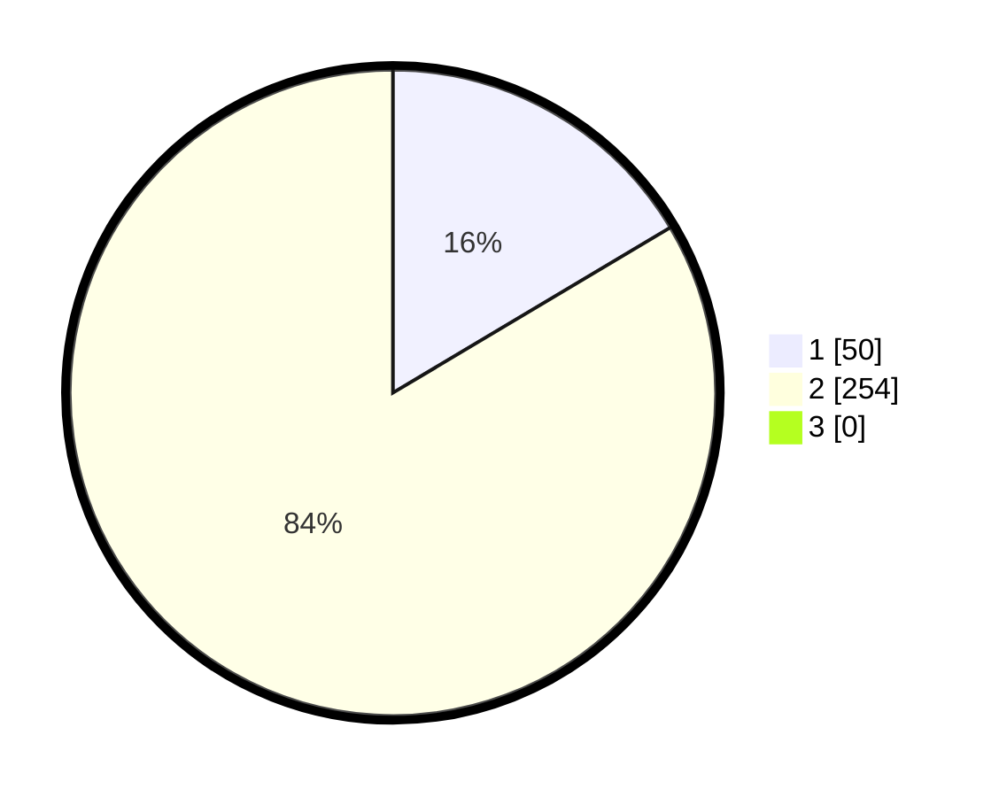

# Hasil

## Grafik

## Tabel

| No. | Nama Paslon    | Suara | Suara (raw) | Persentase |
|:--- |:-------------- | -----:| -----------:| ----------:|
| 1   | ANIES MUHAIMIN | 50    | [50][p-1]   | 16,45      |
| 2   | PRABOWO GIBRAN | 254   | [254][p-2]  | 83,55      |
| 3   | GANJAR MAHFUD  | 0     | [0][p-3]    | 0,00       |

[p-1]: https://github.com/gigit-pemilu/pemilu-2024-35-jawa-timur/blob/main/pilpres/hitung-suara/sub/35-jawa-timur/sub/28-pamekasan/sub/05-proppo/sub/2022-jambringin/sub/016-tps/sub/paslon-1.txt
[p-2]: https://github.com/gigit-pemilu/pemilu-2024-35-jawa-timur/blob/main/pilpres/hitung-suara/sub/35-jawa-timur/sub/28-pamekasan/sub/05-proppo/sub/2022-jambringin/sub/016-tps/sub/paslon-2.txt
[p-3]: https://github.com/gigit-pemilu/pemilu-2024-35-jawa-timur/blob/main/pilpres/hitung-suara/sub/35-jawa-timur/sub/28-pamekasan/sub/05-proppo/sub/2022-jambringin/sub/016-tps/sub/paslon-3.txt

## Foto C Plano

https://sirekap-obj-formc.kpu.go.id/c4ef/pemilu/ppwp/35/28/05/20/22/3528052022016-20240214-231130--b734a082-c1e5-4175-8546-e2f41e6198de.jpg

https://sirekap-obj-formc.kpu.go.id/c4ef/pemilu/ppwp/35/28/05/20/22/3528052022016-20240214-231237--c6cd12f9-b3f1-4c61-8380-d9523c5f4a39.jpg

https://sirekap-obj-formc.kpu.go.id/c4ef/pemilu/ppwp/35/28/05/20/22/3528052022016-20240214-231351--586f39b8-700d-4aa4-9160-fd8913725f11.jpg

## Metadata

| Key        | Value               |
| ---------- | ------------------- |
| Time Stamp | 2024-02-17 14:45:18 |

