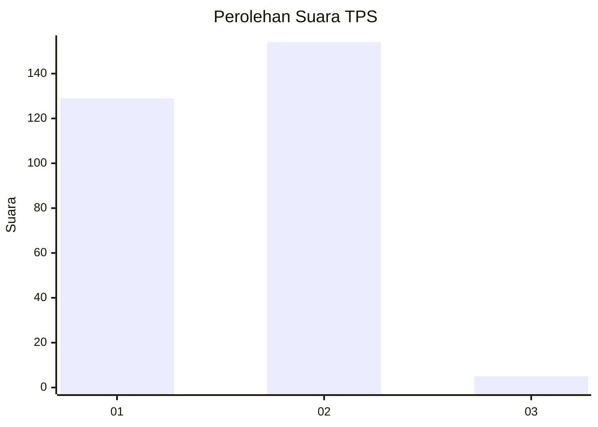
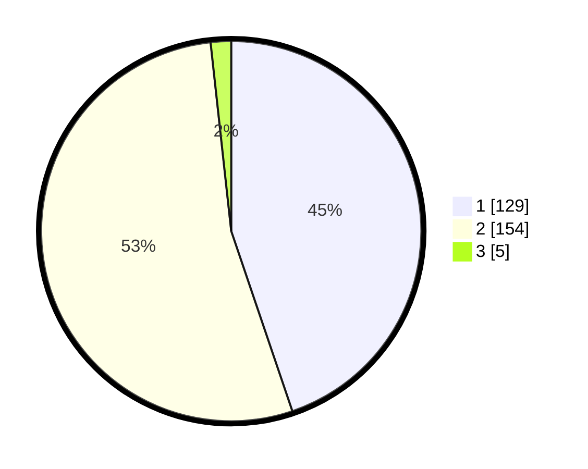

# Hasil

## Grafik

## Tabel

| No. | Nama Paslon    | Suara | Suara (raw) | Persentase |
|:--- |:-------------- | -----:| -----------:| ----------:|
| 1   | ANIES MUHAIMIN | 129   | [129][p-1]  | 44,79      |
| 2   | PRABOWO GIBRAN | 154   | [154][p-2]  | 53,47      |
| 3   | GANJAR MAHFUD  | 5     | [5][p-3]    | 1,74       |

[p-1]: https://github.com/gigit-pemilu/pemilu-2024/blob/main/pilpres/hitung-suara/sub/35-jawa-timur/sub/28-pamekasan/sub/05-proppo/sub/2022-jambringin/sub/017-tps/sub/paslon-1.txt
[p-2]: https://github.com/gigit-pemilu/pemilu-2024/blob/main/pilpres/hitung-suara/sub/35-jawa-timur/sub/28-pamekasan/sub/05-proppo/sub/2022-jambringin/sub/017-tps/sub/paslon-2.txt
[p-3]: https://github.com/gigit-pemilu/pemilu-2024/blob/main/pilpres/hitung-suara/sub/35-jawa-timur/sub/28-pamekasan/sub/05-proppo/sub/2022-jambringin/sub/017-tps/sub/paslon-3.txt

## Foto C Plano

https://sirekap-obj-formc.kpu.go.id/9e0e/pemilu/ppwp/35/28/05/20/22/3528052022017-20240215-081445--2c856a9e-dc31-47e2-b4a0-d074e841d4ff.jpg

https://sirekap-obj-formc.kpu.go.id/9e0e/pemilu/ppwp/35/28/05/20/22/3528052022017-20240215-081533--372b3396-b9d1-4b5f-8be1-a1489230ad14.jpg

https://sirekap-obj-formc.kpu.go.id/9e0e/pemilu/ppwp/35/28/05/20/22/3528052022017-20240215-081823--0ccea59d-f925-4978-9c12-a8fe347f1cd4.jpg

## Metadata

| Key        | Value               |
| ---------- | ------------------- |
| Time Stamp | 2024-02-17 14:45:18 |

