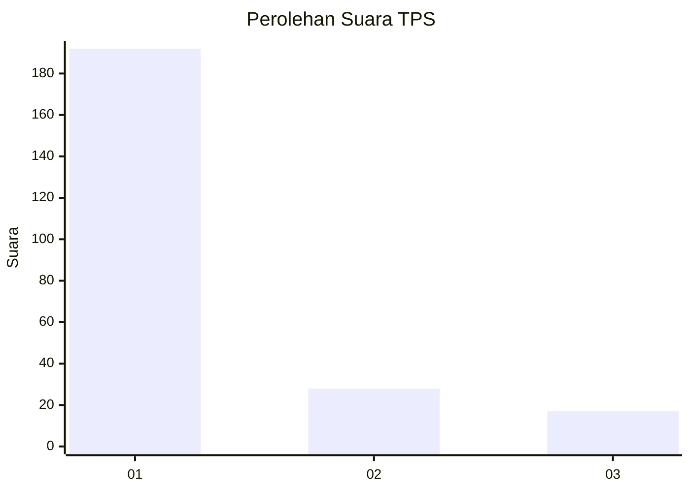
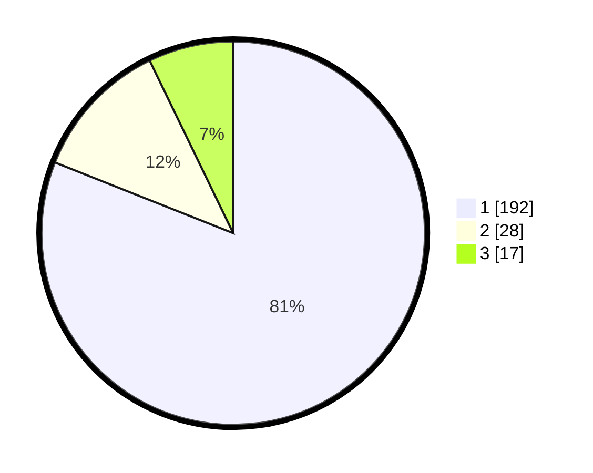

# Hasil

## Grafik

## Tabel

| No. | Nama Paslon    | Suara | Suara (raw) | Persentase |
|:--- |:-------------- | -----:| -----------:| ----------:|
| 1   | ANIES MUHAIMIN | 192   | [192][p-1]  | 81,01      |
| 2   | PRABOWO GIBRAN | 28    | [28][p-2]   | 11,81      |
| 3   | GANJAR MAHFUD  | 17    | [17][p-3]   | 7,17       |

[p-1]: https://github.com/gigit-pemilu/pemilu-2024/blob/main/pilpres/hitung-suara/sub/35-jawa-timur/sub/28-pamekasan/sub/05-proppo/sub/2023-campor/sub/002-tps/sub/paslon-1.txt
[p-2]: https://github.com/gigit-pemilu/pemilu-2024/blob/main/pilpres/hitung-suara/sub/35-jawa-timur/sub/28-pamekasan/sub/05-proppo/sub/2023-campor/sub/002-tps/sub/paslon-2.txt
[p-3]: https://github.com/gigit-pemilu/pemilu-2024/blob/main/pilpres/hitung-suara/sub/35-jawa-timur/sub/28-pamekasan/sub/05-proppo/sub/2023-campor/sub/002-tps/sub/paslon-3.txt

## Foto C Plano

https://sirekap-obj-formc.kpu.go.id/e9d7/pemilu/ppwp/35/28/05/20/23/3528052023002-20240215-072737--bc7b4956-73f7-4bb3-9449-c8c9877233a7.jpg

https://sirekap-obj-formc.kpu.go.id/e9d7/pemilu/ppwp/35/28/05/20/23/3528052023002-20240215-072835--63fd2507-14c0-4dd5-ab9c-3385cc06c72d.jpg

https://sirekap-obj-formc.kpu.go.id/e9d7/pemilu/ppwp/35/28/05/20/23/3528052023002-20240215-072913--85221c9b-fb0f-4e53-9bca-309d20ffda72.jpg

## Metadata

| Key        | Value               |
| ---------- | ------------------- |
| Time Stamp | 2024-02-17 14:45:18 |

