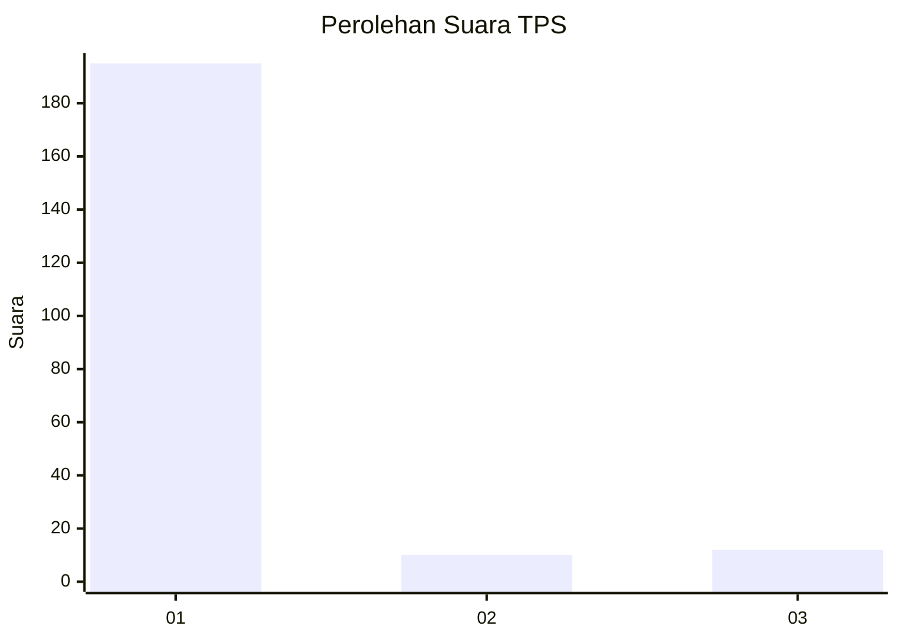
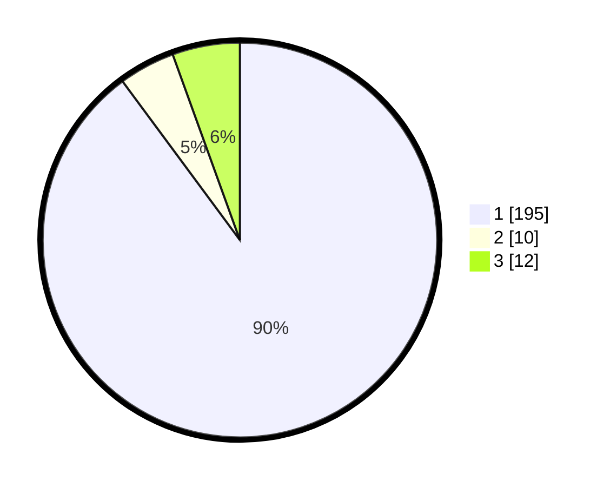

# Hasil

## Grafik

## Tabel

| No. | Nama Paslon    | Suara | Suara (raw) | Persentase |
|:--- |:-------------- | -----:| -----------:| ----------:|
| 1   | ANIES MUHAIMIN | 195   | [195][p-1]  | 89,86      |
| 2   | PRABOWO GIBRAN | 10    | [10][p-2]   | 4,61       |
| 3   | GANJAR MAHFUD  | 12    | [12][p-3]   | 5,53       |

[p-1]: https://github.com/gigit-pemilu/pemilu-2024-35-jawa-timur/blob/main/pilpres/hitung-suara/sub/35-jawa-timur/sub/28-pamekasan/sub/05-proppo/sub/2023-campor/sub/003-tps/sub/paslon-1.txt
[p-2]: https://github.com/gigit-pemilu/pemilu-2024-35-jawa-timur/blob/main/pilpres/hitung-suara/sub/35-jawa-timur/sub/28-pamekasan/sub/05-proppo/sub/2023-campor/sub/003-tps/sub/paslon-2.txt
[p-3]: https://github.com/gigit-pemilu/pemilu-2024-35-jawa-timur/blob/main/pilpres/hitung-suara/sub/35-jawa-timur/sub/28-pamekasan/sub/05-proppo/sub/2023-campor/sub/003-tps/sub/paslon-3.txt

## Foto C Plano

https://sirekap-obj-formc.kpu.go.id/3f33/pemilu/ppwp/35/28/05/20/23/3528052023003-20240214-213032--a3a7ae69-cac3-40ed-8829-ab4a0be3692d.jpg

https://sirekap-obj-formc.kpu.go.id/3f33/pemilu/ppwp/35/28/05/20/23/3528052023003-20240214-213147--5be9e8dc-89df-4372-84df-f998f3bce46f.jpg

https://sirekap-obj-formc.kpu.go.id/3f33/pemilu/ppwp/35/28/05/20/23/3528052023003-20240214-213244--f9874c35-34ef-47da-abf1-6256b81c6391.jpg

## Metadata

| Key        | Value               |
| ---------- | ------------------- |
| Time Stamp | 2024-02-17 14:45:18 |

