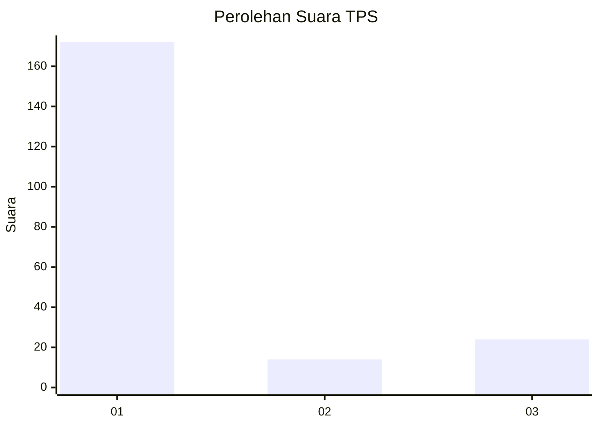
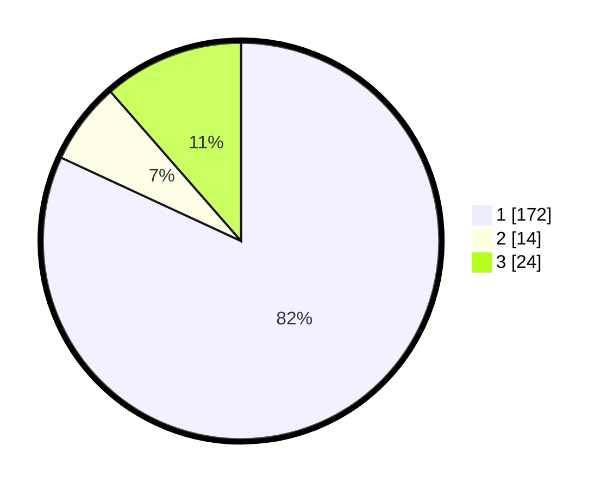

# Hasil

## Grafik

## Tabel

| No. | Nama Paslon    | Suara | Suara (raw) | Persentase |
|:--- |:-------------- | -----:| -----------:| ----------:|
| 1   | ANIES MUHAIMIN | 172   | [172][p-1]  | 81,90      |
| 2   | PRABOWO GIBRAN | 14    | [14][p-2]   | 6,67       |
| 3   | GANJAR MAHFUD  | 24    | [24][p-3]   | 11,43      |

[p-1]: https://github.com/gigit-pemilu/pemilu-2024/blob/main/pilpres/hitung-suara/sub/35-jawa-timur/sub/28-pamekasan/sub/05-proppo/sub/2023-campor/sub/004-tps/sub/paslon-1.txt
[p-2]: https://github.com/gigit-pemilu/pemilu-2024/blob/main/pilpres/hitung-suara/sub/35-jawa-timur/sub/28-pamekasan/sub/05-proppo/sub/2023-campor/sub/004-tps/sub/paslon-2.txt
[p-3]: https://github.com/gigit-pemilu/pemilu-2024/blob/main/pilpres/hitung-suara/sub/35-jawa-timur/sub/28-pamekasan/sub/05-proppo/sub/2023-campor/sub/004-tps/sub/paslon-3.txt

## Foto C Plano

https://sirekap-obj-formc.kpu.go.id/361a/pemilu/ppwp/35/28/05/20/23/3528052023004-20240214-192708--51e1e2ae-a2d5-4ed7-91db-19b6a4f8c0ce.jpg

https://sirekap-obj-formc.kpu.go.id/361a/pemilu/ppwp/35/28/05/20/23/3528052023004-20240214-192811--9b331783-5a42-48f9-97ff-0508bd73dce9.jpg

https://sirekap-obj-formc.kpu.go.id/361a/pemilu/ppwp/35/28/05/20/23/3528052023004-20240215-062012--babb397c-32d5-4cb1-a63d-1fea9ea78937.jpg

## Metadata

| Key        | Value               |
| ---------- | ------------------- |
| Time Stamp | 2024-02-15 22:00:27 |

